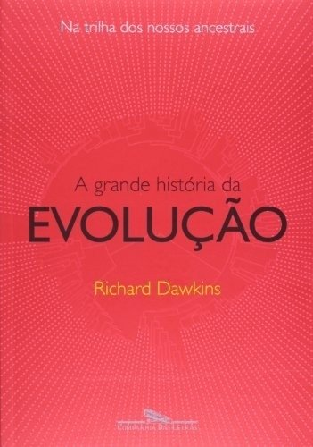

Como sempre, Richard Dawkins escreve de uma maneira bem fluida, e, portanto, este é um ótimo livro de divulgação científica. Há ouro aqui.

O livro inicia uma peregrinação ao passado, começando pela nossa própria espécie. Vamos cada vez mais longe no tempo, encontrando outras espécies pelo caminho, no momento em que nossos ancestrais se tornam os mesmos. Nessa jornada, encontramos ancestrais mais óbvios, como os que compartilhamos com os gibões, gorilas e orangotangos, até chegarmos aos ancestrais conhecidos que deram origem a toda a subclasse dos mamíferos. Indo ainda mais profundamente, passamos pelos filos dos reinos dos vertebrados, anfíbios, equinodermos (aqueles animais simétricos, como estrelas-do-mar, pepinos-do-mar etc.), até finalmente alcançarmos os (possivelmente) primeiros seres que deram origem a toda a vida. Ufa, foi uma viagem e tanto!

Digo que é impossível imaginar um período tão extenso quanto 1 milhão de anos. Nós, humanos, estamos acostumados a uma escala de tempo muito menor; medimos a nossa existência em décadas. É difícil até pensar em um século para trás ou para frente, imagine então na escala de 100 milhões, 1 bilhão ou 2 bilhões de anos! Por isso, entender como o processo de evolução funciona é crucial: pequenas alterações (mutações) no DNA se acumulam ao longo do tempo (e quanto tempo!). Pense na visão. Nós temos dois olhos, que enxergam uma certa gama de cores, têm a capacidade de focalizar objetos a uma distância determinada e outros que estão mais distantes. Certas aves têm uma visão adaptada para enxergar objetos a longas distâncias, a quilômetros. Como pensar na visão em termos evolutivos? Uma armadilha comum seria imaginar "evoluir de um olho para dois" ou de meio olho para um. Mas não é assim que a evolução funciona.

> Saltar abismos não é o que a evolução faz.

A visão evoluiu independentemente várias vezes no reino animal. O que significa "independentemente"? Quer dizer que espécies não relacionadas acabaram se adaptando devido a pressões ambientais do seu meio. Por exemplo, imagine o pardal, um pássaro, e uma cobra, como a sucuri. Ambas não têm braços, e vamos ignorar a possibilidade de que, em algum momento, seus ancestrais possam ter tido membros superiores (assim como as aves tiveram algo parecido com braços, que se adaptaram ao que hoje vemos como asas). Para ilustrar, vamos supor que nenhum ancestral dessas espécies jamais teve membros. Essas espécies não estão mais relacionadas, porque elas não se cruzam entre si, ou seja, não trocam mais material genético. Seus ancestrais em comum estão a milhões de anos no passado.

Agora, imagine que, devido a pressões ambientais — a cobra nas florestas tropicais e os pássaros nas montanhas —, cada uma, por razões e processos diferentes, tenha desenvolvido, ao longo de milhares de anos, membros superiores de forma independente (já que elas não se cruzam). É como chegar em casa por caminhos diferentes ou dar um cheque-mate com estratégias distintas. Assim aconteceu com a visão, que foi desenvolvida de maneira independente diversas vezes. Algumas espécies desenvolveram olhos compostos (como os insetos), enquanto as lulas desenvolveram a visão independentemente dos vertebrados (humanos, mamíferos, etc.), apesar de sua semelhança superficial. Outras espécies desenvolveram apenas uma sensibilidade à luz, e assim por diante.

Nesse caso, não se pode afirmar que a visão dos humanos ou das águias seja o "produto final" de como a visão deveria ser. Cada espécie se adaptou conforme o ambiente e a competição natural em seu meio as pressionaram a evoluir.

Ao longo da leitura, somos constantemente confrontados com a ideia, bastante comum, de que nós somos o produto máximo da evolução. É tentador olhar para um macaco, ou mesmo para um inseto, e pensar que são "produtos" inacabados, como se faltasse algo a esses seres. Que engano.

> Em andamento? Inacabadas? Só com a insensatez de uma interpretação _a posteriori_. (...) é verdade que, se ficássemos frente a frente com um _Homo erectus_, ele decerto nos lembraria uma escultura inacabada, em andamento. Mas só porque estamos olhando com uma visão humana _a posteriori_. Um ser vivo está sempre às voltas com a sobrevivência em seu próprio meio. Ele nunca é inacabado — ou, em outro sentido, ele é sempre inacabado. Assim como nós, provavelmente, também somos.

Para se ter uma ideia das consequências genéticas acidentais, podemos observar a domesticação que nossa espécie realizou com o trigo, o milho e animais como o gato, a vaca e o cachorro. Dawkins ilustra isso mencionando os interessantes estudos russos sobre as raposas-prateadas.

> D. K. Belyaev e seus colegas capturaram raposas-prateadas, _Vulpes vulpes_, e passaram a cruzá-las sistematicamente, com o objetivo de obter animais mais mansos. O êxito foi impressionante. Cruzando entre si os indivíduos mais mansos de cada geração, Belyaev obteve, em vinte anos, raposas que se comportavam como cães da raça border collie, procuravam a companhia humana e abanavam a cauda para quem se aproximava. (...) Essas raposas geneticamente amansadas não só se comportavam como os collies, mas também se pareciam com eles. Ganharam pelagem preta e branca, com manchas brancas na face e no focinho. No lugar das características orelhas empinadas das raposas selvagens, ganharam "simpáticas" orelhas caídas. Seu equilíbrio hormonal reprodutivo mudou, e elas adquiriram o hábito de reproduzir-se o ano todo em vez de em uma temporada específica. Constatou-se que apresentavam níveis mais elevados de serotonina neuralmente ativa, o que provavelmente tinha relação com sua menor agressividade. Bastaram vinte anos para transformar raposas em "cães" pela seleção artificial.

Falando de cruzamento, herança genética e, consequentemente, de DNA, aprendi algo no livro que explodiu minha mente: as mitocôndrias são passadas apenas pela mãe no processo de reprodução. Isso ocorre porque o DNA mitocondrial (mtDNA), que está presente dentro das mitocôndrias, é herdado exclusivamente da mãe. Quando um óvulo é fecundado pelo espermatozoide, praticamente todo o citoplasma (onde as mitocôndrias estão localizadas) do embrião vem do óvulo, e o espermatozoide contribui apenas com seu núcleo, sem mitocôndrias. Portanto, todas as mitocôndrias no corpo de uma pessoa têm origem materna.

Imagine que mutações ou doenças associadas a ele são transmitidas apenas de mães para seus filhos, independentemente do sexo da prole. Se uma mutação prejudicial ocorre no mtDNA, essa mutação pode ser responsável por várias doenças mitocondriais. Se uma mulher tiver uma mutação no mtDNA, todos os seus filhos, homens e mulheres, herdarão essa mutação. No entanto, somente as filhas poderão transmiti-la para as gerações seguintes, pois os filhos homens não passam o mtDNA adiante. Uma doença mitocondrial conhecida é a hemofilia.

Voltando um pouco na história recente, digamos 40 mil anos (de novo, como é difícil pensar nesses termos!), Dawkins escreve sobre algo crucial que aconteceu em nossa história e que ainda está sendo amplamente estudado.

> Algo aconteceu (há 40 mil anos) (...) o nome que Jared Diamond escolheu para descrever o ocorrido: o Grande Salto para Frente. Antes do Grande Salto para Frente, os artefatos produzidos pelos homens quase não haviam mudado por 1 milhão de anos. Os que chegaram até nós são, na maioria, ferramentas e armas de pedra de feitio bem tosco. Sem dúvida, a madeira (ou, na Ásia, o bambu) era um material usado com mais frequência, mas as relíquias de madeira não sobrevivem facilmente. Pelo que sabemos, não havia pinturas, esculturas, estatuetas, bens levados para sepulturas ou ornamentações. Depois do Salto, todas essas coisas aparecem subitamente no registro arqueológico, junto com instrumentos musicais como flautas de osso, e não demorou muito para o povo de Cro-Magnon criar obras impressionantes como os murais da Caverna de Lascaux. (...) florescente surto cultural que se seguiu à longa estagnação do Paleolítico Inferior.

Será que uma mutação crucial foi propagada em nossos genes? Alguns acreditam que foi nesse período que começamos a nos comunicar, o que pode fazer sentido. Imagine as primeiras tentativas de comunicação, nomeando coisas, pessoas ou mesmo sentimentos, como "amor" ou aflições como "perigo". Afinal, isso poderia ser apenas um "huaaa", um grito ou grunhido, quem sabe, mas inconfundivelmente representava um "perigo", e isso poderia ter sido crucial para os grupos.

Ainda no assunto da espécie humana, Dawkins aborda um tema espinhoso: o da raça.

> (...) tendemos a não descrever pessoas como sendo de raça mista; nos precipitamos a inseri-las em uma raça ou em outra. (...) Mas muitas pessoas — provavelmente mais numerosas do que a maioria de nós pensa — têm ancestrais negros e brancos. Se formos usar a terminologia de cores, muitos de nós presumivelmente nos encontraremos em algum lugar intermediário. No entanto, a sociedade insiste em nos chamar de uma coisa ou outra.

> Não importa o que possamos pensar como observadores de aparências superficiais, a espécie humana é hoje, para um geneticista, especialmente uniforme. Considerando a variação genética que a população humana possui, podemos medir a fração que está associada aos agrupamentos regionais que denominamos raças. E constatamos que essa fração é uma porcentagem pequena do total: entre 6% e 15%, dependendo de como ela é medida — muito menor do que em muitas outras espécies nas quais foram distinguidas raças. Assim, os geneticistas concluem que a raça não é um aspecto importante de uma pessoa. Há outros modos de dizer isso. Se todos os humanos fossem exterminados com exceção de uma única raça situada em uma região específica, a grande maioria da variação genética na espécie humana seria preservada. Isso não é intuitivamente óbvio e pode surpreender algumas pessoas. Se as afirmações relacionadas às raças fossem tão informativas quanto pensava a maioria dos vitorianos, por exemplo, sem dúvida seria preciso preservar uma boa amostra de todas as diversas raças para preservar a maior parte das variações na espécie humana. Mas isso não ocorre.

Outro assunto que achei digno de nota é o comportamento dos bonobos. Enquanto o chimpanzé resolve suas questões de sexo com o poder, o bonobo resolve as questões de poder com sexo.

 Os bonobos usam o sexo como meio de troca na interação social, mais ou menos como nós usamos o dinheiro. Recorrem à cópula, ou a gestos copulativos, para apaziguar, afirmar dominância, consolidar laços com outros membros de qualquer idade ou sexo em seu grupo, inclusive infantes bem jovens. Eles não têm nada contra a pedofilia; na verdade, agrada-lhes todo tipo de "filia". Segundo Dawkins, O primatologista Frans de Waal conta que, em um grupo de bonobos em cativeiro que ele observava, os machos tinham ereção assim que o tratador se aproximava nas horas de refeição. De Waal imagina que isso poderia ser uma preparação para a partilha da comida — medida sexualmente. As fêmeas da espécie praticam aos pares a fricção gênito-genital (GG rubbing).

> Uma fêmea põe-se diante da outra, agarra-se nela com os braços e pernas, e a outra, então, de quatro, ergue a parceira do chão. Em seguida, as duas fêmeas roçam lateralmente seus genitais intumescidos, mostrando os dentes e emitindo gritinhos que provavelmente refletem experiências orgásmicas.

Dawkins joga um balde de água fria sobre nossas esperanças de algo como o parque dos dinossauros um dia acontecer:

> (...) as próprias moléculas de DNA de animais mortos há muito tempo não são preservadas. As _informações_ contidas no DNA podem ser preservadas para sempre, mas tão somente por meio da recópia frequente. O enredo do filme _Parque dos dinossauros_, embora não seja tolo, entra em choque com os fatos práticos. É possível conceber que, por um breve período após ser embalsamado em âmbar, um inseto hematófago poderia ter contido as instruções necessárias para reconstruir um dinossauro. Mas, infelizmente, depois que um organismo morre, o DNA do seu corpo, assim como o sangue que o animal sugou, não sobrevive intacto por mais do que alguns anos — e apenas dias, no caso de alguns tecidos moles. A fossilização também não preserva o DNA.

> Nem mesmo o congelamento profundo preserva por muito tempo o DNA. Enquanto escrevo este livro, cientistas estão escavando um mamute congelado no _permafrost_ da Sibéria na esperança de extrair DNA suficiente para gerar um novo mamute clonado no útero de uma elefanta moderna. Receio que seja uma esperança vã, embora o mamute esteja morto há apenas alguns milhares de anos. Entre os corpos mais antigos dos quais se extraiu DNA capaz de ser lido está o de um homem de Neandertal. (...) Mas, infelizmente, apenas fragmentos desconectados de seu DNA de 30 mil anos podem ser recuperados. Para vegetais no permafrost, o recorde é de aproximadamente 400 mil anos.

Bom, eu não sou nenhum especialista e não sei o quanto a informação pode estar distorcida ou sensacionalista, mas, pesquisando, encontrei algo que parece contradizer um pouco do que ele diz (lembrando que a edição do livro é de 2009). Em uma [notícia deste ano, 2024](https://revistagalileu.globo.com/ciencia/arqueologia/noticia/2024/07/pele-de-mamute-de-52-mil-anos-ajuda-cientistas-a-desvendar-dna-da-especie.ghtml), é mencionado que cientistas trabalharam com o DNA de um mamute encontrado no permafrost.

> “Trabalhamos com uma amostra congelada por dezenas de milênios em que foi preservada toda a estrutura do cromossomo pré-histórico”.

Como você pode ver, o livro abrange muitos assuntos e é bastante rico. Eu não poderia deixar de mencionar o trecho em que ele fala sobre a origem da vida:

> A origem da vida foi a origem da verdadeira hereditariedade; poderíamos até dizer a origem do primeiro gene. (...) Ninguém sabe se o primeiro gene era feito de DNA, e eu aposto que não era. Com primeiro gene, quero dizer primeiro replicador. Um replicador é uma entidade, por exemplo, uma molécula, que forma linhagens de cópias de si mesmo. Sempre haverá erros de cópia, e assim a população adquirirá variedade. A chave da verdadeira hereditariedade é que cada replicador se parece com aquele do qual foi copiado mais do que se parece com um membro aleatoriamente escolhido da população. A origem do primeiro replicador desse tipo não foi um evento provável, mas só teve de ocorrer uma vez. Dali por diante, suas consequências foram automaticamente autossustentáveis, e eles, por fim, originaram, pela evolução darwiniana, todas as formas de vida.

E é isso, este livro tem bastante informação e, com certeza, eu vou revisitá-lo. Ele não precisa ser lido de cabo a rabo; pode-se ler a história ou o capítulo que mais lhe interessar. Como ele é estruturado contando a nossa história evolutiva até o início da vida, se você tiver interesse no passado recente, comece pelo início; se estiver mais interessado no princípio da vida, vá para o final.

O planeta Terra é incrível, a vida na Terra é incrível e, digo, nós somos incríveis também, pois algo em nosso cérebro evoluiu para que tenhamos a capacidade de compreender tudo isso. Claro que Dawkins escreveu melhor sobre isso, e é com ele que finalizo esta publicação, que não mostra nem um por cento da qualidade de informação que esse livro tem a oferecer:

> Não só a vida neste planeta é deslumbrante e profundamente satisfatória para todos aqueles cujos sentidos não foram embotados pela familiaridade, mas o próprio fato de que evoluiu em nós a capacidade cerebral para compreender nossa gênese evolutiva redobra o deslumbramento e intensifica a satisfação.
> O universo poderia facilmente ter permanecido sem vida e simples. (...) O fato de isso não ter ocorrido — o fato de a vida ter evoluído a partir de quase nada, cerca de 10 bilhões de anos depois de o universo ter evoluído a partir de quase nada — é tão espantoso que eu seria louco se tentasse fazer-lhe justiça pondo-o em palavras. E nem mesmo isso é o fim da questão. Não só a evolução aconteceu, mas acabou conduzindo a seres capazes de compreender o processo, e até de compreender o processo pelo qual o compreendem.
> Minha objeção a crenças sobrenaturais é justamente porque não fazem de forma alguma justiça à sublime grandiosidade do mundo real. Elas representam um estreitamento da realidade, um empobrecimento de tudo o que o mundo real tem a oferecer.

