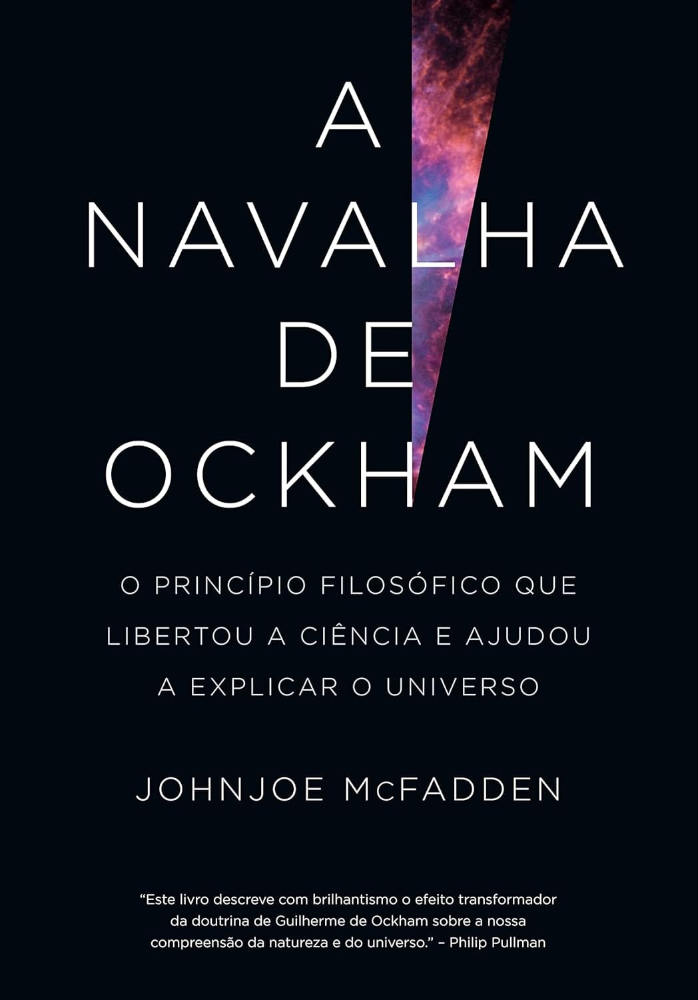

----

A navalha de Occam mostra como a simplicidade teve e tem um papel muito importante no desenvolvimento da Ciência. Quando complicamos demais uma explicação ou uma solução, devemos retirar e cortar o desnecessário até chegarmos a uma ideia simples.

> É inútil fazer com mais aquilo que pode ser feito com menos.

O livro divide-se contando um pouco do contexto histórico da Idade Média, nas crenças e no modo de pensar predominante naquela época. Trouxe-me algumas informações novas que eu não conhecia, como, por exemplo, a forma como os eruditos católicos uniram os universais de Aristóteles e o silogismo ao dogma cristão. Com sua navalha, Ockham retirou a Igreja do posto de 'A Rainha das Ciências'.

> \[...\]Segundo ele, a existência de Deus era uma certeza, mas a ciência só pode consistir em hipóteses. A ciência, conforme sustentava Guilherme, produz probabilidades, não provas.

Outra informação interessante que acabei encontrando foi que, de uma forma ou de outra, os árabes acabaram influenciando o início do Renascimento, já que durante muitos séculos a Europa havia 'esquecido' e perdido acesso a boa parte do conhecimento antigo. Foi através da tradução de filósofos antigos para o árabe que a Europa pôde superar a estagnação.

Por mais que algumas partes tenham sido um pouco cansativas, o livro é realmente bastante interessante do ponto de vista histórico e também uma forma interessante de divulgar a ciência. Recomendo.