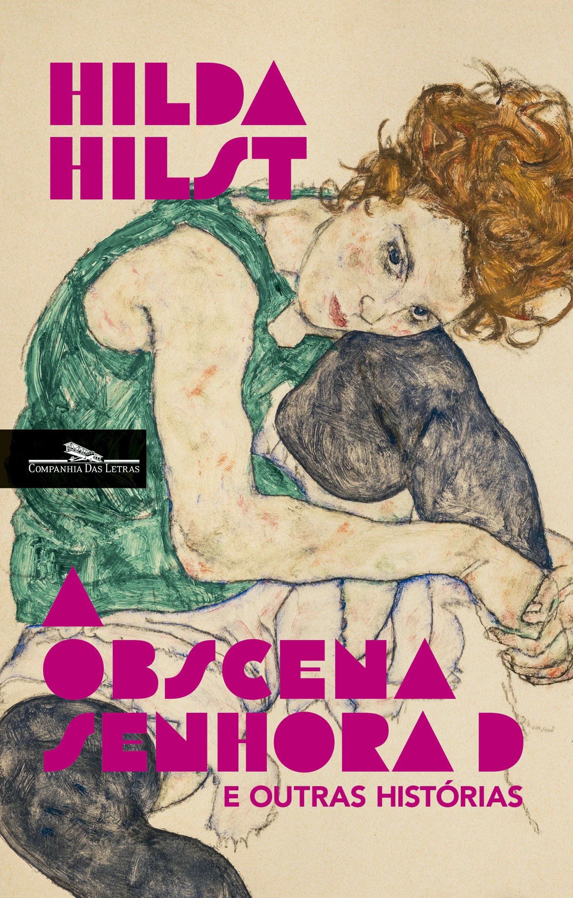

>Prosa escolhida de Hilda Hilst, uma das maiores escritoras de língua portuguesa, e que é também um ícone de liberdade e transgressão.Uma obra provocadora e profundamente crua, muitas vezes tomada como imoral, que rompeu cânones literários e expandiu horizontes.

Esse livro é uma coletânea com algumas das principais histórias de Hilda Hilst. Nunca a havia lido antes, então este é meu primeiro contato com a autora.

**21 de Janeiro**: Terminei a história que dá nome ao livro. É interessante, mas muito confusa. Acredito que isso se deva, principalmente, à tentativa de transmitir a instabilidade mental da personagem, a Senhora D. Ela é uma viúva que não conseguiu superar o luto. Vive embaixo da escada de sua própria casa, parece realmente louca, tem visões do falecido, relembra sua vida, não sai de casa, não cuida de sua higiene pessoal, incomoda a vizinhança e acaba sendo vista como "a louca da rua". Hilda consegue, de fato, transmitir a confusão mental da personagem, mas, honestamente, essa abordagem é muito fora da caixa para o meu gosto. Não entendi muita coisa e, sinceramente, não pretendo reler essa história. Voltarei para falar sobre o restante do livro.

**25 de Janeiro**: Abandonei o livro quando estava pouco mais da metade. Não é para mim. Imagino que realmente não seja para qualquer um: são histórias não lineares, que normalmente seguem o fluxo do estado mental do personagem – portanto, passado, presente e futuro se misturam em algumas sentenças. Além disso, a temática trata de assuntos normalmente indizíveis, quase tabu. Como na história do livro "O caderno rosa de Lori Lamby", que é estruturado como o diário de uma jovem de oito anos, Lori Lamby, que descreve de maneira inocente e, ao mesmo tempo, chocante, situações de abuso e exploração sexual, inclusive de forma bem explícita. Sem dúvida, muitas pessoas não conseguiriam digerir isso. Normalmente, não tenho problema com esse tipo de abordagem, mas o estilo da autora, repleto de simbolismos, sua escrita peculiar e os temas – para mim – abordados de uma forma não tão interessante, me fizeram desistir.

Sem dúvida, há muita originalidade ali, mas acho que não sou o público-alvo. Quem sabe daqui a alguns anos.