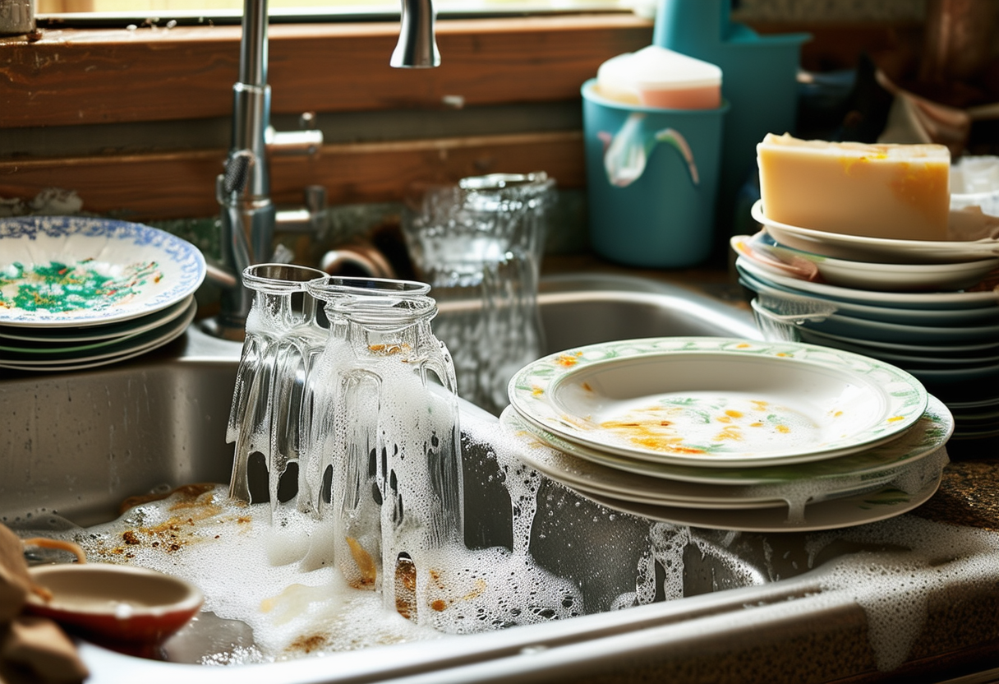

----

A vida é como lavar louças.

Sem energia no fim do dia, você vê uma pilha de louças a serem lavadas e pensa: "Nem fudendo que eu vou lavar isso tudo!" É desanimador, assim como qualquer problema ou desafio a ser superado na vida.

Mas lavar louças é o tipo de coisa que tem de ser feita. Chega uma hora em que você não consegue mais adiar e tem que encarar o problema. Então você começa, sem vontade, às vezes sem fibra nenhuma, lamentando a pilha que espera ser lavada.

Acontece que, uma vez começado, a pilha começa a diminuir e chega um momento em que você percebe que o desafio é superável, e que a cada prato lavado, você se aproxima mais e mais de uma pia completamente limpa, agradável aos olhos até.

Então você termina. Todas as louças na pia estão limpas, a própria pia está limpa, agora livre de água, sabão e sujeira. É realmente satisfatório.

Entretanto, assim como na vida, lavar louças de vez em quando tem suas surpresas. Você abre o forno ou o micro-ondas e lá dentro há algumas panelas com restos de comida, prontas para serem lavadas. E você pensa: "Nem fudendo que eu vou lavar isso tudo!"

Assim, a vida nos ensina que sempre haverá novos desafios, mas cada um deles é superável, um prato de cada vez.