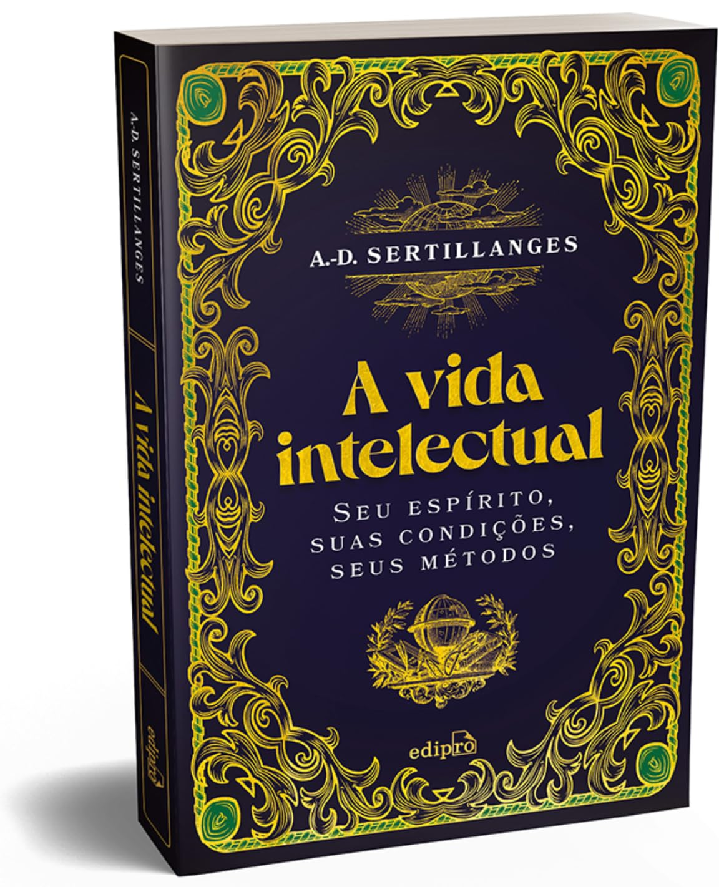

A Vida Intelectual foi uma leitura bastante recomendada em vários lugares  como Twitter, páginas na Internet, vídeos do Youtube. No entanto, minha experiência com a leitura foi decepcionante.

Antes mesmo de começar, eu já estava ciente do teor religioso do livro, uma vez que o autor era um sacerdote. Mesmo assim, abri o livro com a mente aberta, esperando obter insights valiosos. No entanto, deparei-me com ideias que, em grande parte, parecem ser apenas opiniões do autor, que refletem uma perspectiva cristã. Não tenho a intenção de usar o termo de forma pejorativa, mas acredito que a leitura pode ser mais proveitosa para aqueles que compartilham da mesma fé, dado que o autor frequentemente mistura a religião com a ciência. Ele faz isso ao parafrasear frequentemente Tomás de Aquino, o qual via a Igreja ou o dogma católico como a "Mãe de todas as Ciências", mais informações podem ser encontradas sobre em [A Navalha de Ochham](a-navalha-de-ockham-o-principio-filosofico-que-libertou-a-ciencia-e-ajudou-a-explicar-o-universo).

Algumas afirmações, como "não procurar o conhecimento vão", "os gênios não saem para jantar" e a sugestão de que "a mulher deve esposar a carreira de seu marido", são expressas de maneira que permite diversas interpretações duvidosas. Na minha perspectiva, essas afirmações refletem mais a opinião pessoal do autor do que verdades universais.

Há também algumas ideias que, embora óbvias para mim, são mencionadas, como o comprometimento com o aprendizado, a vida intelectual e a necessidade de filtrar leituras ("ler menos"), especialmente em um mundo moderno saturado de informações.

Novamente, talvez para um cristão, esta seja uma leitura valiosa, mas para mim, parece excessivamente dogmática. Não recomendo a menos que você compartilhe da mesma fé, e mesmo assim, com ressalvas.