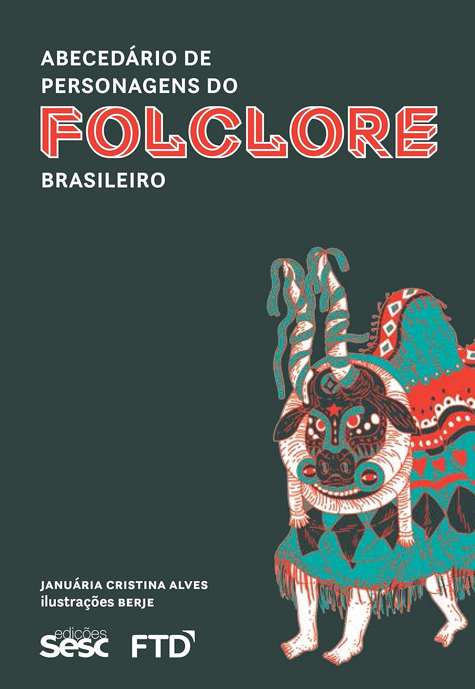

> Este livro reúne 141 personagens significativas e recorrentes do nosso folclore, com um recorte que busca contemplar a diversidade de origens – indígena, africana, europeia e oriental – como elemento constituinte da cultura brasileira. São humanos, bichos e seres fantásticos, que convivem e se misturam nas histórias populares. Cada personagem é apresentada em forma de verbete ilustrado, que descreve suas características físicas e psicológicas, sua origem e as narrativas em que aparece. O texto ainda faz a relação cultural e literária com outras fontes da bibliografia. As ilustrações ressaltam os traços físicos e de caráter ou mostram determinada situação da aventura folclórica do ser mítico.

É bastante interessante notar que muito do que achamos ser o folclore "brasileiro" tem influência não só indígena, mas também europeia, africana e até mesmo árabe. Por causa disso, já vi pessoas defenderem que não há um folclore brasileiro, o que considero um argumento equivocado!

Que importância tem o fato de o mito do lobisomem ter sido importado de outros países? Ou que o mito do Chupa-Cabra tenha surgido primeiro em Porto Rico? A beleza do folclore está justamente nas histórias que são contadas, transmitidas de geração em geração e adaptadas ao longo do tempo e conforme a região em que são narradas.

Para mim, o Saci-Pererê é um personagem genuinamente brasileiro, na medida em que passou por transformações regionais que lhe conferiram um caráter único e especial. Não me importa que existam paralelos com personagens ancestrais na Europa ou na África — como indicam os registros históricos. A própria noção de Saci no Brasil — e na América do Sul — não é uniforme. Existem muitas descrições desse personagem: o Saci, o Saci-Perê, o Saci-Sêrêrê, o Saci-Taterê, o Iaci-Íaterê — este último no Paraguai. Em alguns lugares, ele é descrito com mãos furadas, como o _Fradinho da Mão Furada_ em Portugal; em outros, ele tem duas pernas, ou apenas uma; em outros, é peludo, pelado, ou até mesmo um chupador de sangue. A cultura não é estática, e ainda bem que não é!

Além disso, ser brasileiro significa aceitar que somos uma nação de origem multicultural. Por isso, vemos mitos que têm características indígenas, africanas e europeias. Eu acho isso incrível!

> É preciso  lembrar que um dos legados mais importantes de uma nação é sua memória ficcional; nela encontramos suas origens culturais.

Um personagem interessante que merece menção é a figura de _Pai João_, que não lembro de ter conhecido nem na escola, nem na literatura. Retratado como um preto velho, de cabelos brancos e encaracolados, "pitando" um cachimbo, ele é descrito no livro como um personagem presente no Brasil da escravidão, nos engenhos, nas minas de ouro e nas plantações. Simboliza a opressão branca sobre os negros, que, nesse contexto, se curvam a essa situação, convivendo com ela com certa sabedoria e uma discreta revolta.

Copio aqui a cantiga _"Lundu de Pai João"_, que me impressionou muito quando li:

```
Quando iô tava na minha tera  
Iô chamava capitão  
Chega na tera dim baranco,  
Iô me chama – Pai João.

Quando iô tava na minha tera  
Comia minha garinha,  
Chega na tera dim baranco  
Cárne sêca co farinha.

Quando iô tava na minha tera  
Iô chamava generá,  
Chega na tera dim baranco  
Pega o cêto vai ganhá.

Dizofôro dim baranco  
Nó si póri aturá,  
Tá comendo, tá... drumindo.  
Manda nego trabaiá.

Baranco – dize quando môre  
Jesuchrisso que levou,  
E o pretinho quando môre  
Foi cachaxa que matou.

Qunado baranco vai na venda
Logo dizi tá 'squentáro,
Nosso preto vai na venda,
Acho copo tá viráro.

Baranco dize – preto fruta,  
Preto fruta co rezão;  
Sinhô baranco também fruta  
Quando panha casião.

Nosso preto fruta garinha  
Fruta sacco de fuijão;  
Sinhô baranco quando fruta  
Fruta prata e patacão.

Nosso preto quando fruta  
Vai pará na coreção,  
Sinhô baranco quando fruta  
Logo sai sinhô barão.

```

Note que as palavras estão grafadas para imitar a fala de um africano que ainda mal domina a língua portuguesa — à moda de um preto velho. Trata-se de uma crítica contundente à sociedade, que continua muito atual.

Daí a importância de obras como essa, que buscam resgatar personagens esquecidos do nosso folclore e, ao mesmo tempo, apresentar figuras modernas, mesmo que, até então, só existam em uma pequena cidade do interior de Pernambuco ou sobrevivam nas grandes cidades na forma de lendas urbanas, como a Loira do Banheiro e a Mulher de Vermelho.

O folclore é notadamente o retrato de um povo e de sua cultura e, por isso, relevante para a educação.  Foi uma boa leitura!