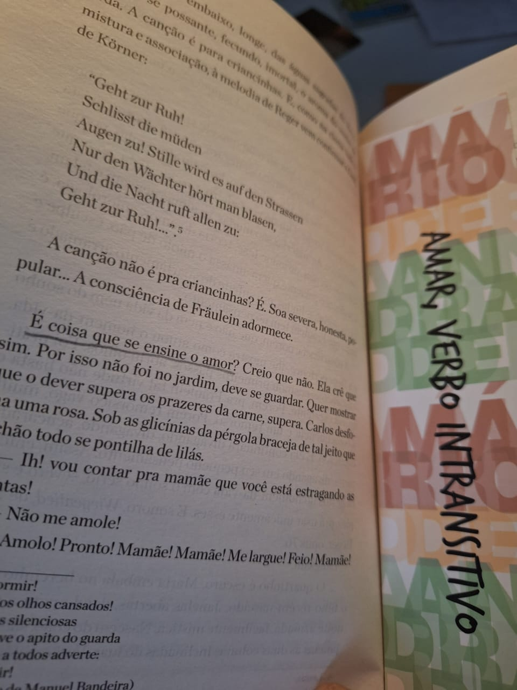

## "É coisa que se ensine o amor?"

Na história, Souza Costa, chefe de uma rica família tradicional brasileira, contrata Elza, uma alemã de 35 anos, para ser a nova governanta de sua casa e, secretamente, iniciar seu filho adolescente, Carlos, na sexualidade, com o objetivo de amadurecer o rapaz e protegê-lo de aventureiras e golpistas. Um tema bastante polêmico e tabu, numa época em que era comum (ou pelo menos, até pouco tempo atrás, ainda era) os pais contratarem prostitutas para iniciarem seus filhos.

Não considero que seja um livro pornográfico ou imoral. Sim, estamos falando de uma mulher de 35 anos seduzindo um jovem de 15 anos. Foi um escândalo na época, e acredito que cumpriu seu propósito ao desafiar os mais conservadores e trazer à tona os tabus da sociedade da época, da mesma forma que Nelson Rodrigues fez brilhantemente em várias de suas obras.

Além disso, o livro não descreve cenas sexuais explícitas nem possui diálogos ao estilo de "Cinquenta Tons de Cinza". Grande parte do que é sugerido é subliminar, como quando Elza faz o jovem ler um lied alemão de Heine, com o intuito implícito de seduzi-lo:

```
Vem, linda peixeirinha,
Trégua aos anzóis e aos remos!
Senta-te aqui comigo,
Mãos dadas conversemos.

Inclina a cabecinha
E não temas assim:
Não te fias do oceano?
Pois fia-te de mim!

Minha'alma, como o oceano,
Tem tufões, correntezas,
E muitas lindas pérolas
Jazem nas profundezas.

> Lied de Heine, tradução de Manuel Bandeira
```


Enquanto Souza Costa pensa estar apenas contratando uma prostituta para a primeira experiência sexual do filho, não subestime Elza. Ela é uma alemã orgulhosa, exilada de sua terra natal, mas que sonha em voltar e se casar com um alemão tradicional, após juntar economias suficientes. Elza tem orgulho de sua tarefa, pois acredita que é uma das mais importantes: ensinar o amor.

> Nenhuma faceirice por enquanto. no princípio tinha de ser simples. Simples e insexual. O amor nasce das excelências interiores. Espirituais, pensava. o desejo depois.

Ao contrário do que o título do livro sugere, o amor não é um verbo intransitivo, mas transitivo, pois exige complemento para fazer sentido. Se eu amo, eu amo algo: "Eu amo a vida", "Eu amo caminhar", "Eu amo boa companhia". 

Talvez Mário de Andrade quisesse nos levar a refletir sobre não apenas o papel e a construção do amor, mas também o papel da língua, da prosa e da cultura da sociedade brasileira da época. Talvez esse fosse o objetivo, considerando o contexto da publicação, logo após a **Semana de Arte Moderna**.

> Se você ama, ou por outra se já deseja no amor, pronuncie baixinho o nome desejado. Veja como ele se moja em formas transmissoras do encosto que enlanguesce. Esse ou essa que você ama, se torna assim maior, mais poderoso. E se apodera de você. Homens, mulheres, fortes, fracos... Se apodera.

## "Esta nossa educação brasileira..."

_"Esta nossa educação brasileira..."_ é a frase que lemos logo na primeira página, sugerindo já uma reflexão sobre o que significa ser brasileiro. Esse é um ponto forte do livro, que busca construir ou revelar uma identidade brasileira, frequentemente fazendo comparações entre os alemães e os brasileiros.

> Mas não tem dúvida: isto da vida continuar igualzinha, embora nova e diversa, é um mal. Mal de alemães. O alemão não tem escapadas nem imprevistos. A surpresa, o inédito da vida, é pra ele uma continuidade a continuar. Diante da natureza não é assim. Diante da vida é assim. Decisão. Viajaremos hoje. O latino falará: "Viajaremos hoje!". O alemão fala: "Viajaremos hoje". Ponto final. Pontos de exclamação... É preciso exclamar para que a realidade não canse...

>A aritmética nunca foi propícia aos brasileiros. Nós não somamos coisa nenhuma. Das quatro operações, unicamente uma nos atrai, a multiplicação, justo a que mais raro frequenta os sucessos deste mundo vagarento.

Através da perspectiva de Elza, surgem algumas pérolas memoráveis sobre o brasileiro, com as quais muitos concordariam, especialmente no que se refere à relação com o estudo. _"Esses brasileiros, que preguiça de estudar!"_

> Pra ela era preciso entender sempre o significado das palavras, senão não compreendia mesmo. Estes brasileiros, uma preguiça de estudar![...] Porém quando careciam de saber, sabiam. Adivinhavam. 

## Conclusão

> Vieram correndo em busca dos amantes, os tempos de intimidade. A gente nem respira e a vida já fica tão de ontem! É esquisito: o amor realizado se torna logo parecido com amizade.

Foi interessante acompanhar o desfecho do relacionamento entre Elza e o jovem Carlos. Cheguei a pensar que terminaria como _"Os Sofrimentos do Jovem Werther"_, de forma trágica e alemã, mas não. O caso serviu para que o garoto amadurecesse e se tornasse um homem, não sem antes causar tumulto e derramar muitas lágrimas, como era esperado.

> A felicidade é tão oposta à vida que, estando nela, a gente esquece que vive. Depois, quando acaba, dure pouco, dure muito, fica apenas aquela impressão do segundo. Nem isso, impressão de hiato, de defeito de sintaxe logo corrigido, vertigem em que ninguém dá tanto de si.

É interessante a reflexão de que, no fim, isso apenas acelerou o que aconteceria de qualquer forma, mais cedo ou mais tarde. Ou seja, Carlos amadureceria, com ou sem Elza.

Enfim, eu realmente gostei do texto, que com certeza está cheio de passagens memoráveis sobre o espírito brasileiro e, sobretudo, sobre a vida e o amor.
