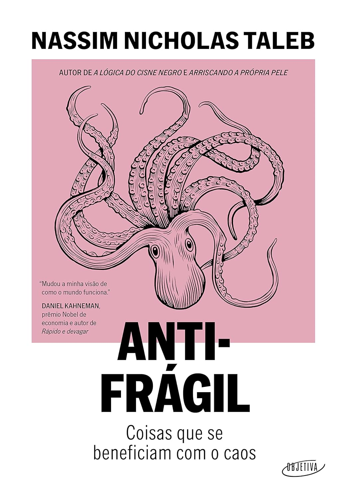

> Do autor dos best-sellers _A lógica do Cisne Negro_ e _Arriscando a própria pele_, _Antifrágil_ revela como prosperar em um mundo de incertezas. Extremamente ambicioso e multidisciplinar, Antifrágil é sobre como se comportar ― e prosperar ― em um mundo cheio de imprevistos. Erudita e espirituosa, a mensagem de Taleb é revolucionária: o que não é antifrágil certamente sucumbirá.

Essa leitura eu deixei em banho-maria por um mês, até finalmente desistir. A ideia é boa: se beneficiar do caos, estar preparado ou se colocar numa posição em que você se beneficie da aleatoriedade futura. Mas poderia ser um artigo de blog — achei cansativo, chato e repetitivo. Não é para mim, mas provavelmente é para muita gente. A vida é curta demais para insistir numa leitura que não está interessante, então finalmente abandonei. Quem sabe daqui a uns anos eu volte a ele.