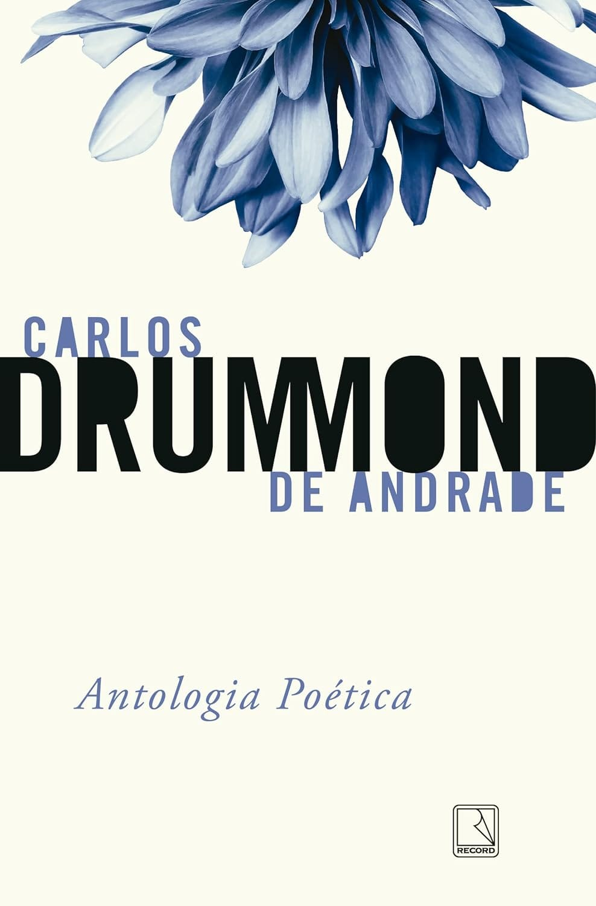

---


Carlos Drummond dispensa apresentações, então vamos direto ao ponto. 'Antologia Poética' é dividida em alguns tópicos que conferem coesão e unidade aos poemas: 1) O indivíduo; 2) A terra natal; 3) A família; 4) Amigos; 5) O choque social; 6) O conhecimento amoroso; 7) A própria poesia; 8) Exercícios lúdicos; 9) Uma visão, ou tentativa de, da existência.

Confesso que nem tudo foi de fácil digestão; certas poesias não me desceram bem. Talvez, em uma próxima releitura, me caiam melhor em outro estado de espírito. Felizmente, o saldo final de toda a leitura foi muito positivo. Recomendo muito esta leitura!

Abaixo, algumas marcações de versos notáveis que chamaram a minha atenção:

### Poema de Sete Faces

```
Mundo mundo vasto mundo,
se eu chamasse Raimundo
seria uma rima, não seria uma solução.
Mundo mundo vasto mundo,
mais vasto é meu coração.

```


```
Eu não devia te dizer
mas essa lua
mas esse conhaque
botam a gente comovido como o diabo.

```


### A Bruxa

```
Tenho tanta palavra meiga,
conheço vozes de bichos,
sei os beijos mais violentos,
viajei, briguei, aprendi.
Estou cercado de olhos,
de mãos, afetos, procuras.
Mas se tento comunicar-me,
o que há é apenas a noite
e uma espantosa solidão.

```


### José

```
E agora, José?
A festa acabou,
a luz apagou,
o povo sumiu,
a noite efriou,
e agora, José?
e agora, você?
você que é sem nome,
que zomba dos outros,
você que faz versos,
que ama, protesta?
e agora, José?

```


### A Flor e a Náusea

```
Em vão me tento explicar, os muros são surdos.
Sob a pele das palavras há cifras e códigos.
O sol consola os doentes e não os renova.
As coisas. Que tristes são as coisas, consideradas sem ênfase.

```


### O amor bate na aorta

```
Essa ferida, meu bem,
às vezes não sara nunca
às vezes sara amanhã.

```


### Não se mate[^1]

```
Carlos, sossegue, o amor
é isso que você está vendo:
hoje beija, amanhã não beija,
depois de amanhã é domingo
e segunda-feira ninguém sabe
o que será.

```


```
O amor no escuro, não, no claro,
é sempre triste, meu filho, Carlos,
mas não diga nada a ninguém,
ninguém sabe nem saberá.

```


### Canção para álbum de moça

```
Bom dia sempre: se acaso
a resposta vier fria
ou tarde vier, contudo
esperarei o bom dia.

```


### Cantiga de enganar

```
O mundo,
    meu bem,
        não vale
a pena, e a face serena
vale a face torturada.
Há muito aprendi a rir,
de quê, de mim? ou de nada?
O mundo, valer não vale.

```

---
[^1]: Minha interpretação sobre esse poema: [Não se mate](nao-se-mate-carlos-drummond-de-andrade)