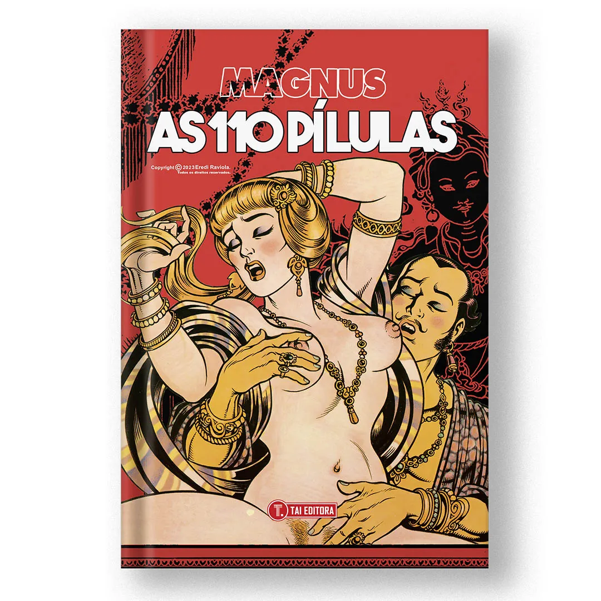

----

> Uma obra-prima erótica de Magnus. As 110 Pílulas é uma reinterpretação audaciosa do clássico erótico chinês Jin Ping Mei, lançando luz sobre a saga de Hsi-Men Ching, um farmacêutico abastado que se vê enredado em uma trama de paixão, poder e desespero ao receber um afrodisíaco poderoso de um monge ancião. As interações com suas seis esposas, marcadas por uma atração magnética e conflitos crescentes, especialmente com a resoluta Madame Lua, delineiam um panorama intricado de amor, desejo e a inevitabilidade da perdição humana. A narrativa, destacando a maestria artística de Magnus, revela uma saga erótica que oscila entre o sublime e o profano, proporcionando uma leitura estimulante e visualmente arrebatadora.

Não é pra todo mundo, muito menos para aqueles puristas. Ao contrário do que possa parecer, não é apenas explicito, e o conto adaptado é realmente bastante interessante. Não conheço o clássico original chinês, mas essa adaptação não deixou a desejar em nada.