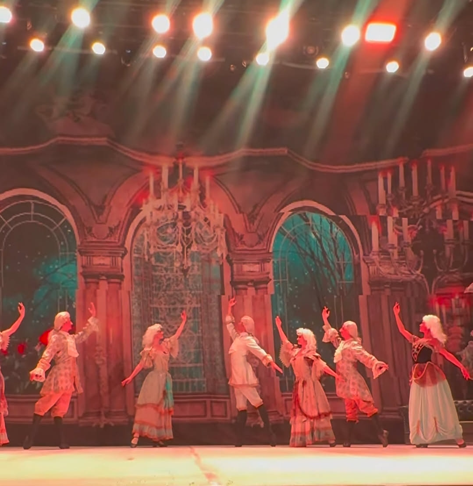

Na última sexta, dia 28, tive o prazer de ver **O Quebra-Nozes**, apresentado pelo Ballet Clássico de São Petersburgo. Foi realmente incrível! Consegui um lugar privilegiado, bem em frente e ao centro do palco, na segunda fileira. Valeu cada centavo.

A coreografia é fiel à tradição russa, lembrando muitas outras apresentações que podemos ver no YouTube. O cenário, apesar de simples, não prejudicou a imersão. Como sabemos, _O Quebra-Nozes_ é um clássico natalino de Tchaikovsky, que acompanha a festa de Natal de Clara até o Reino dos Doces. A apresentação ainda contou com a presença de Alexander Volchkov, convidado de prestígio internacional.

Já faz um tempo que tive uma sacada para eventos ao vivo. Não gravo, não tiro fotos, não filmo. Percebi que não há sentido em perder parte do show para registrar algo que não ficará tão bom em uma câmera limitada, numa posição não tão favorável. Então, sempre depois da apresentação, vou às mídias sociais oficiais do evento e pego as recordações, essas sim feitas por profissionais. Bem melhor. Abaixo seguem os registros publicados no Instagram do OhArtes.

<figure class="video">  
  
  
    <video controls preload="metadata" width="100%">
			  <source src="img/ballet-classico-de-sao-petersburgo-apresenta-o-quebra-nozes/o-quebra-nozes-01.mp4" type="video/mp4">
			  Seu navegador não suporta vídeo.
		</video>
  

  <figcaption>O quebra-nozes - O ínicio</figcaption>  
</figure>

<figure class="video">  
  
  
    <video controls preload="metadata" width="100%">
			  <source src="img/ballet-classico-de-sao-petersburgo-apresenta-o-quebra-nozes/o-quebra-nozes-02.mp4" type="video/mp4">
			  Seu navegador não suporta vídeo.
		</video>
  

  <figcaption>O quebra-nozes - a festa natalina</figcaption>  
</figure>

<figure class="video">  
  
  
    <video controls preload="metadata" width="100%">
			  <source src="img/ballet-classico-de-sao-petersburgo-apresenta-o-quebra-nozes/o-quebra-nozes-03.mp4" type="video/mp4">
			  Seu navegador não suporta vídeo.
		</video>
  

  <figcaption>O quebra-nozes - os presentes</figcaption>  
</figure>

<figure class="video">  
  
  
    <video controls preload="metadata" width="100%">
			  <source src="img/ballet-classico-de-sao-petersburgo-apresenta-o-quebra-nozes/o-quebra-nozes-04.mp4" type="video/mp4">
			  Seu navegador não suporta vídeo.
		</video>
  

  <figcaption>O quebra-nozes - atacada por ratos</figcaption>  
</figure>

<figure class="video">  
  
  
    <video controls preload="metadata" width="100%">
			  <source src="img/ballet-classico-de-sao-petersburgo-apresenta-o-quebra-nozes/o-quebra-nozes-05.mp4" type="video/mp4">
			  Seu navegador não suporta vídeo.
		</video>
  

  <figcaption>O quebra-nozes - salva</figcaption>  
</figure>

<figure class="video">  
  
  
    <video controls preload="metadata" width="100%">
			  <source src="img/ballet-classico-de-sao-petersburgo-apresenta-o-quebra-nozes/o-quebra-nozes-06.mp4" type="video/mp4">
			  Seu navegador não suporta vídeo.
		</video>
  

  <figcaption>O quebra-nozes - o ínicio da viagem</figcaption>  
</figure>

<figure class="video">  
  
  
    <video controls preload="metadata" width="100%">
			  <source src="img/ballet-classico-de-sao-petersburgo-apresenta-o-quebra-nozes/o-quebra-nozes-07.mp4" type="video/mp4">
			  Seu navegador não suporta vídeo.
		</video>
  

  <figcaption>O quebra-nozes - lugares maravilhosos</figcaption>  
</figure>

<figure class="video">  
  
  
    <video controls preload="metadata" width="100%">
			  <source src="img/ballet-classico-de-sao-petersburgo-apresenta-o-quebra-nozes/o-quebra-nozes-08.mp4" type="video/mp4">
			  Seu navegador não suporta vídeo.
		</video>
  

  <figcaption>O quebra-nozes - dança do café</figcaption>  
</figure>

<figure class="video">  
  
  
    <video controls preload="metadata" width="100%">
			  <source src="img/ballet-classico-de-sao-petersburgo-apresenta-o-quebra-nozes/o-quebra-nozes-09.mp4" type="video/mp4">
			  Seu navegador não suporta vídeo.
		</video>
  

  <figcaption>O quebra-nozes - mais lugares exóticos</figcaption>  
</figure>

<figure class="video">  
  
  
    <video controls preload="metadata" width="100%">
			  <source src="img/ballet-classico-de-sao-petersburgo-apresenta-o-quebra-nozes/o-quebra-nozes-10.mp4" type="video/mp4">
			  Seu navegador não suporta vídeo.
		</video>
  

  <figcaption>O quebra-nozes - um belo sonho</figcaption>  
</figure>

<figure class="video">  
  
  
    <video controls preload="metadata" width="100%">
			  <source src="img/ballet-classico-de-sao-petersburgo-apresenta-o-quebra-nozes/o-quebra-nozes-11.mp4" type="video/mp4">
			  Seu navegador não suporta vídeo.
		</video>
  

  <figcaption>O quebra-nozes - fim</figcaption>  
</figure>