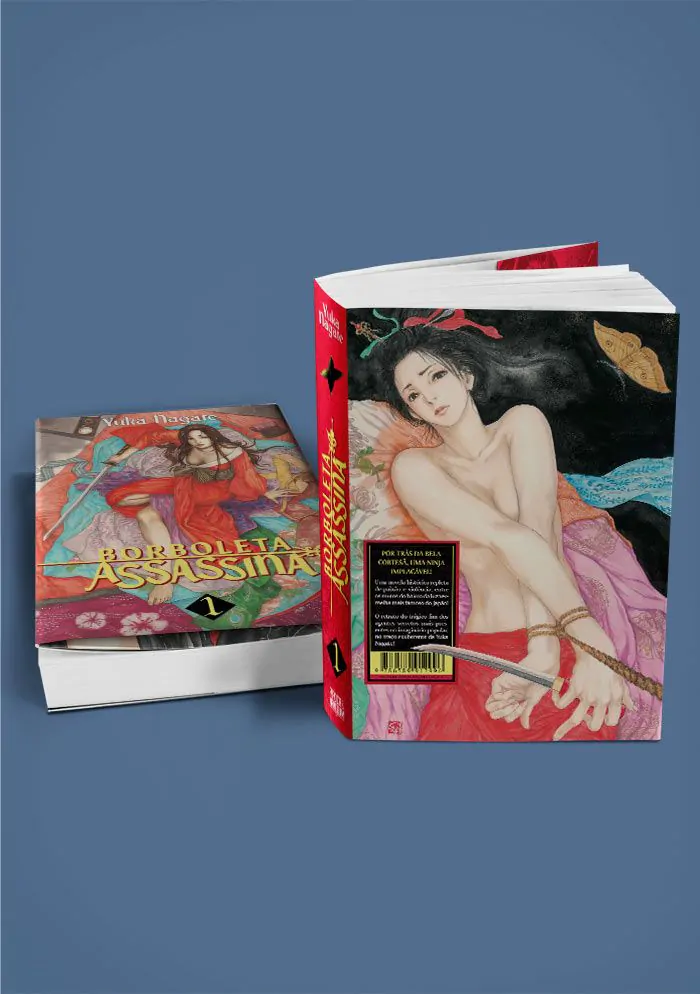

> Yoshiwara, o famoso bairro da luz vermelha no Japão, é o lar de Kochou, cortesã de luxo que brilha por onde passa... mas, nas sombras, assume a identidade de Ochou, uma shinobi (ou ninja) cuja missão é caçar antigos companheiros renegados...

Me lembra muito _Blade - A Lâmina do Imortal_, que, inclusive, preciso reler, mas é menos brutal. Não tenho muito a acrescentar: a arte é linda, a mangaká tem um traço suave, e a trama, apesar de ser do tipo episódica, é muito boa. Recomendo!