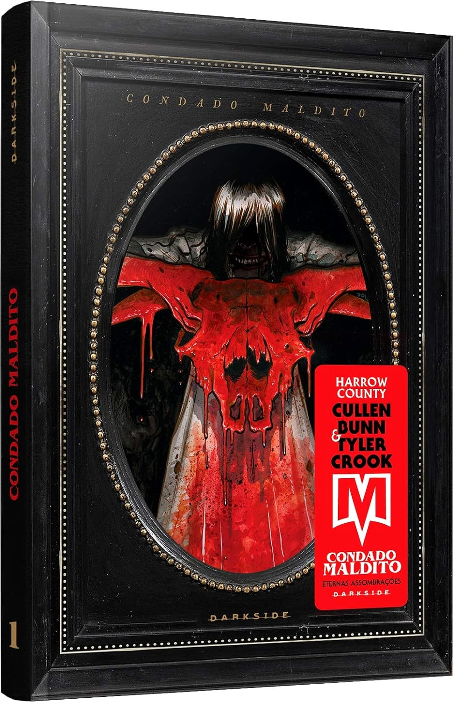

> Emmy sempre soube que a floresta ao redor de sua casa estava cheia de fantasmas e monstros. No entanto, na véspera de seu aniversário de dezoito anos ela descobre que está conectada a essas criaturas ― e à própria terra ― de uma maneira que não imaginava ser possível. Aguarde na sombra do carvalho retorcido e ouça o balido das cabras. Condado Maldito: Bruxas & Assombrações é o primeiro de uma série de oito volumes a ser publicada pela DarkSide Books em parceria com a Macabra Filmes ao longo dos próximos meses, e chega para os leitores em uma edição assombrosa e com um tratamento especial de tirar o fôlego. Você está pronto para ver os cordeiros virarem lobos?

Adoro o gênero de terror e horror e esse quadrinho foi bastante envolvente e com uma ótima ambientação na arte. Me deixou com altas expectativas para os próximos volumes. Recomendo.