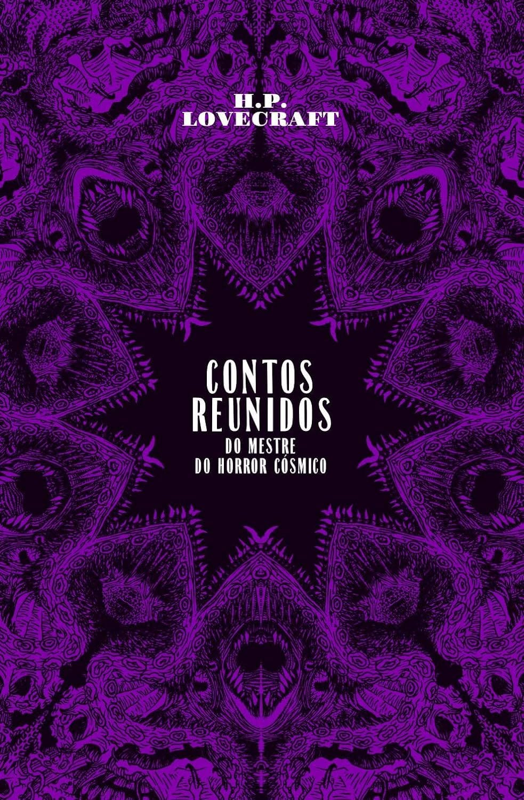

Quase três meses se passaram,e essa foi uma longa e lenta leitura!

Não li de forma estritamente diária, mas sim quando estava mentalmente predisposto.  Os melhores contos, a meu ver, são os mais famosos sem dúvida, como os destacados abaixo. 

> O gênero que Lovecraft revolucionou em sua breve carreira foi o que ele próprio denominava weird fiction (ficção insólita). Lovecraft expressou em uma carta: "O cerne de uma narrativa insólita é algo que não poderia de forma alguma acontecer".

### Dagon

Li o primeiro conto, "Dagon". A história é sobre um personagem que é capturado em seu navio pelos nazistas durante a Primeira Grande Guerra Mundial. De alguma forma, ele consegue fugir do cárcere em um barco, levando consigo mantimentos.

À deriva por vários dias, ele acaba atolado em uma espécie de ilha, ou melhor, em um grande monte de terra, que parece ter emergido do fundo do mar. Pela forma que Lovecraft descreve o local e o estranhamento do personagem, é como se ele estivesse em outra dimensão: uma paisagem de céus negros com um grande monte de terra emergido, envolto por lodo e carcaças de criaturas aquáticas mortas.

O personagem decide, então, investigar o terreno em busca de ajuda. Passam-se dias e, desde o início, ele sabe que aquele não é um local normal, tendo até muitos pesadelos durante sua incursão. Finalmente, ele encontra desenhos e hieróglifos de criaturas estranhas, muitas desenhadas com corpos de hominídeos com cabeças de peixe. Então, ele vê uma criatura monstruosa.

Os últimos trechos, onde o personagem conta como foi sua fuga da ilha, conseguiram ilustrar a situação de degradação mental e progressiva loucura em que se encontrava de uma forma bastante realista.

> De minha frenética ascensão pela escarpa e os rochedos e de minha delirante jornada de volta ao barco encalhado, lembro-me pouco. Parece-me que cantei intensamente e gargalhei de maneira estranha quando não pude mais cantar. Tenho recordações indistintas de uma grande tempestade algum tempo depois que alcancei o bote; seja como for, sei que ouvi o ribombar de trovões e outros sons que a Natureza só profere em seus humores mais enfurecidos.

O final do conto é exatamente o que eu imagino de algo no mundo de Lovecraft: o Horror Cósmico, forças estranhas e inimagináveis andam e se arrastam pelo mundo, e ter ciência disso é um horror grandioso e impossível de carregar sem perder a sanidade.

### O Depoimento de Randolph Carter

Harley Warren desapareceu, e é por Randolph Carter, a última pessoa a tê-lo visto, em seu depoimento à polícia, que temos as pistas do que pode ter acontecido. Essa história me fez lembrar do ditado "a curiosidade matou o gato".

> Alucinação ou pesadelo, aquilo pode ter sido - alucinação ou pesadelo eu espero com fervor que tenha sido - no entanto, é tudo o que minha mente retém do que sucedeu naquelas horas chocantes depois que nos afastamos da visão dos homens."

### A Cidade Sem Nome

Um explorador descobre uma cidade enterrada no meio do deserto árabe, e nela, múmias reptilianas. ⚠️ **Sinto que devo ler este conto mais uma vez em um momento mais oportuno.**

> Foi com esse lugar que Abdu Alhazred, o poeta louco, sonhou na noite antes de ter cantado seu dístico inexplicável:  
> "**Não está morto o que na eternidade jaz, ao longo de éons mesmo a morte se desfaz.**"

### O Chamado de Cthulhu

Ao contrário dos anteriores, até aqui, esse foi o conto mais longo, dividido em algumas partes. Aqui, conhecemos Cthulhu, uma criatura cósmica milenar que chegou à Terra muito antes do primeiro homem existir, e seu culto milenar dedicado a trazê-lo de volta, o que ocasionaria a total destruição da humanidade.

Neste contexto, R'lyeh, a cidade morada de Cthulhu, submersa, acaba por emergir parcialmente, o que parece aumentar a influência de Cthulhu sobre algumas pessoas mais sensitivas. A meu ver, essa é uma clara ligação ao conto "Dagon", onde também há um fato similar, em que uma área de terra com símbolos que remetem a algum tipo de culto também emerge, indicando que talvez seja R'lyeh.

> Vivemos numa plácida ilha de ignorância em meio a negros mares de infinitude, e não formos destinados a nos aventurar muito longe.

> Na sua morada em R'lyeh, o morto Cthulhu aguarda sonhando.

> Eles adoravam (...) os Grandes Anciões que viveram eras antes de existirem os homens, e que chegaram ao nosso mundo ainda jovens vindo do céu. Esses anciões já haviam perecido, no interior da terra e no fundo do mar; mas seus corpos mortos haviam contados seus segredos em sonhos aos primeiros homens, que formaram um culto que jamais morreu.

### O Modelo de Pickman

Esse conto foi adaptado em “O Modelo de Pickman”, episódio 5 de **_O Gabinete de Curiosidades de Guillermo Del Toro_**. Ainda não o assisti.

Ótimo conto com algumas referências aos artistas Angarola, Goya, Doré, Fuseli e outros, que revelam o gosto estético do autor em pintura. O personagem Pickman, segundo as notas do editor, é citado na 'História do Necronomicon' e em 'A busca onírica por Kadath', onde aparece transformado em ghoul. A descrição dos quadros feitos por Pickman me proporcionou um verdadeiro cenário de horror. Recomendo!

### Finalizando

Existem outros contos inacabados, póstumos, e aqueles escritos por Lovecraft em sua juventude... tornando esta, possivelmente, a compilação mais abrangente de contos curtos de Lovecraft em língua portuguesa!

Sem dúvidas, bastante recomendável!