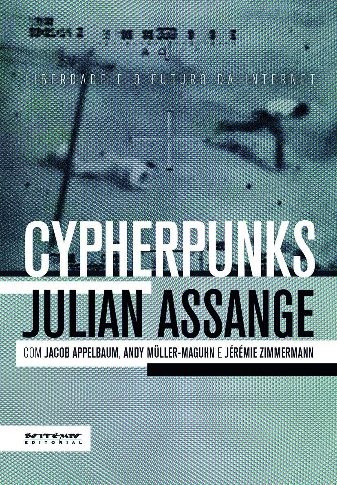

> A obra é resultado de reflexões de Assange e de um grupo vanguardista de pensadores rebeldes e ativistas que atuam nas linhas de frente da batalha em defesa do ciberespaço (Jacob Appelbaum, Andy Müller-Maguhn e Jérémie Zimmermann). A questão fundamental que o livro apresenta é: a comunicação eletrônica vai nos emancipar ou nos escravizar?Apesar de a internet ter possibilitado verdadeiras revoluções no mundo todo, Assange prevê uma futura onda de repressão na esfera on-line, a ponto de considerar a internet uma possível ameaça à civilização humana.

Surgem preocupações sobre os sistemas de vigilância que foram construídos e que estão sendo refinados cada vez mais. Nesse contexto, a solução é a criptografia. Nem toda a violência estatal do mundo pode resolver problemas matemáticos tão complexos, que demandariam séculos, milênios de poder de processamento para serem resolvidos na força bruta.

> Em geral nem chegamos a nos conscientizar de quão próximos estamos da violência, porque todos nós fazemos concessões para evitá-la.

> Nossa missão é proteger a autodeterminação onde for possível, impedir o avanço da distopia onde não for possível e, se tudo mais falhar, acelerar sua autodestruição.

> Costumávamos dizer que, com o Facebook, o usuário não é o cliente. Na verdade, o usuário do Facebook é o produto, e os verdadeiros clientes são as empresas anunciantes. Essa é a explicação menos paranoica e mais inocente do que esta acontecendo.

> É preciso reconhecer que, com a criptografia, nem toda a violência do mundo poderá resolver uma equação matemática.

Apesar de abordar temas extremamente importantes, a forma como as reflexões foram apresentadas não me agradou.

As ideias são expostas na forma de conversas entre um grupo de ativistas e Assange (fundador da *WikiLeaks*). Fiquei com a impressão de que poderia ser um vídeo, mostrando a conversa deles sobre o tema, e que a edição em livro foi um pouco desnecessária para o que foi apresentado ali.