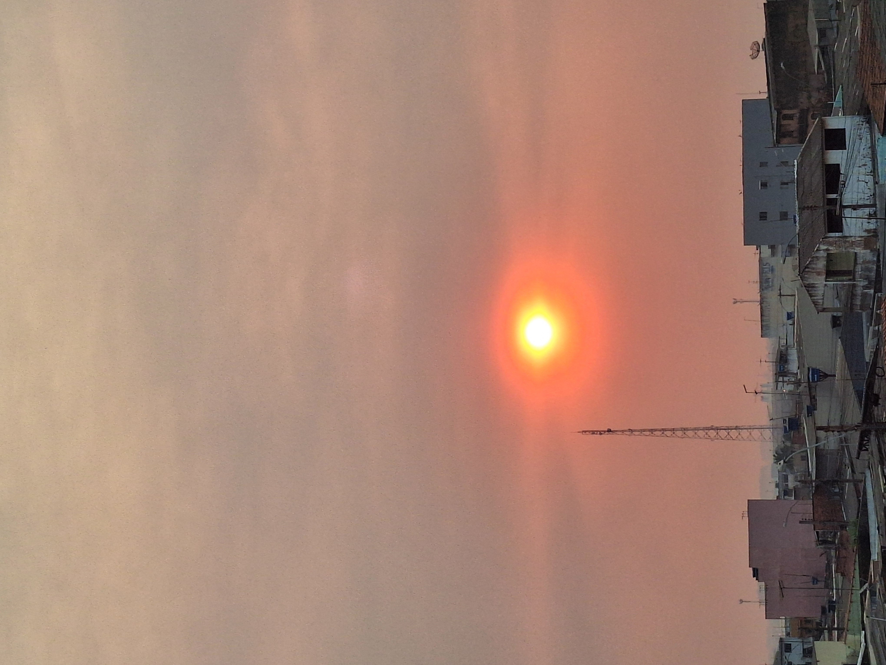

Eu estava indo bem, no total fiz 18 treinos. Já conseguia correr 7,5 km em uma hora. Eu estava realmente indo bem. Então, veio esse calor dos infernos, a terrível fumaça — sem exageros —, algo que nunca tinha visto na vida, e, por isso, parei de correr. Quebrei meu desafio.

Durante esses dias, foi frequente a luz solar ser obstruída. Frequentemente, ela assumia uma cor de aspecto alaranjado.

As fotos não conseguem mostrar o quão graves foram as queimadas e a fumaça. As ruas estavam repletas de fuligem. Aqui em casa, para se ter uma ideia, encontramos uma pena de pássaro totalmente queimada. Ao tentar pegá-la, ela se desfez na minha mão. Muito triste!

No momento em que escrevo esta publicação, foi contabilizado que a Floresta Nacional perdeu 40% de sua área por queimadas. **E elas ainda estão ocorrendo.**

Tudo isso me desanimou muito. A fumaça inviabilizou não somente a prática de atividade física, mas até mesmo saídas para ir ao mercado, por exemplo. Mesmo nos dias em que a fumaça deu uma amenizada, acabei não indo. Mas a vida tem que continuar.

Torcendo para que o pior já tenha passado, vou iniciar novamente o desafio! Então, é isso. 

Hoje vai ser meu dia 01, novamente!