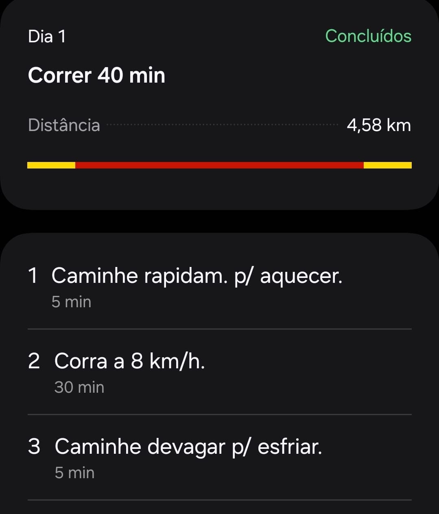
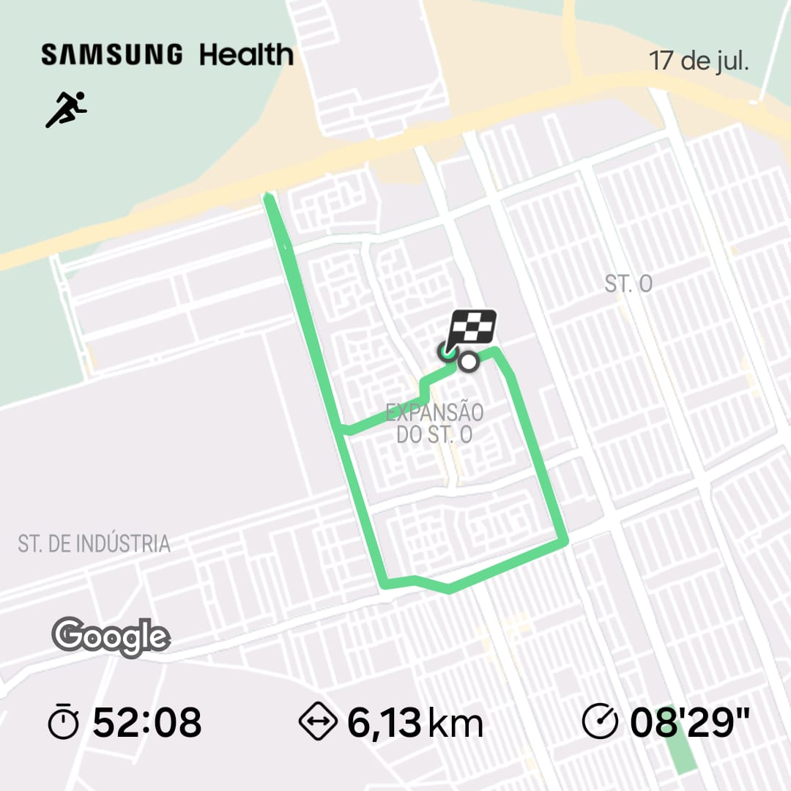
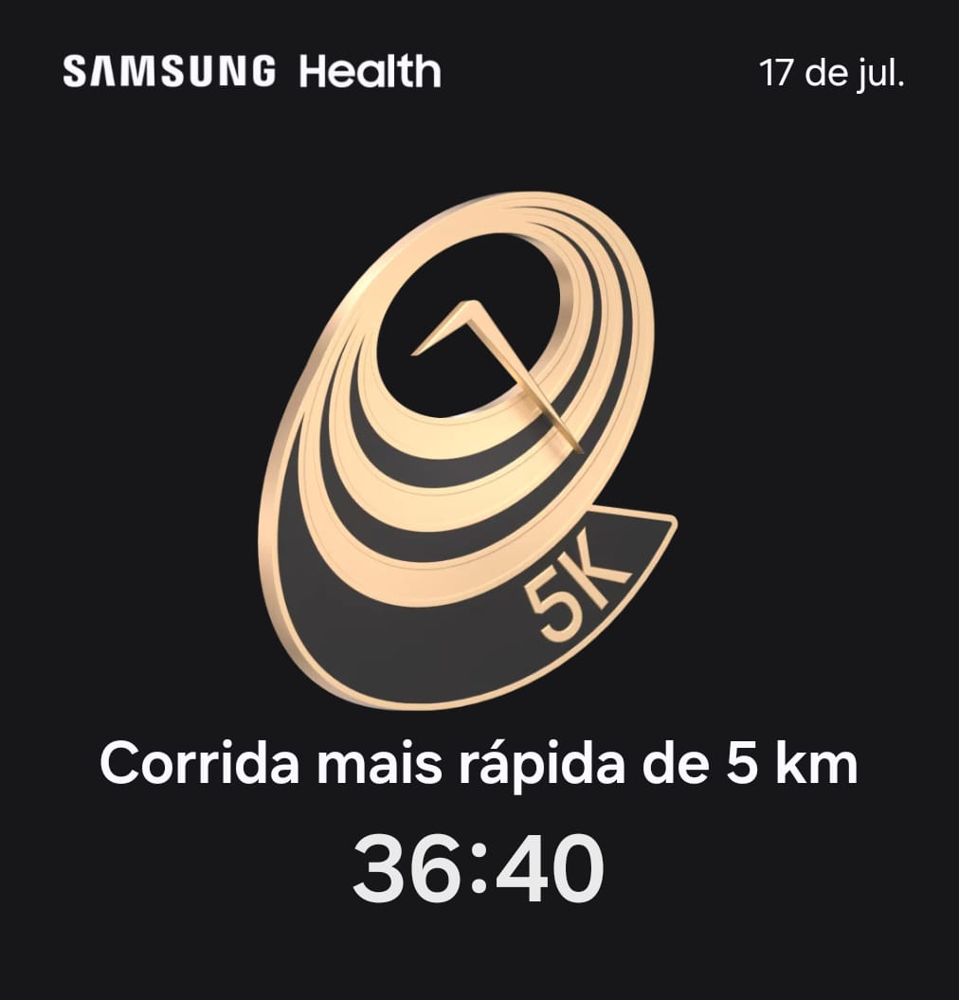

----

Resolvi voltar a correr, mas agora é sério. Quero conseguir correr 10 km direto.

Eu gosto de correr, mas a preguiça é maior que a vontade de correr. Por isso, vou registrar neste site todo o meu progresso, do 0 km até, se tudo ocorrer bem, os 10 km. Essa é uma forma que encontrei para me manter motivado e também colocar um compromisso público. Mesmo que, na prática, quase ninguém saiba desse compromisso, dado o tamanho da minha audiência. 😅

Para me ajudar a registrar os dados do meu desempenho nas corridas, vou utilizar o aplicativo Samsung Health, instalado tanto no celular quanto no meu relógio inteligente. O aplicativo tem um programa com um cronograma para ajudar a alcançar os 10 km. Segundo esse cronograma, começando de hoje até o dia 8 de setembro, treinando 3 vezes por semana, eu conseguirei correr durante 70 minutos um percurso de 10 quilômetros. Vamos ver, eu espero conseguir.

Hoje, sendo o dia 1, já tive minha primeira corrida. O objetivo era correr durante 40 minutos, um total de 4,58 km. O plano da corrida de hoje era o seguinte:

Hoje foi bem tranquilo, com um aquecimento de 5 minutos, 30 minutos correndo e, para finalizar, 5 minutos caminhando. O último quilômetro foi complicado porque peguei um terreno com uma leve inclinação, corri contra o vento e já estava com pouca energia devido à corrida. Este foi o percurso que fiz:

Foi uma boa corrida. O planejado era um percurso de 40 minutos, mas fiz pouco mais de 50 minutos. O planejado era percorrer 4 km e fiz um pouco mais de 6 km. O ritmo médio do percurso foi de 8 minutos e 29 segundos por quilômetro. Acho que peguei os últimos 10 a 15 minutos para descansar caminhando.

Eu já havia corrido 5 km antes. Não lembro ao certo, mas acho que já cheguei aos 7 km e alguma coisa. De qualquer forma, o aplicativo me deu uma conquista, a de "Corrida mais rápida de 5 km" com o tempo de 36:40.

Então é isso, eu volto para registrar o dia 2, se tudo ocorrer bem!