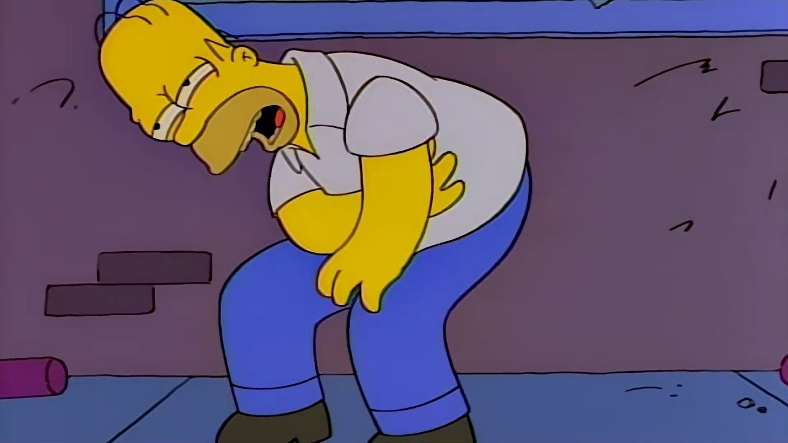
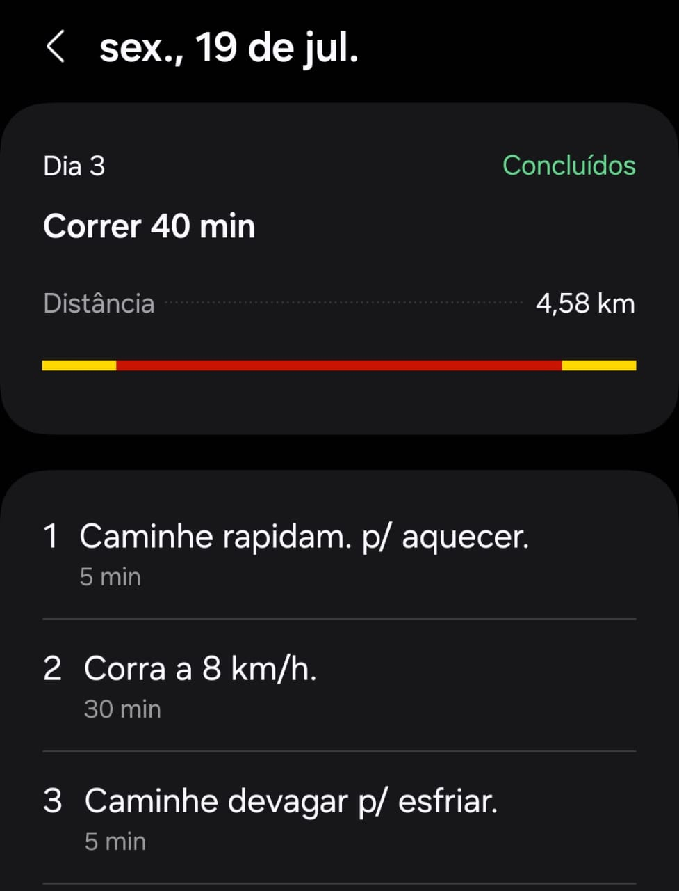
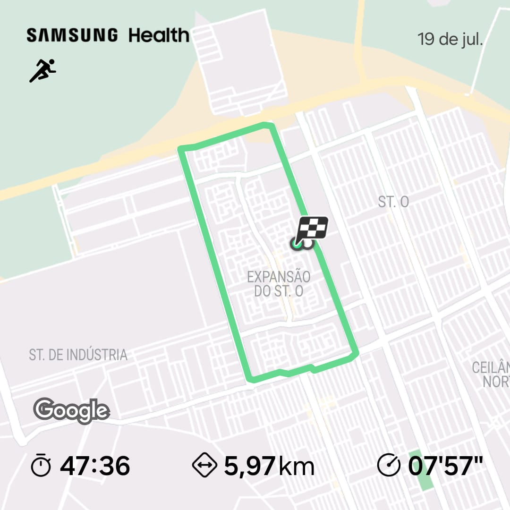
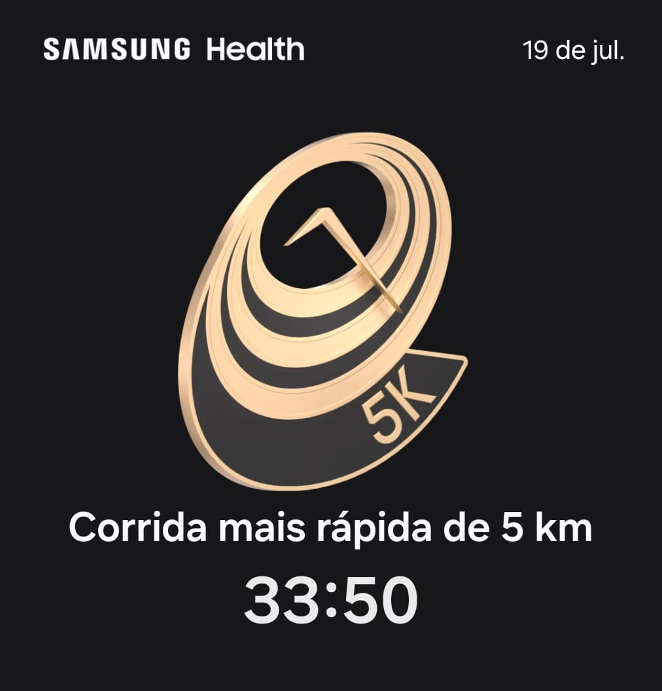

----

Depois do primeiro dia de corrida, tirei o dia seguinte para descansar e, então, corri no outro (hoje). O meu cronograma foi o mesmo do dia 1: correr durante 40 minutos, um total de 4,58 km. Foi bastante difícil.

Passei o dia de ontem (o dia de descanso) e o de hoje com as pernas doloridas, como se eu tivesse feito um treino de pernas na academia, sabe? Como se eu tivesse puxado ferro.

Além disso, como sempre, a maior batalha é travada na mente. A ansiedade de chegar logo ao destino e o cálculo mental da distância que ainda falta são bem desencorajadores. Percebi que só de pensar nesse tipo de coisa parece que a energia diminui mais.

Felizmente, completei o percurso. Antes de correr, estipulei uma meta simples: hoje eu faria um percurso que rodeasse o bairro. Ficou legal de ver o trajeto.

O último quilômetro foi o mais difícil: subida, vento e cansaço. De qualquer forma, não sei como, mas consegui bater um recorde pessoal: fiz 5 km em um tempo ainda menor do que no primeiro dia. Realizei o trajeto 3 minutos mais rápido! Gostei muito desse resultado, ainda mais por não estar tão mentalmente motivado.

A próxima corrida é domingo, dia 21. Espero estar mais recuperado do que estive hoje. Outra coisa é que acho que não vai funcionar eu obrigatoriamente publicar um status do treino. Ao contrário, vou voltar aqui quando achar que realmente há alguma mudança no treino ou quando tiver algo significativo para escrever.

Então, até o próximo report!