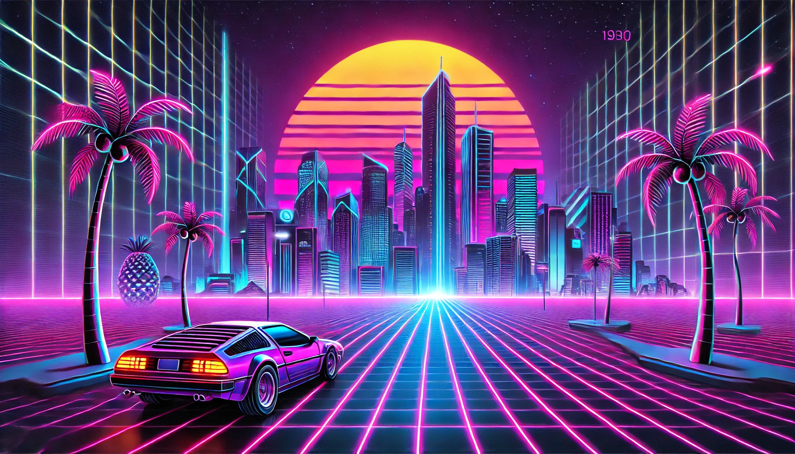

## Conteúdo

## Descobri Retrowave

Sempre gostei de músicas e clipes com sons produzidos por sintetizadores, melodias nostálgicas, neons — algo que remetesse aos anos 80. Quando ouvia, sempre me vinha à mente aquele som típico da época. Esses dias, me indicaram a música **[Euphories, da dupla (ou banda?) VIDEOCLUB](https://www.youtube.com/watch?v=ejOjC-mTfA0)**, que é incrível! Ela está cheia de referências aos anos 80, como jogos e filmes retrô.

<figure class="youtube">  
  
  
    
      <iframe width="560" height="315" src="https://www.youtube.com/embed/ejOjC-mTfA0?si=2yLAJkJj7l5cy2qJ" title="YouTube video player" frameborder="0" allow="accelerometer; autoplay; clipboard-write; encrypted-media; gyroscope; picture-in-picture; web-share" referrerpolicy="strict-origin-when-cross-origin" allowfullscreen></iframe>  
    
  
  <figcaption>    Euphories, da dupla (ou banda?) VIDEOCLUB  
  </figcaption>  
</figure>

Foi o suficiente para me fazer explorar mais sobre esse estilo. Isso me levou a visitar o **[Index of Aesthetics](https://cari.institute/aesthetics)**, onde descobri que esse realmente é um estilo musical: ele se chama _Synthwave_ ou _Retrowave_. Vou chamá-lo de _Retrowave_, porque é mais fácil de lembrar.

Esse estilo é inspirado na cultura dos anos 80, com influências marcantes da música eletrônica, videogames retrô e visuais de neon, frequentemente remetendo a uma visão futurista daquela época.

Normalmente, músicas desse estilo são carregadas de sintetizadores, baixos pulsantes e melodias nostálgicas.

### O que são baixos pulsantes?

Baixos pulsantes referem-se a uma linha de baixo com uma batida constante, rítmica e marcante. Imagine um som grave que segue um padrão repetitivo, como "dum-dum-dum-dum," criando um ritmo contínuo e hipnotizante.

Um exemplo é **[Algorithm, do Muse](https://youtu.be/wJcVLxRtDms?si=DVS1NQXejz29C2wP)**, onde, logo no início, o baixo dá a base da música e cria uma sensação de movimento — como se você estivesse dirigindo em uma rodovia.

<figure class="youtube">  
  
  
    
      <iframe width="560" height="315" src="https://www.youtube.com/embed/wJcVLxRtDms?si=flDMHmC2z-nRsQ1r" title="YouTube video player" frameborder="0" allow="accelerometer; autoplay; clipboard-write; encrypted-media; gyroscope; picture-in-picture; web-share" referrerpolicy="strict-origin-when-cross-origin" allowfullscreen>  
      </iframe>    
  
  <figcaption>    Algorithm, do Muse  
  </figcaption>  
</figure>

Outros exemplos no mesmo estilo são:

**[Kavinsky - Nightcall](https://www.youtube.com/watch?v=MV_3Dpw-BRY)**:

<figure class="youtube">  
  
  
    
      <iframe width="560" height="315" src="https://www.youtube.com/embed/MV_3Dpw-BRY?si=k_1pEtoXvpbzEWEf" title="YouTube video player" frameborder="0" allow="accelerometer; autoplay; clipboard-write; encrypted-media; gyroscope; picture-in-picture; web-share" referrerpolicy="strict-origin-when-cross-origin" allowfullscreen></iframe>  
    
  
  <figcaption>    Kavinsky - Nightcall  
  </figcaption>  
</figure>

**[The Midnight - Sunset](https://www.youtube.com/watch?v=dlW1w6gCWr8)**:

<figure class="youtube">  
  
  
    
      <iframe width="560" height="315" src="https://www.youtube.com/embed/dlW1w6gCWr8?si=4NOJbWwlV99MO9zA" title="YouTube video player" frameborder="0" allow="accelerometer; autoplay; clipboard-write; encrypted-media; gyroscope; picture-in-picture; web-share" referrerpolicy="strict-origin-when-cross-origin" allowfullscreen></iframe>  
    
  
  <figcaption>    The Midnight - Sunset  
  </figcaption>  
</figure>

---

## Ei, olha isso!
Eu ia fazer um post apenas com links interessantes, como no meu [Links Interessantes #1 2024 🔖](links-interessantes-1-2024),mas quer saber? Que coisa chata seria! A partir de agora, vou imitar o **[Cory Doctorow](https://pluralistic.net/)** com sua seção _["Hey look at this"](https://pluralistic.net/2024/12/07/great-kepplers-ghost/#linkdump)_.

Não quer dizer que toda publicação terá essa seção, entretanto.
### Links:

1. **[Baú de Revistas | KRIPTA (1976)](https://memoriamagazine.blogspot.com/2024/08/bau-de-revistas-kripta-1976.html)**  
    Um resgate da memória da revista de terror e suspense _Kripta_, que fez bastante sucesso nos anos 70 e 80.
    
2. **[Where have all the websites gone?](https://www.fromjason.xyz/p/notebook/where-have-all-the-websites-gone/)**  
    Um apelo à reconstrução de uma web mais descentralizada, incentivando a criação e o compartilhamento de links para sites independentes, resgatando o espírito exploratório da "velha" internet.
    
3. **[Public Work](https://public.work)**  
    Um mecanismo de busca para conteúdo de domínio público. Explore mais de 100.000 imagens livres de direitos autorais do The MET, New York Public Library, entre outras fontes.
    
4. **[Index of Aesthetics](https://cari.institute/aesthetics)**  
    Como o nome sugere, é um índice de estilos e estéticas, catalogando tendências que surgiram ao longo das décadas, como _Synthwave_ ou _Retrowave_, que celebra a cultura dos anos 80 com visual neon.
