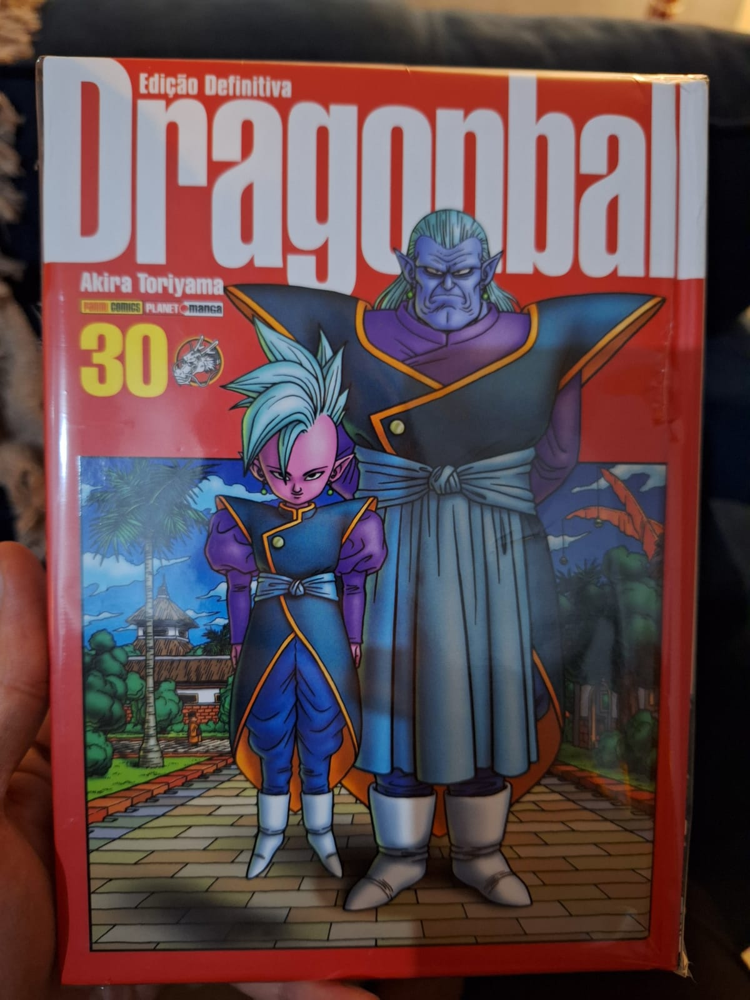

---

> As lutas da categoria adulta do Torneio de Artes Marciais finalmente começam! Na mesma arena onde se reúnem os 16 guerreiros que passaram nas eliminatórias, surgem dois indivíduos com uma aura sombria. Quem serão eles…?! Videl enfrenta os brutais ataques de seu oponente, Spopovich, enquanto Gohan acaba tendo sua energia drenada. Qual será o objetivo deles?! Com a aparição de novos e poderosos inimigos, o Torneio de Artes Marciais segue para uma direção totalmente inesperada! E assim, os guerreiros são mais uma vez conduzidos para o campo de batalha!

O clima está esquentando e novos personagens interessantes surgiram. A apresentação de Shin e Kibito foi realmente muito boa. Apesar de já termos visto algo semelhante nos anos em que assistíamos à reprise na finada TV Globinho, foi bastante enigmático; inicialmente, não sabíamos se eram vilões ou não. Apesar de Shin ter dito a Goku que "não esperava vencê-lo", afirmando claramente que Goku seria mais poderoso, é até ridículo ver como Shin se surpreende com o imenso poder dos Saiyajins durante as batalhas iniciais.

O volume anterior é melhor no aspecto cômico, mas este soube preparar um clímax para o próximo. Estou ansioso para ver a luta entre Gohan e Dabura. Bom volume!