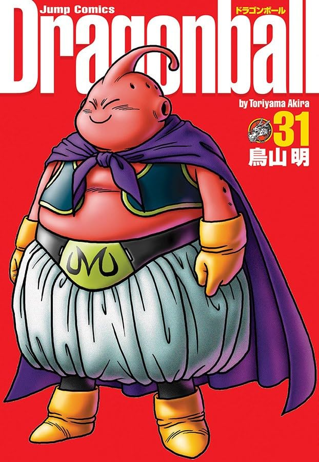

----

Que volume de tirar o fôlego!

Iniciamos com a conclusão do torneio de artes marciais, onde Satan vence a Nº 18, claro, mediante um suborno de 20 milhões pagos por ele!

Em seguida, nosso foco volta-se aos acontecimentos envolvendo a liberação do selo de Boo. Vegeta se deixa dominar (parcialmente) pelo controle mental de Babidi para ter sua tão desejada luta contra Goku.

Aqui vemos o quão longe Vegeta pôde ir para realizar sua obsessão de vencer Goku: ele chega a lançar duas rajadas de energia contra a arquibancada do torneio de artes marciais, matando assim dezenas (centenas?) de pessoas que estavam assistindo.

Sem alternativas, Goku aceita lutar contra Vegeta numa batalha breve (para nós, leitores), mas pau a pau entre os dois. Graças aos efeitos dessa luta, Babidi tem sucesso em juntar energias para quebrar o selo de Boo, que é finalmente libertado.

Achei bastante interessante notar um certo arrependimento de Vegeta e também um sentimento de culpa ao perceber que foi culpa dele a libertação desse adversário tão poderoso. Em um quadro, ele até parece lamentar a suposta morte de Gohan. No final, Vegeta acaba se sacrificando para derrotar Boo, num último ataque que não é mortal para Boo.

Terminamos o volume assim: Gohan, dado como morto, mas sabemos que ele será resgatado pelo núcleo do Kaiohshin; Goku, com seu tempo na Terra, finalizando reconhecendo que não é páreo contra o poder de Boo; últimas esperanças colocadas sobre os jovens Trunks e Goten, que terão que aprender a técnica da fusão e, finalmente, Boo e Babidi tocando o terror na Terra.

Novamente, que volume! Estou ansioso para o próximo!