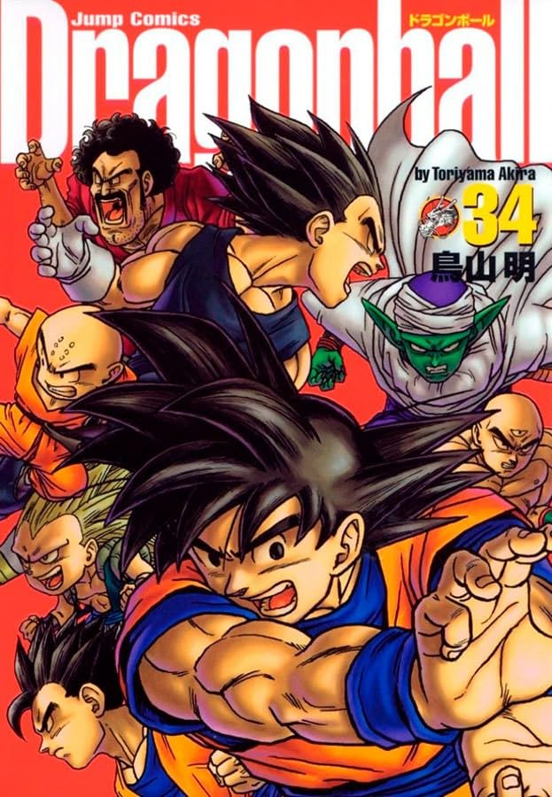

Depois de 4 anos acompanhando essa obra-prima, finalmente chegou ao fim! Não foi fácil, principalmente com o preço de capa aumentando tanto. Para ter uma ideia, o primeiro volume eu comprei em maio de 2020 por R$ 45,10, enquanto o último saiu por R$ 76,02. Culpa de várias coisas, como a inflação, o aumento no preço do papel e, claro, estamos falando da Panini, né? Eles têm o costume de ir encarecendo os volumes mesmo. Mas deixando o choro de lado, foi uma ótima viagem, e foi muito bom ter acompanhado essa história.

Ainda continuo gostando mais da fase clássica do Goku, até mais ou menos a saga do Piccolo. Gosto muito da veia cômica do Akira nesse período. Por outro lado, na saga do Boo, acredito que houve um bom retorno às origens — e eu não lembro se na animação foi assim também. No mangá, teve muita porradaria, como todo mundo gosta, mas sem deixar de lado situações engraçadas e nonsenses. Muitas batalhas, inclusive, trazem golpes cômicos que se encaixariam perfeitamente na atmosfera do _Dragon Ball Clássico_.

Esse último volume teve um pouco de tudo, ainda bem. Além disso, trouxe uma boa dose de emoção na última batalha contra Boo, com Vegeta tendo seu desfecho final: agora, temos a confirmação de que ele não é mais um cara mau e ainda reconhece Goku como o número 1. Depois de tantas vezes salvarem a Terra, achei ótima a sacada de, no final, contra o inimigo mais poderoso do universo, ser o povo da Terra quem salva o dia, dando sua força para a grande Genki Dama de Goku. Confesso que, nessas últimas páginas, meu coração acelerou de emoção. Após a derrota de Boo, tudo volta ao normal, e a história avança dez anos, anunciando então o fim definitivo.

Li que muitos, na época, acharam o desfecho prematuro e foram pegos de surpresa. Eu, no entanto, achei bem satisfatório. A série não termina antes de mostrar a reencarnação do Kid Boo, o terráqueo Oob: um garotinho bem ingênuo, mas com o imenso poder de Boo latente, que se tornará aprendiz de Goku. Mas a história a partir daí nunca saberemos, já que Akira nunca chegou a desenhar nada nesse sentido. Acho que nunca foi a intenção. A história continua em _Dragon Ball Super_ e _Daima_, que se passam logo após a derrota de Boo — dez anos antes do final da série.

Eu já havia lido o mangá via scan há muitos e muitos anos, e acompanhá-lo agora de forma seriada foi uma ótima experiência. Agora vou procurar mais material do Akira, como _Dr. Slump_, que nunca li. É isso! Muito obrigada, Akira Toriyama!

