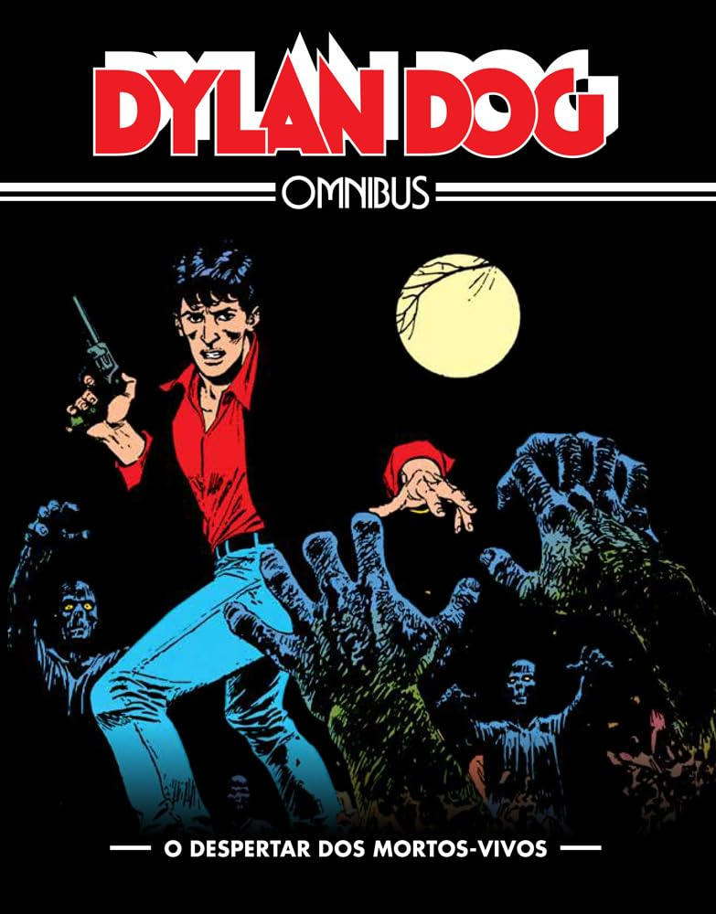

----

> São as 6 primeiras histórias do personagem que Tiziano Sclavi lançou em 1986 e que rapidamente se tornou um fenômeno cultural. Dylan Dog, o protagonista, é um detetive especializado em casos sobrenaturais, caracterizado por seu charme melancólico e um profundo senso de humanidade. A escrita de Sclavi, marcada por um tom sombrio, humor negro e reflexões filosóficas, elevou o quadrinho a uma posição cult, conquistando uma legião de fãs devotados. A série não só redefiniu o gênero de horror nos quadrinhos, mas também influenciou a cultura pop italiana de maneira significativa. Em uma Londres mágica e nevoenta, capital do fantástico e do terror, Dylan Dog investiga os nossos medos e os nossos desejos, os monstros que existem dentro e fora de nós: fantasmas, demônios, mortos-vivos, assassinos seriais, estados de alucinação, magias, bizarrias, infernos, outras dimensões, outros tempos e outras criaturas. Se o terror o persegue, chame Dylan Dog.

Sempre tive uma certa curiosidade sobre _Dylan Dog_, mas nunca havia parado para ler. Por que demorei tanto? São ótimas histórias!

Não há muito o que dizer além do que a sinopse, copiada da loja da Amazon, já explica. Pessoalmente, adorei cada história, repletas de referências à cultura pop, filmes e música. Há menções a _Madrugada dos Mortos_, _Star Trek_, _Sweeney Todd_ e ao famoso estripador, o serial killer que aterrorizou Londres.

_Dylan Dog_ é como um James Bond, mas de uma forma bem menos pasteurizada. Inclusive, ele se apresenta como tal nas primeiras páginas: "Meu nome é Dog, Dylan Dog." Em toda história, ele se envolve com uma bela mulher, o que, na minha opinião, contribui para a atmosfera noir das aventuras. Várias vezes me peguei pensando que a história daria um ótimo filme de terror ou noir.

Há também uma boa dose de comédia, desde aquelas piadas sem graça — que te fazem rir mesmo assim — até o humor mais duvidoso e de mau gosto, que também arranca risadas. O responsável por isso é Groucho, o assistente pirado de Dylan Dog. Fiquei sem saber se ele é realmente maluco ou se possui um senso de humor extremamente afiado, sarcástico e mordaz. Talvez um pouco dos dois.

Uma curiosidade interessante é que, quando Dylan se encontra diante de um enigma ou beco sem saída intelectual, ele costuma tocar clarinete para se concentrar. E, pelo menos uma das músicas que ele toca, de fato existe: _Il Trillo del Diavolo_ (_O Trilo do Diabo_), composta por **Giuseppe Tartini**. Eu não conhecia, mas gostei muito. A peça combina perfeitamente com a natureza excêntrica e sombria do personagem.

Enfim, foi uma leitura muito boa, e recomendo especialmente para quem deseja variar um pouco do eixo americano (com os _comics_) e japonês (com os mangás).
