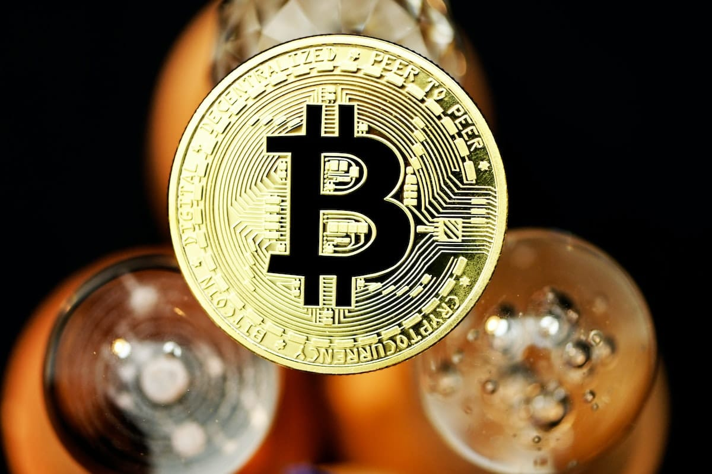
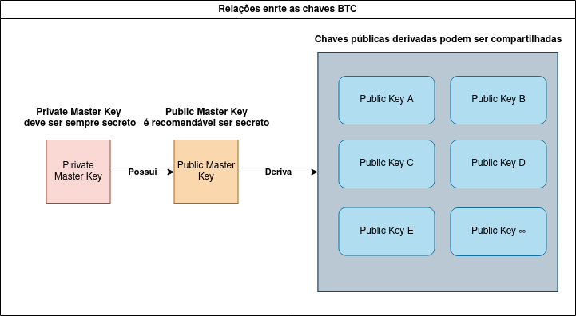

---

Esse é um guia de conceitos básicos sobre o bitcoin. Estou adicionando mais informações à medida que vou aprendendo mais. Por mais que as informações aqui possam ser úteis e que eu tenha tentado transmiti-las da forma mais correta possível, essas informações foram reunidas na medida em que eu mesmo fui pesquisando e aprendendo um pouco mais sobre o assunto. Portanto, ainda assim podem ter algumas informações não muito precisas. Caso ocorra, agradeço a gentileza de me informar que corrijo o mais breve possível! Não confie, verifique! ⚠️ **Atualizado em 15 de Fevereiro de 2024**.

**TD; DR:** O bitcoin é uma moeda digital, que proporciona liberdade financeira, anonimato relativo, resistência à censura, inconfiscabilidade, inclusividade, transparência e acesso global.

## Sumário

## Para que serve o Bitcoin

Para entender a utilidade do bitcoin, antes temos que entender como funcionam as transações bancárias ao menos de forma simples. Imagine uma transferência entre contas de banco. O banco, ou o Estado, no caso das transações feitas por PIX no Brasil, age como uma parte terceira confiável. Você pode enviar e receber dinheiro na sua conta bancária, e o banco é o responsável por garantir a autenticidade da transação. Em tese, ele garante que quem enviou o dinheiro realmente o tinha, e quem deveria receber realmente o recebeu. Caso a transferência seja entre bancos diferentes, é um pouco diferente, mas a essência é a mesma.

Existem alguns problemas nessa abordagem. O banco, como terceiro confiável, sabe, além do valor e identificação das contas envolvidas, a identidade de ambas as partes, remetente e destinatário. Ele tem posse de documentos de identificação, endereços, telefones e, hoje em dia, com a tecnologia mobile, o banco tem posse até mesmo da identidade biométrica de uma pessoa. Outro problema é que uma transação entre contas pode ser bloqueada, revertida, cancelada, sem o consentimento das partes envolvidas.

Podemos resumir sobre o que é bitcoin e para que serve, parafraseando a conclusão do white paper [Bitcoin: Um Sistema de Dinheiro Eletrônico Peer-to-Peer](https://bitcoin.org/files/bitcoin-paper/bitcoin_pt_br.pdf) escrito pelo próprio criador, Satoshi Nakamoto, abaixo (ou pule para a minha explicação, logo após):

::toggle-card{title="Clique aqui para ler a conclusão do White Paper"}
Propusemos um sistema de transações eletrônicas, sem depender de confiança. Começamos com o framework habitual de moedas feitas de assinaturas digitais, que fornece um forte controle de propriedade, mas é incompleto sem uma maneira de evitar o gasto duplo. Para resolver isso, propusemos uma rede peer-to-peer usando prova de trabalho para gravar um histórico público de transações que rapidamente se torna computacionalmente impraticável para um atacante para mudar se nós honestos controlarem a maioria do poder de CPU. \[..\]Os nós trabalham todos de uma vez, com pouca coordenação. Eles não precisam ser identificados, uma vez que as mensagens não são roteadas para qualquer lugar particular e só precisam ser apresentadas em regime de melhor esforço. \[...\]. Eles votam com seu poder de CPU, expressando a aceitação de blocos válidos, trabalhando em estendê-los e rejeitando blocos inválidos, recusando-se a trabalhar com eles. Todas as regras e incentivos necessários podem ser aplicados com este mecanismo de consenso.
::

O que a conclusão afirma é que foi proposto um sistema de dinheiro eletrônico que não depende de um terceiro confiável. Esse sistema é baseado em moedas feitas de assinaturas digitais e um histórico público de todas as transações feitas, a tal da **blockchain**.

Para gravar uma transação na rede, é exigido uma prova de trabalho, que vai ficando cada vez mais complexa com o tempo, exigindo muito poder computacional, inviabilizando que um agente malicioso tente atacar a rede escrevendo transações inválidas, já que ele teria que reescrever toda a cadeia do bloco. A rede teria alguns a gentes independentes, nós, que verificariam cada transação e votariam com seu processamento na aceitação de blocos válidos e rejeitando blocos inválidos.

A grosso modo, é assim que funciona o bitcoin, de forma que para enviar moedas, você não precisa informar seus dados pessoais, desde que suas moedas sejam legítimas e reconhecidas pela rede. Ao fazer uma transferência para outra carteira, nós irão verificar a validade da transação, evitando por exemplo, um gasto duplo, e por consenso, validarão o bloco na blockchain. Ao contrário de uma transferência bancária, um gasto de bitcoin não pode ser revertido ou cancelado. A blockchain, não pode ser reescrita! Por isso é importante ter muito cuidado ao manipular suas moedas.

## A moeda: bitcoin e satoshi

Assim como outras moedas, o bitcoin é divisível. O Satoshi está para o Bitcoin assim como o centavo está para o real. No Real temos 1 real ou 100 centavos, que é 0,01 real, a menor unidade do Real. No bitcoin temos 1 satoshi ou sat que é 0,00000001 bitcoin. Note que é mais fácil falar 1 satoshi do que 0,00000001 bitcoin. Seja 1 BTC ou 1 satoshi, as moedas estão na blockchain, o tal histórico público.

Novas moedas bitcoin são geradas a partir de prova de trabalho, matematicamente por meio de computadores. Esse processo é conhecido como "**mineração**" e só existirão 21 milhões de moedas bitcoin para sempre.

A cada 4 anos, ou a cada 240 mil blocos, ocorre o evento chamado **Halving**. Nesse evento, a recompensa dos mineradores por cada bloco minerado cai pela metade, tornando o bitcoin mais escasso. Isso significa que o bitcoin é uma moeda escassa e não é uma moeda inflacionária. A última moeda a ser minerada será emitida até 2140.

Sejam bitcoins ou satoshis, você só conseguirá transacionar essas moedas com a chave privada correta que dá acesso às suas moedas. Isso nos leva ao próximo tópico.

## Chaves privadas e públicas

Uma chave privada, em termos simples, é como uma senha que você não deve compartilhar com ninguém! Com ela, você pode assinar transações e enviar bitcoins para outras pessoas. Essa informação é extremamente sigilosa; não há outra maneira de colocar isso: se alguém souber qual é sua chave privada, seus bitcoins podem ser roubados! Se você perder sua chave privada, seus bitcoins ficarão inacessíveis e você não conseguirá utilizá-los. Simples assim.

A chave privada, ou chave privada mestra (**Master Private Key**), assim como a chave pública, é composta por 256 bits ou 78 números aleatórios. É um número consideravelmente grande, tornando a probabilidade de gerar um número já utilizado por outra pessoa bastante baixa. A partir da chave privada, a chave pública é gerada.

A chave pública, ou chave pública mestra (**Master Public Key**), atua como o seu endereço na rede Bitcoin. Antigamente, esse endereço era público, e para que eu pudesse enviar bitcoins para você, eu deveria enviar para esse endereço. Com a posse da sua chave privada, você poderia então transferir os bitcoins para outro endereço público. Embora ainda funcione dessa maneira, não é mais a prática mais recomendada.

Para solucionar potenciais problemas de segurança e privacidade, é comum hoje em dia gerar um endereço público (outra chave pública) derivado matematicamente da chave pública mestre. Dessa forma, ao enviar uma moeda, é recomendável que o destinatário crie um endereço público derivado da sua chave pública mestre. Em seguida, ele compartilhará esse endereço público com o remetente, que o utilizará para enviar as moedas. Isso resulta em sua chave pública e privada tornando-se informações pessoais, e o que você compartilhará é o endereço público derivado da sua chave pública mestre.

Observe que ao informar sua chave pública mestra, todas as suas transações nos endereços públicos relacionados a ela serão conhecidas. Isso é prejudicial para a privacidade, por isso, utilize chaves públicas geradas a partir da chave pública mestra. Por fim, nunca divulgue sua chave privada, pois uma vez informada, sua conta estará comprometida e outra pessoa poderá sacar suas moedas.

Hoje em dia, é bastante comum utilizar as seeds, que são mnemônicos para a chave privada. São 24 palavras, normalmente em inglês, cada palavra correspondendo a um número. Na carteira [Electrum](https://electrum.org/), por exemplo, ao criar uma nova carteira, é gerada uma seed. Com isso, o processo de recuperar e fazer backup da carteira torna-se simples. É crucial que você anote as seeds exatamente como apareceram no momento da criação e na mesma ordem. Caso não anote exatamente, você perderá acesso à carteira. Mas o que é uma carteira? Respondo a seguir.

## Carteiras Bitcoin

Uma carteira digital armazena e protege suas chaves privadas, aquelas mesmas que dão acesso às suas moedas.

As carteiras bitcoin podem ser **hot wallets** ou **cold wallets**:

Hot wallets são carteiras conectadas o tempo todo à internet e, por isso, tendem a ser mais vulneráveis a hacking. Ideais para transferências do dia a dia e valores menores.

Já as Cold wallets sã carteiras que ficam desconectadas da internet, podendo ser uma carteira de papel ou também um dispositivo de hardware, semelhante a um pen drive.

## UTXO e consolidação de moedas

UTXO, basicamente, refere-se ao valor que você pode gastar em um endereço Bitcoin. Para gastar um UTXO, é necessário ter recebido fundos em sua carteira anteriormente. Cada UTXO contém informações sobre o endereço do remetente e do destinatário, tornando bastante difícil gastá-lo mais de uma vez. Dado que o tema é relativamente extenso, decidi dedicar um post completo explicando em detalhes [o que é UTXO](o-que-e-utxo).

## Instalando um Full Node Bitcoin

Um nó Bitcoin é basicamente um computador que roda o software Bitcoin Core e se conecta à rede Bitcoin. Ele guarda uma cópia completa da blockchain do Bitcoin e, além disso, verifica e retransmite transações. Ter um nó Bitcoin ativo é uma forma fantástica de colaborar para a segurança e descentralização da rede Bitcoin. Ao manter um nó completo, você verifica todas as transações e blocos por conta própria, sem depender de terceiros. Seus dados e transações ficam seguros, sem serem expostos a terceiros, como provedores de carteiras ou exploradores de blocos.

Eu criei um um post dedicado documentando os passos para [instalar e configurar um node](como-configurar-um-node-bitcoin).

## Conclusão

O Bitcoin é uma inovação que desafia as estruturas tradicionais, oferecendo liberdade financeira e resistência à manipulação. Seu funcionamento, baseado em uma rede descentralizada e na imutabilidade da blockchain, proporciona transações seguras e transparentes, livres das amarras dos sistemas financeiros convencionais.

Então é isso. Ainda há muito a aprender e esse guia de conceitos básicos está longe de estar completo. Ainda nem falei sobre as opções de carteiras, sobre ⚡**Lightning Network** etc. Escrevi esse guia primeiramente para mim e vou atualizá-lo ainda muito mais, não confio na minha memória e essa página é para ser uma forma fácil de eu checar algum conceito que aprendi. Espero que seja útil também para qualquer um que chegar aqui mas não confie em mim, verifique. Busque outras fontes, experimente!

Lembre-se: uma chave privada é uma responsabilidade que não pode ser compartilhada, e a imutabilidade da blockchain é o alicerce da confiança. Nesse mundo digital, a precaução é a chave para a preservação da autonomia financeira. Portanto, mantenha suas chaves seguras, sua compreensão firme e seu espírito explorador ativo. O Bitcoin é mais do que uma moeda; é um convite para redefinir o conceito de autonomia financeira no século XXI.

Vamos nessa! 🚀

* * *

## Referências

*   [White Paper: Bitcoin: Um Sistema de Dinheiro Eletrônico Peer-to-Peer](https://bitcoin.org/files/bitcoin-paper/bitcoin_pt_br.pdf)
*   [Bitcoin.org](https://bitcoin.org/)
*   [O que é bitcoin](https://www.blog.areabitcoin.com.br/o-que-e-bitcoin/)
*   [Como usar bitcoin – um guia básico](https://oi.arataacademy.com/lp/como-usar-bitcoin-guia-basico/)
*   [MEGA TUTORIAL BITCOIN - Como comprar, vender, corretora, bisq, lightning, e como funciona o BITCOIN](https://www.youtube.com/watch?v=LHY3Ofhwo8w)
*   [Chave pública e privada do Bitcoin: entenda o que são e como funcionam](https://portaldobitcoin.uol.com.br/chave-publica-e-privada-do-bitcoin-entenda-o-que-sao-e-como-funcionam/)
*   [O que é a Master Public Key?](https://academy.bit2me.com/pt/qual-%C3%A9-a-chave-p%C3%BAblica-mestra/)
