----

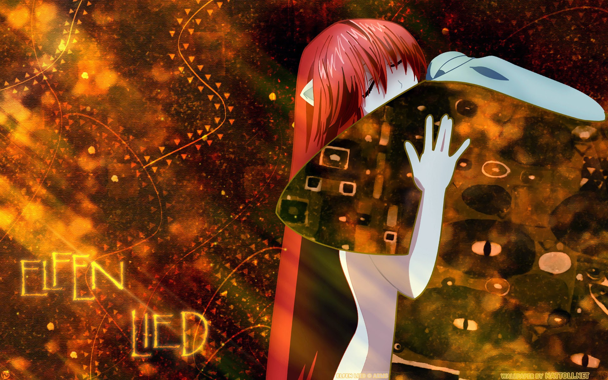

Seu som assustador, letras bíblicas em latim, além de destacar a nudez de Lucy de uma maneira linda, fazendo referencia as pinturas de Gustav Klimt, é nada menos do que arte!

Esse animação obviamente tem seus altos e baixos mas certamente nunca deve ser esquecida.

Ao longo desse texto, vou mostrar algumas pinturas de Klimt que foram homenageadas na abertura de Elfen Lied. Vamos lá!  ! 🎨🎬

## Sumário

## A abertura
Confira a abertura da animação: 

::video-card{src="/video/elfen-lied-opening-hd-720p-creditless-lilium.mp4" iframe="false"}
#description
Elfen Lied Opening HD 720p Creditless Lilium
Vídeo Original em https://www.youtube.com/watch?v=ddvXXtfKltg
::

## Anne Marie Zilberman

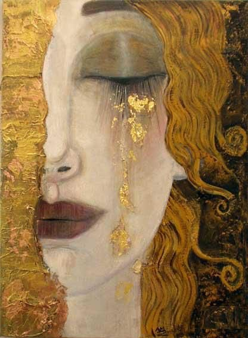

Pesquisando por aí, vi que muita gente confunde a obra Golden Tears (ou Freya's Tears), atribuindo erroneamente a autoria dela à Gustav Klimt. Na verdade, é de Anne Marie Zilberman e, infelizmente, não consegui achar mais informações sobre ela.

Dizem que o primeiro quadro da abertura faz referência a Golden Tears, mas a verdade é que não se sabe se a pintura foi feita antes ou depois da produção e exibição de Elfen Lied. Provavelemente não tem nenhuma relação entre os trabalhos. 

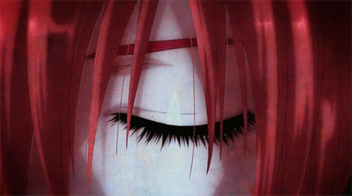

## Gustav Klimt

Gustav Klimt nasceu em 1862 em Baumgarten, perto de Viena, na Áustria-Hungria. Frequentou a Escola de Artes e Ofícios de Viena antes de assumir comissões com seu irmão, Ernst, e um colega Franz von Matsch de 1879. Ao longo da próxima década, ao lado de várias comissões privadas para retratos, eles pintaram murais e tetos interiores em grandes edifícios públicos, incluindo o Burgtheater, o Museu Kunsthistorisches e o teto do Grande Salão da Universidade de Viena.

Em 1897, ele foi um membro fundador e presidente da Secessão de Viena, um grupo de artistas que queriam romper com o que eles viam como o conservadorismo predominante da Viena Konstlerhaus. Klimt, em particular, desafiou o que ele viu como os “limites hipócritas de respeitabilidade estabelecidos pela sociedade vienense”. Segundo a historiadora de arte Susanna Partsch, ele era “o enfant terrible da cena artística vienense, foi reconhecido como o pintor de mulheres bonitas”.
### The Kiss

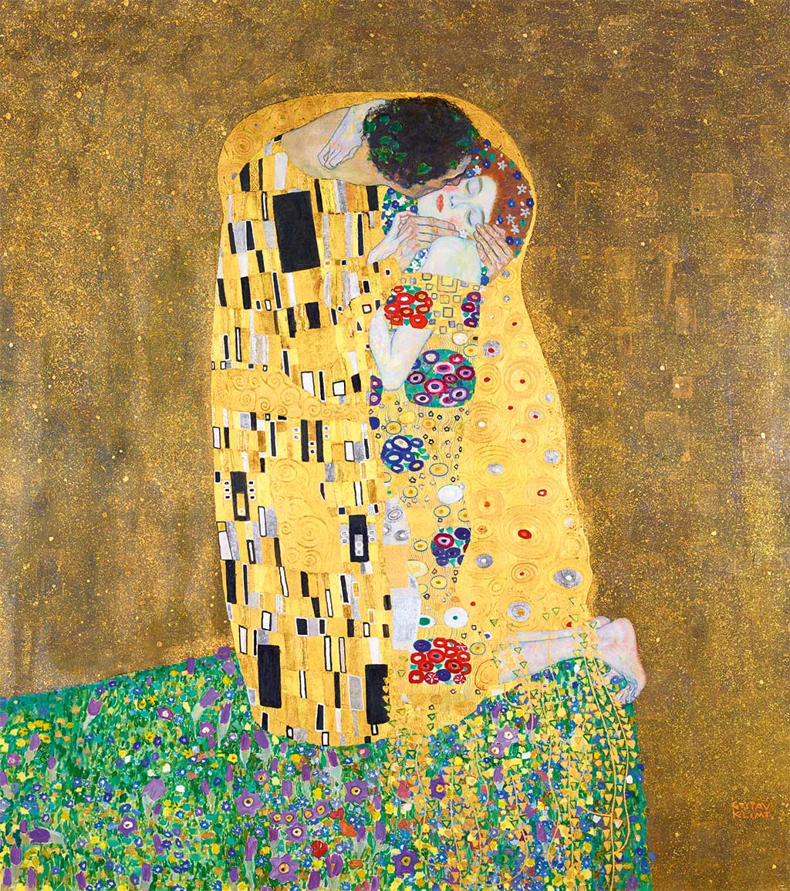

_**The Kiss**_ é uma pintura a óleo com adição de folhas de ouro, prata e platina. Foi criada em algum ponto entre 1907 e 1908, no período que os estudiosos da arte chamam de "Fase Dourada". A pintura retrata um casal abraçando um ao outro, com seus corpos enrolados em um belo manto decorado.

No anime vemos duas referencias a esse quadro:

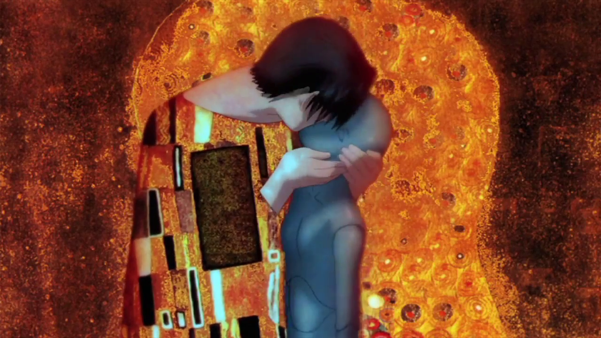

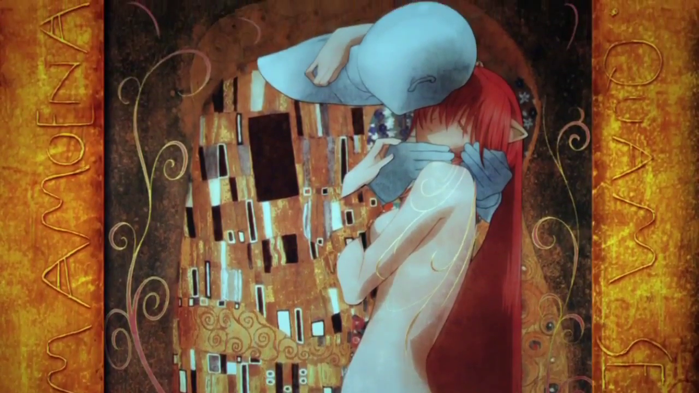
### _Danaë_

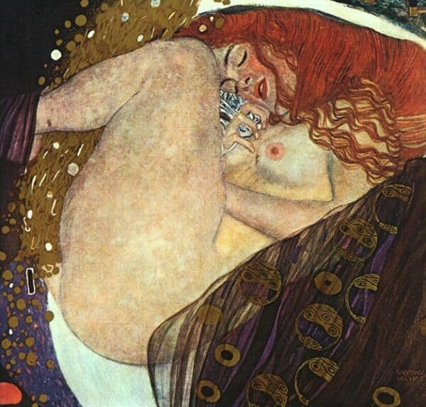

_**Danaë**_ é uma pintura a óleo sobre tela de 1907. Klimt retratou o momento em que Danaë é tomada pelo Senhor do Olimpo. 

Enquanto estava aprisionada por seu pai, o rei de Argos, em uma torre de bronze, Danaë foi visitada por Zeus, aqui simbolizado como a chuva dourada fluindo entre suas pernas.

O tema Danaë esteve muito em voga no início da década de 1900 entre muitos artistas; a personagem foi utilizada como um símbolo de perfeição do amor divino, e transcendência.

Ao contrário das outras pinturas, essa não é referenciada na abertura, mas sim no fechamento do anime:

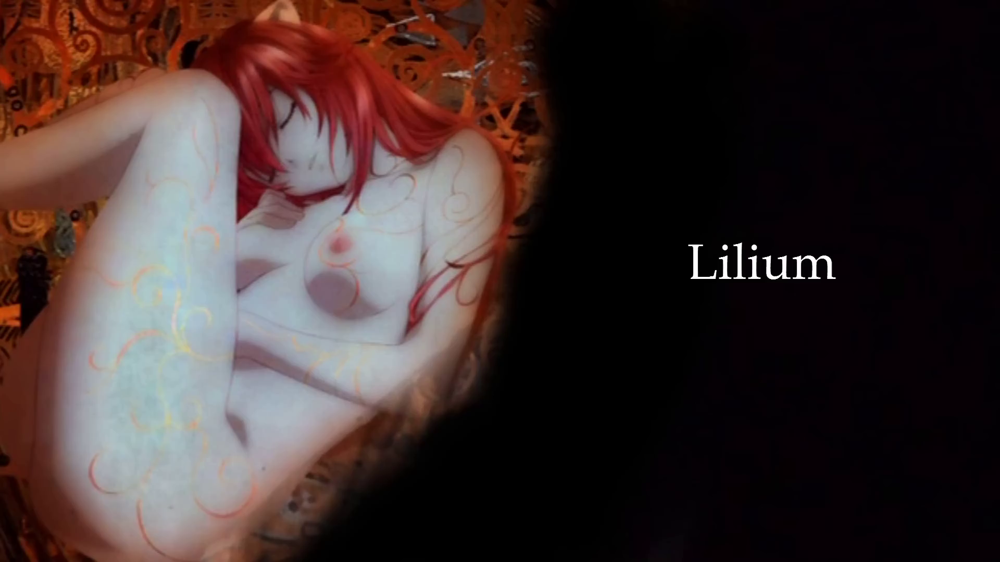

### As Três Idades da Mulher

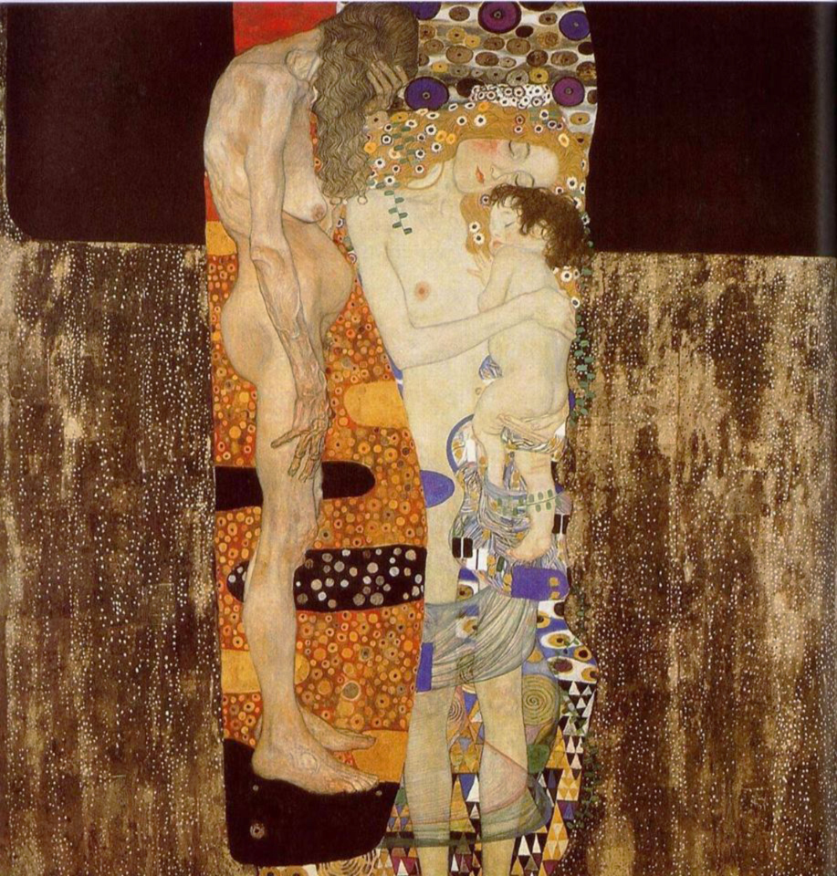

Feita com a técnica óleo sobre tela em 1905, _**As Três Idades da Mulher**_ tem o ciclo da vida como temática, na imagem estão dispostas verticalmente: uma mulher idosa, uma jovem e uma garotinha, todas nuas, com o objetivo de mostrar a passagem do tempo.

Na abertura, um rápido frame conversa com essa pintura:

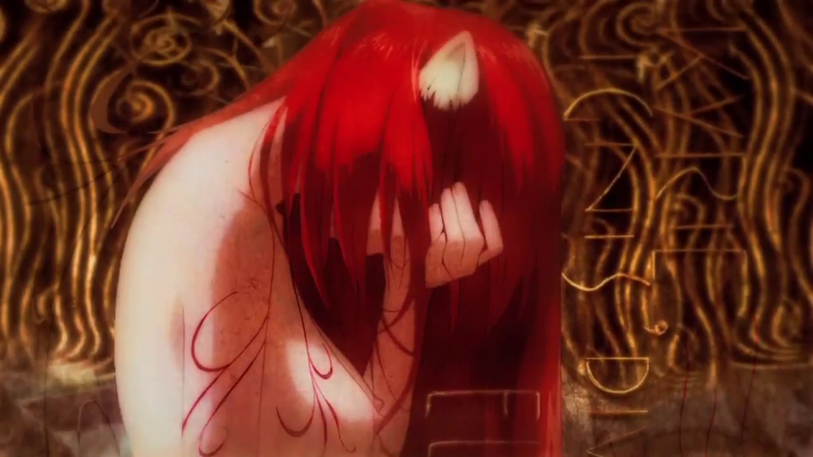

Não consegui capturar o frame inteiro mas achei por ai na internet as duas imagens lado a lado:

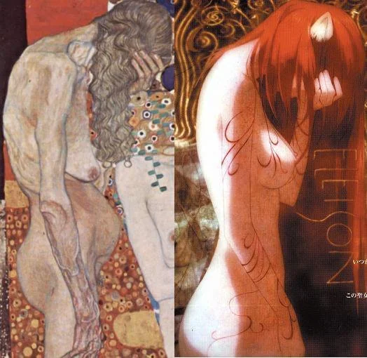

### Friso Stoclet
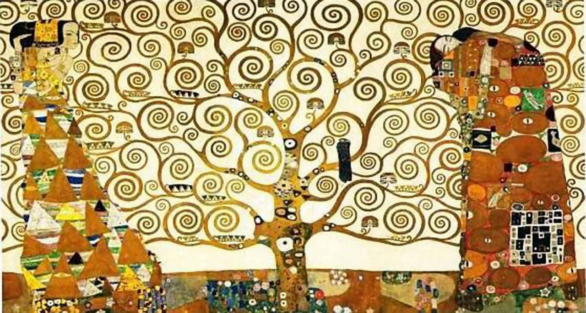

A sua última grande pintura mural é o _Friso Stoclet_ (1905 a 1909). Esta pintura é um estudo para uma série de três mosaicos criado por Klimt, para cumprir um contrato de 1905-1911.

Esse terceiro mural de Friso Stoclet é chamado de "O Abraço" ou "O cumprimento":

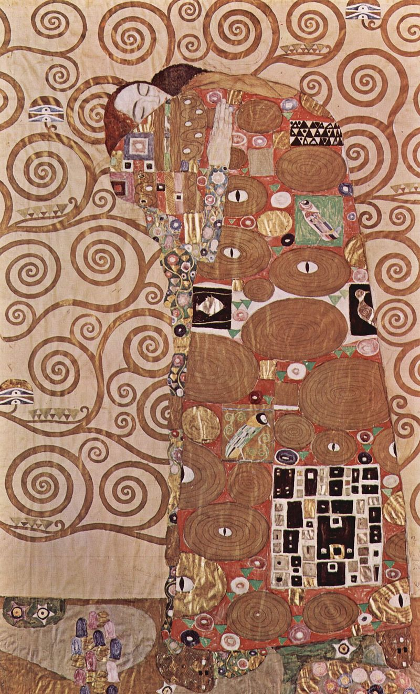

No anime vemos esse lindo quadro:

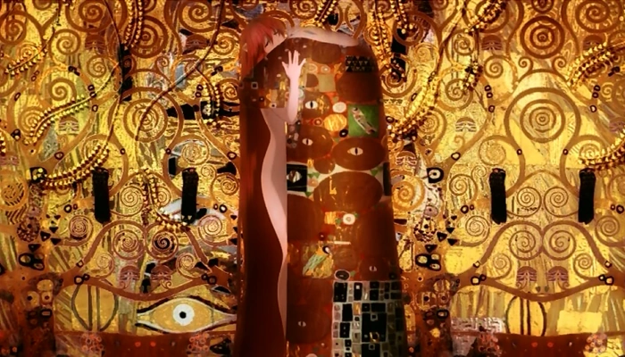
### Judite e a Cabeça de Holofernes

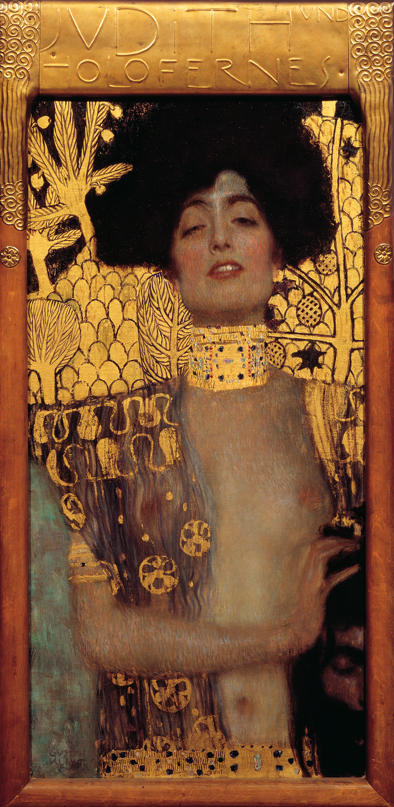

_**Judite e a Cabeça de Holofernes**_ (também conhecida como _**Judith I**_)  é uma pintura a óleo  pintada em 1901. Ele retrata a figura bíblica de Judith segurando a cabeça de Holofernes depois de decapitá-lo. Klimt pintaria uma segunda obra retratando o assunto em 1909.

Não parece ter nenhuma relação mais óbvia com a abertura além do tema dourado, mas coloquei aqui por que gostei mesmo!

### Adam and Eve

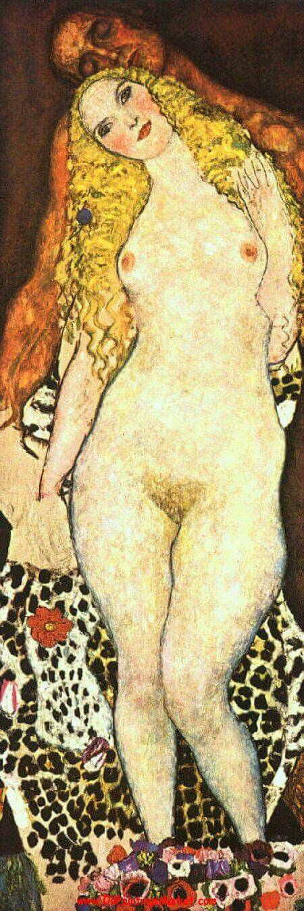

**Adão e Eva** (1917) foi a primeira pintura bíblica de Klimt. A pintura parece representar a humanidade em um estado de graça, antes da queda. Como uma heroína casta, Eva é uma heroína bem diferente de Judith.

Não sei se propositalmente, mas esse frame da abertura conversa com essa pintura:

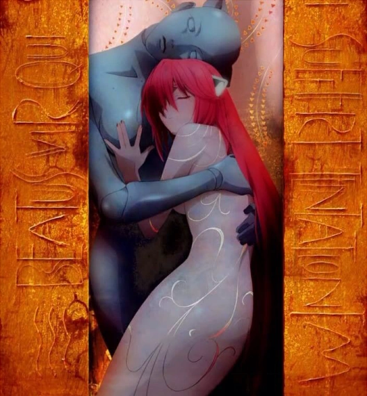

### Retrato de Mäda Primavesi

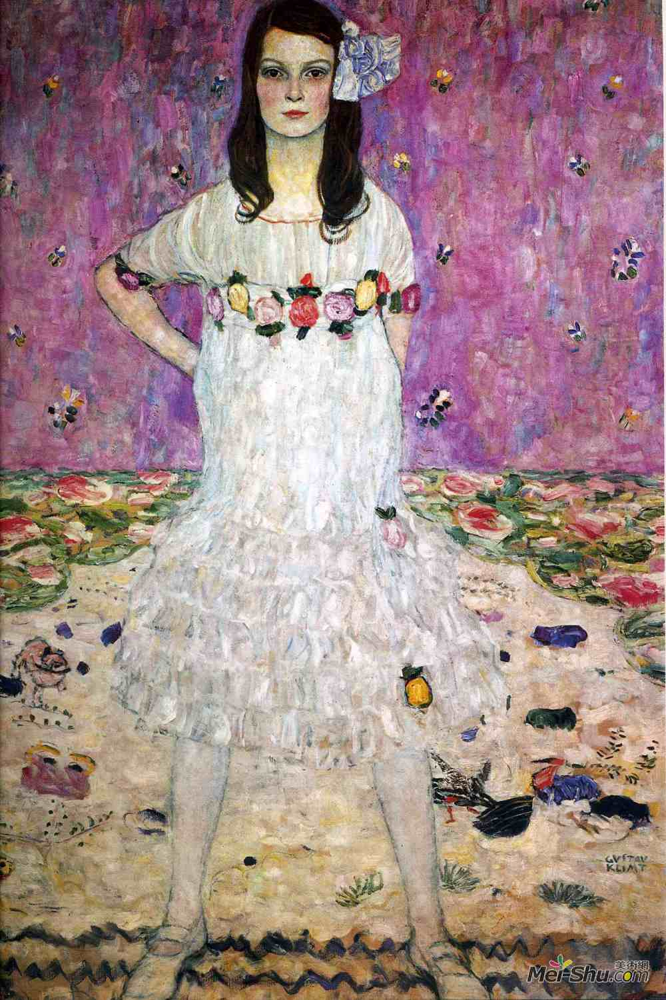

_**Muda Primavesi**_ é uma pintura óleo sobre tela transmite um notável grau de confiança para uma menina (Muda Primavesi) de nove anos com uma  expressão e a postura bem decidida.

Na abertura temos a referência a essa pintura ao passar o quadro:

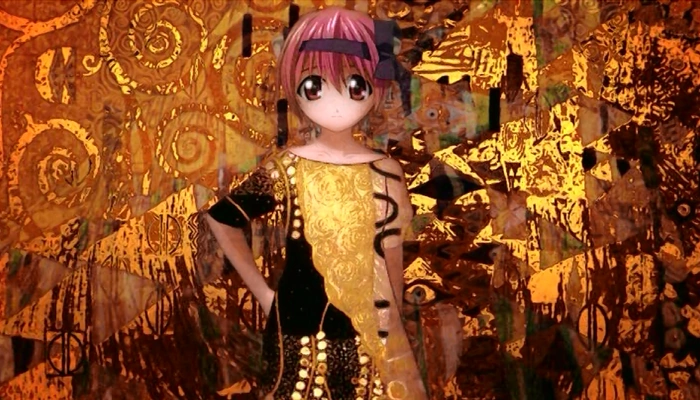
### Golden Adele

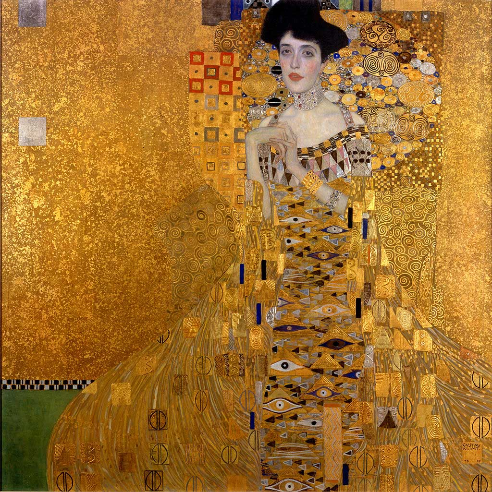

A pintura _**Golden Adele**_ (1907) mede 138 por 138 cm, é composta por tinta a óleo e prata e folha de ouro em tela. O retrato mostra Adele Bloch-Bauer sentada em um trono ou cadeira dourada, na frente de um fundo estrelado dourado.

O anime homenageou esse quadro ao referenciá-lo também:

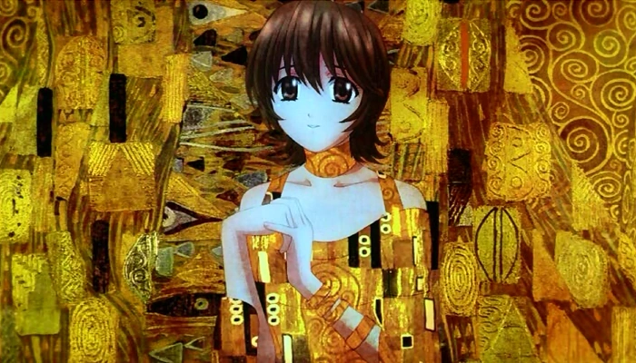

### Retrato de Ria Munk III

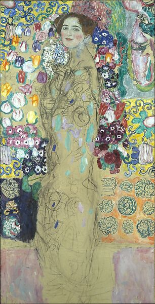

Klimt foi contratado para pintar o retrato póstumo de Maria ("Ria") Munk, que cometera suícidio, depois que o escritor Hanns Heinz Ewers cancelou seu noivado.

O próximo frame mostrado da abertura, possivelmente conversa com essa pintura:

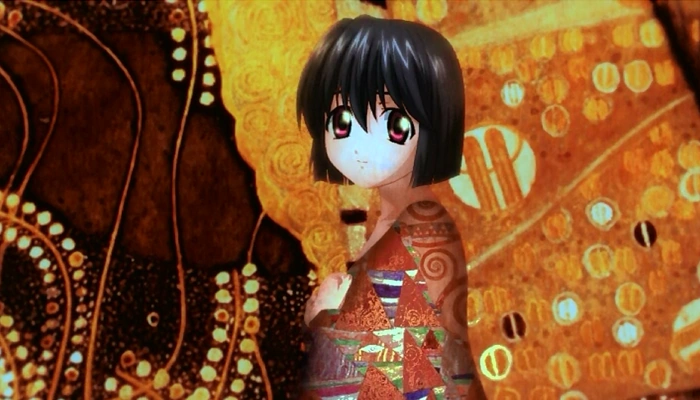
### Water Snakes II

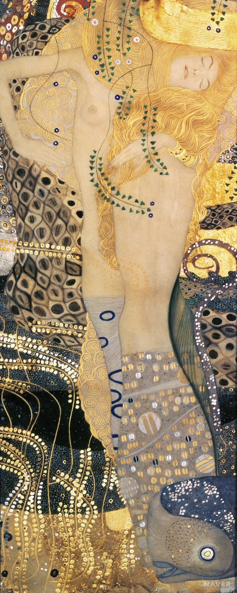

_**Water Snakes**_ II foi pintada em diversas técnicas, desde aquarela e têmpera até folhas douradas em pergaminho. A composição mostrava figuras esguias e esticadas e exibia uma ilustração abstrata de uma mulher de cabelos compridos abraçando uma figura semelhante a uma serpente.

A captura que fiz talvez não retrate bem mas pelo vídeo fica nítido que essa foi outra homenagem: 

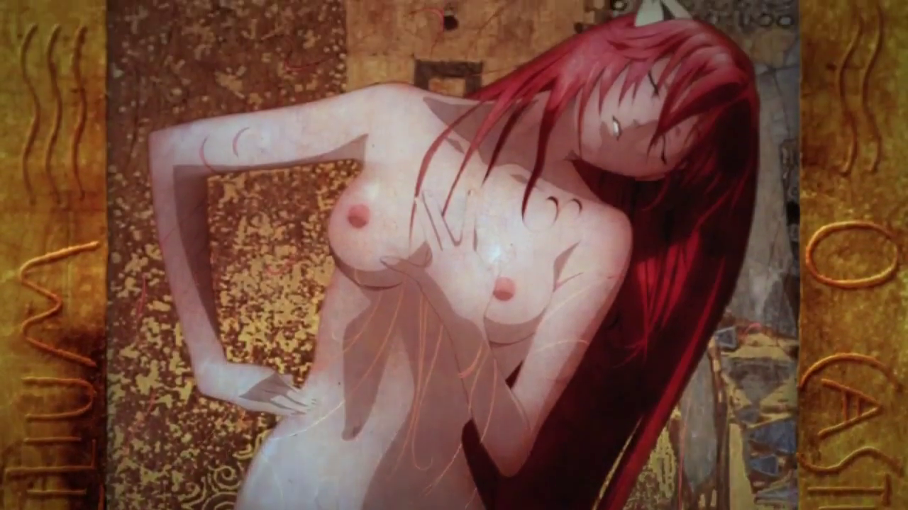

## A letra da Abertura

::toggle-card{title="Lilium - Versão original"}

Os iusti  
Meditabitur sapientiam  
Et lingua eius  
Loquetur indicium  

Beatus vir qui  
Suffert tentationem  
Quoniquom cum  
Probates fuerit accipient coronam vitae  

Kyrie, fons bonitatis  
Kyrie, ignis divine, eleison  

O quam sancta  
Quam serena  
Quam benigna  
Quam amoena  
O castitas lilium  
Esse virgo creditur  

O quam sancta  
Quam serena  
Quam benigna  
Quam amoena  
O castitas lilium  

Kyrie, fons bonitatis  
Kyrie, ignis divine, eleison  

O quam sancta  
Quam serena  
Quam benigna  
Quam amoena  
O castitatis lilium
::

::toggle-card{title="Lírio - Versão traduzida"}

A boca do justo  
Mediará a sabedoria  
E a sua língua  
Proferirá o julgamento  

Bem-aventurado o homem que  
Resiste à tentação  
Porque, depois de provado  
Ele receberá a coroa da vida  

Senhor, fonte da bondade  
Senhor, fogo divino, tende piedade  

Ó, quão santa  
Quão serena  
Quão gentil  
Quão agradável  
Ó lírio de castidade  
Acredita-se ser pura  

Ó quão santa  
Quão serena  
Quão gentil  
Quão agradável  
Ó lírio de castidade  

Senhor, fonte da bondade  
Senhor, fogo divino, tende piedade  

Ó quão santa  
Quão serena  
Quão gentil  
Quão agradável  
Ó lírio de castidade  
::
