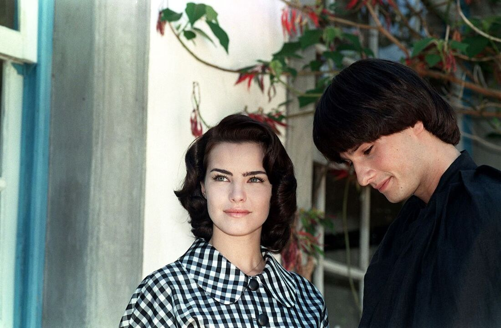

----

Quem diria! Fazia muitos anos que eu não assistia nada na TV aberta, mas, por algum motivo, senti vontade de ver _Hilda Furacão_, uma minissérie exibida na Globo lá em 1998. Acabei de terminar todos os 32 capítulos.

Eu já tinha lido o romance homônimo de Roberto Drummond duas ou três vezes durante a adolescência e lembro que gostei muito, especialmente pela forma como ele abordava os conflitos entre os revolucionários comunistas da época e a sociedade conservadora. O livro é menos um romance entre duas pessoas e mais um trabalho que busca contextualizar os eventos que culminaram no golpe militar de 1964.

Já a minissérie, embora adapte bastante o contexto e o pano de fundo do livro, foca mais no romance entre a prostituta Hilda e o Frei Malthus, o "Santo". Achei até melhor assim, apesar de sentir que o roteiro puxa para um lado doutrinador em favor dos chamados revolucionários. Não me entenda mal; não sou daqueles que negam o golpe de 64 nem daqueles que chamam o golpe de "Revolução de 64" 🤮. 

O golpe trouxe cerceamento de liberdades e represálias terríveis, mas também reconheço que os grupos envolvidos naquela época — tanto os que apoiaram o golpe quanto os revolucionários — tinham interesses próprios, manipulavam informações e usavam estratégias que serviam a agendas particulares. A situação é muito mais complexa do que uma luta de heróis contra vilões.A análise é bem mais complexa, e isso não justifica algo que precisa ser repudiado — o golpe, mas enfim, não era sobre isso que eu queria falar, e sim sobre a série.

_Hilda Furacão_ tem bons momentos, apesar de um roteiro meio ingênuo e várias histórias paralelas cansativas (ainda que algumas sejam interessantes). Uma coisa que me incomodou foi como o roteiro construiu a paixão entre os protagonistas. A série segue aquele clichê de ódio que vira amor, mas o casal quase não contracena junto, quase não conversa. E quando, enfim, eles percebem que se amam — embora neguem o sentimento — Hilda ainda solta um "Você sente minha falta?". Ora, falta de quê, minha querida, se vocês nunca conversaram? A interação mais próxima que eles tiveram até ali foi o "Santo" tentando, sem sucesso, exorcizá-la! Bom, no final, descobrimos que Hilda completa cinco anos como prostituta em 31 de março de 1964 (data do golpe), o que sugere que, durante esse tempo, eles devem ter se encontrado e conversado. Mas a passagem de tempo na série é confusa. Enfim, isso ainda não tira o mérito da minissérie.

O final, por outro lado, é horrível. Os protagonistas se desencontram, cada um segue sua vida e, nos últimos minutos, eles se reencontram anos depois, em uma manifestação contra a ditadura. Não tenho nada contra a manifestação, mas sim contra o fato de que, ao longo dos 32 capítulos (ou cinco anos), nada indicava que eles tinham esse perfil, mesmo convivendo com pessoas que facilmente estariam naquela cena — mas não estavam.

Então, é isso. No geral, gostei de assistir a minissérie, mas também me lembrei do porquê de raramente assistir algo produzido aqui: roteiros ingênuos, soluções fáceis e muita, mas muita enrolação. De qualquer forma, recomendo, especialmente pelo contexto histórico que ela traz sobre um momento importante da nossa história como brasileiros.
