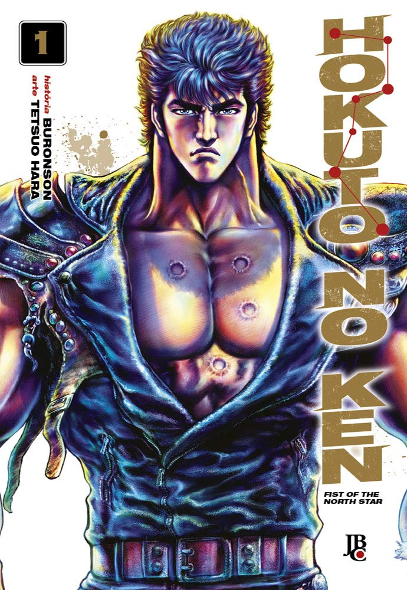

----

> O ano é 199X. O mundo foi devastado por chamas nucleares. A sociedade civilizada foi dizimada, e agora a violência rege esse novo mundo. É uma Era onde apenas os mais fortes sobrevivem. Neste cenário pós-apocalíptico, um homem com sete feridas no peito vaga pelo deserto… Ele é aquele que foi escolhido como o sucessor do estilo assassino terrível, o herdeiro do Hokuto Shin-ken. Ele é Kenshiro!! A lenda do salvador da humanidade está prestes a começar. Mas aqueles que ousarem se interpor em seu caminho sentirão a fúria do seu punho… “Você já está morto!”

Esse eu já tinha lido na época do seu lançamento. Agora, com a coleção finalmente completa, estou relendo desde o primeiro volume.

Os desenhos às vezes são um pouco desproporcionais, como alguns personagens gigantes, mas nada que atrapalhe. É incrível como sempre, com arte muito bem desenhada, cenário punk pós-apocalíptico à moda de Mad Max e muita violência.

Super recomendado!