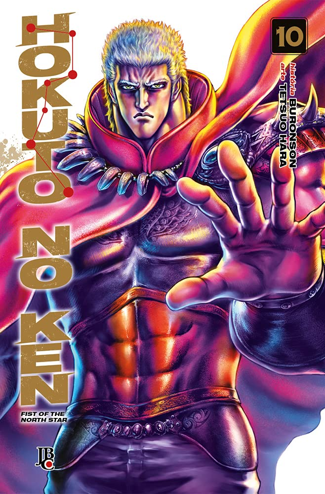

----

> Dois sucessores de uma arte marcial lendária - Kenshiro e Raoh.A batalha entre os dois homens que dominaram a Técnica Máxima - A Reencarnação do Nada - é a verdadeira batalha mortal!Quando o punho cheio de sentimentos de Raoh, choca-se com o punho inquebrantável de Kenshiro...Enfim, o mundo volta a ter luz.“Não deixo arrependimentos nesta vida”

Finalmente, uma conclusão para o embate entre Kenshiro e Raoh. Alguns podem achar piegas ou brega, mas eu gostei muito de como tudo ocorreu. Em sua derrota, Raoh percebe a superioridade de Kenshiro, o que resulta em um fim bastante interessante.

Este poderia muito bem ser o final da série, mas de alguma forma o autor criou história para mais alguns volumes. Fico curioso, pois Raoh até então era o vilão definitivo dessa história. Seguirei acompanhando.