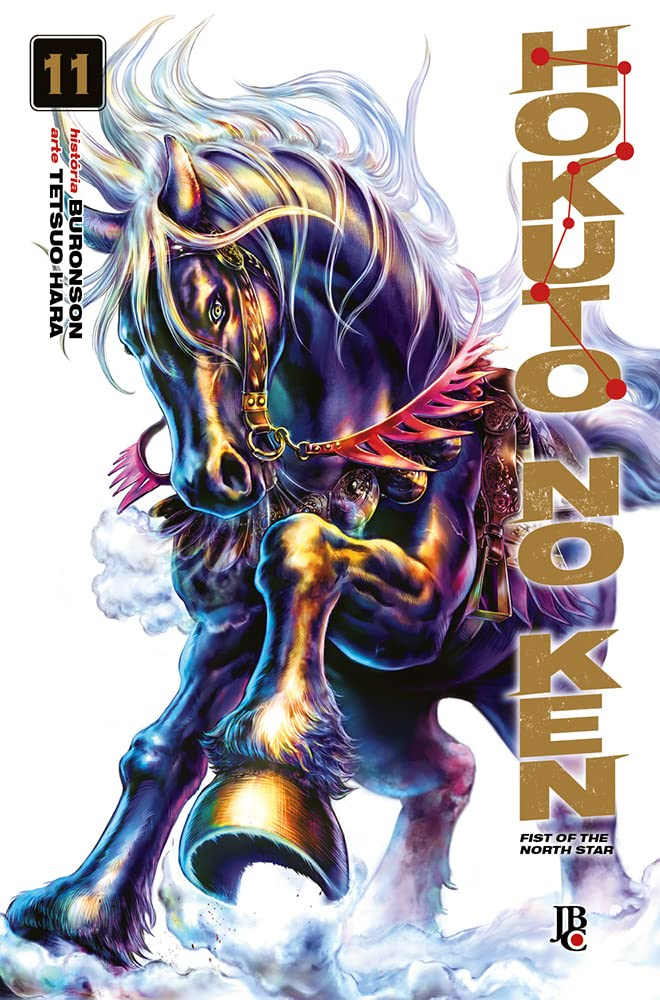

----

> Depois de inúmeras batalhas mortais com amigos e rivais, a paz finalmente voltou, e Kenshiro pôde passar os últimos momentos de Yuria ao seu lado.Porém, o mundo voltou a ficar conturbado...Será que os olhos de Kenshiro, que perderam tudo uma vez, conseguirão recuperar a luz da esperança novamente?A história secreta do salvador do século é finalmente revelada!“Vamos andar juntos, abraçando o destino do sucessor do Hokuto Shin‑ken!”

Eu estava curioso para saber como continuariam a história depois de Raoh, o adversário definitivo de Kenshiro. Da forma que fizeram, faz sentido. Colocaram um lapso de tempo de 10 anos entre os acontecimentos, e o esperado aconteceu: depois de um período de paz, a humanidade voltou à barbárie, onde os fortes e poderosos governam tiranicamente e os fracos não têm vez.

Gostei bastante do emocionante primeiro capítulo do volume, "Aquele que Cavalga em Minhas Costas". Essa é uma história extra escrita por Tetsuo Hara e Buronson em abril de 2014, em comemoração aos 30 anos de Hokuto no Ken. Segundo Tetsuo, essa história preenche uma lacuna que sempre o incomodou. Depois do confronto de Ken com Raoh, avançaram a obra em dez anos, como dito antes, e realmente, lendo agora pela primeira vez esse volume, acredito que o leitor deve ter sentido que faltava algo. O que aconteceu com Ken nesses dez anos? E sua amada, Yuria? Como, do nada, Ken aparece montado em Rei Negro, o cavalo de Raoh? Essa história, que introduz o volume, responde a importantes perguntas.

Rei Negro é reapresentado, e quem diria que um cavalo teria cenas tão emocionantes e fortes! Em suas aparições, era mostrado como um cavalo bruto, uma arma, uma máquina de guerra que só permitia o maior dos guerreiros montá-lo. Agora, vemos um ser que diariamente se prepara, esperando o próximo a montá-lo: nosso protagonista Ken, agora numa espécie de depressão, com repulsa pelo poder que existe em seus punhos!

Espero que mostrem mais do cavalo de Raoh nos próximos capítulos, apesar de achar que talvez não aconteça. Talvez esse background de Rei Negro tenha sido pensado justamente na ocasião dos 30 anos de Hokuto no Ken, portanto, muito depois da obra ter sido finalizada. Torço para que não!