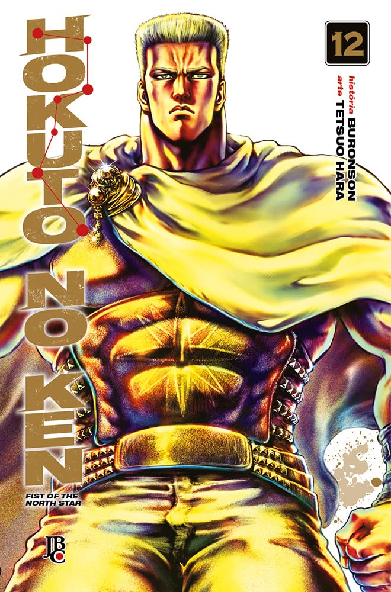

> Bat e Lin, liderando a Armada de Hokuto, avançam para cima do exército da Capital Imperial enquanto Kenshiro precisa enfrentar Falco, o Dourado, sucessor do estilo Gento Ko-ken.Hokuto Shin-ken e Gento Ko-ken…Ambos são guerreiros que carregam a estrela protetora do Imperador Celestial, e no momento em que colidirem, o Céu se partirá em dois!“Vou derrubá-lo, pelo meu amigo! Não tenho outra escolha!!”

Como sempre, a história se torna repetitiva, pois em todo arco surge um vilão tão poderoso quanto o anterior. Ainda assim, a construção de cada antagonista é interessante. Li este volume dois meses após o anterior e confesso que me deixou um pouco cansado. 

Estou ansioso pelo final da série. Que venha o volume 13!