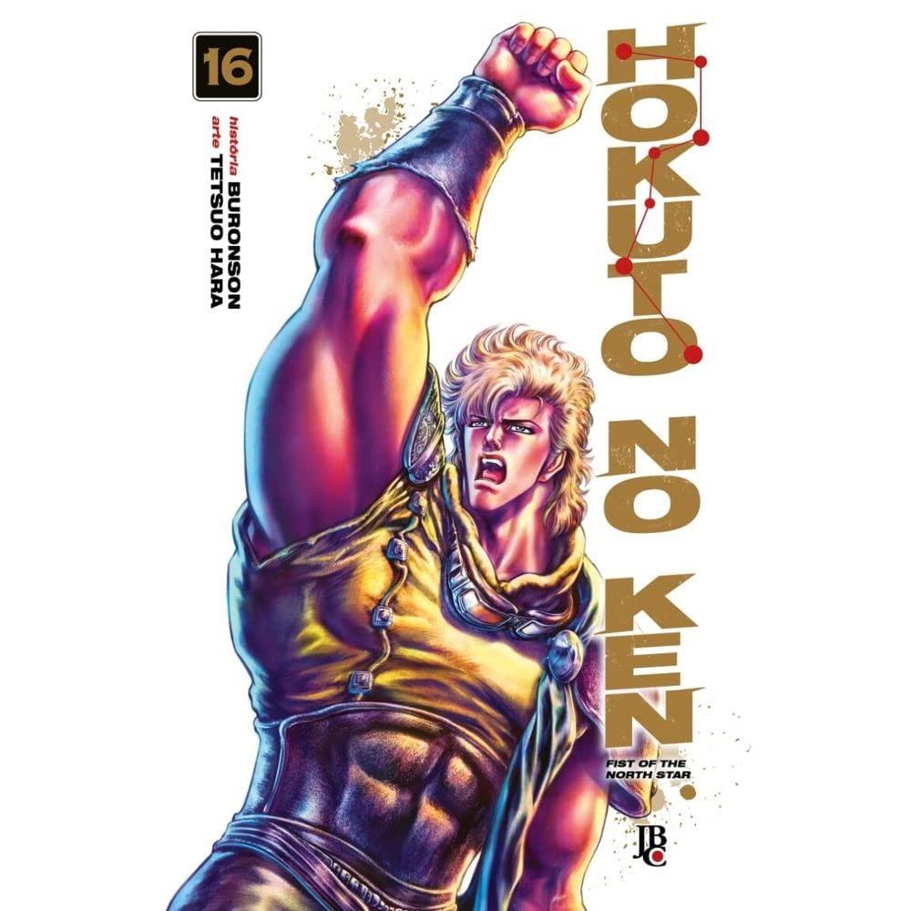

Os volumes 13 ao 16 revelam muito sobre a origem do Hokuto Shin Ken, do nosso protagonista Kenshiro e até de fantasmas do passado, como Toke e Raoh. É incrível como o autor consegue introduzir novos personagens, cada vez mais poderosos que os anteriores, sem tornar a narrativa cansativa ou repetitiva. O último volume foi repleto de ação e teve um final emocionante, com o confronto contra o antagonista, Kaioh (SPOILER -> SPOILER -> irmão de Raoh). Agora, rumo ao que acredito ser o último arco! Só faltam mais dois volumes!