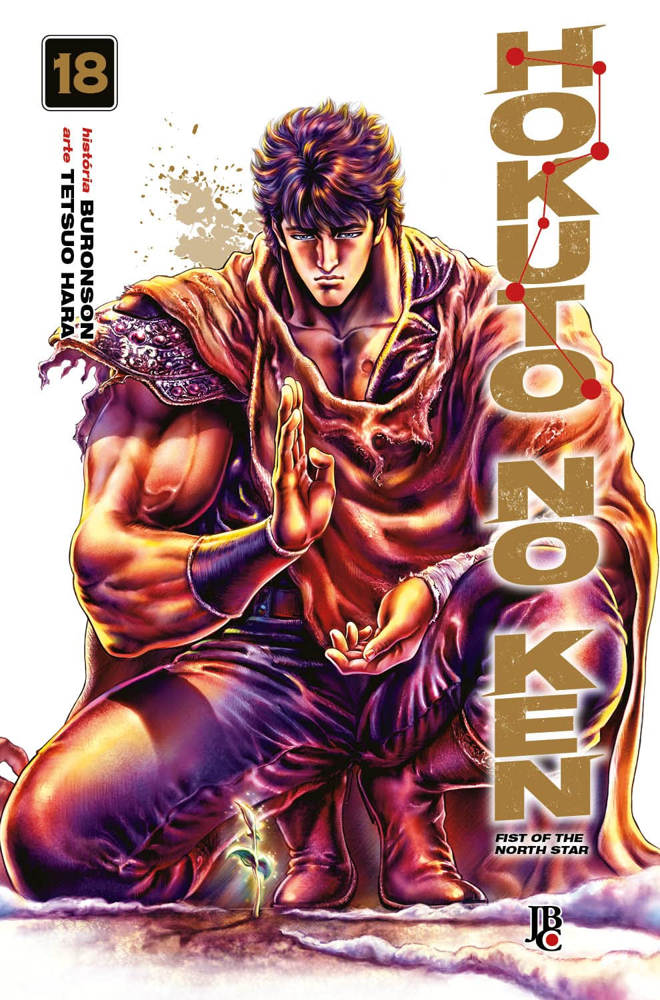

----

Então, finalmente terminei! Eu estava enrolando nesse último volume porque a história não estava interessante para mim. Vilões desnecessários, que claramente não levavam a lugar algum, me deram preguiça nesses últimos volumes. Foi interessante ver a origem de Ken, mas esse último volume não trouxe nada de muito original. Sinto que a primeira metade do volume simplesmente não precisava existir. O final de Ken foi satisfatório, mas, mesmo assim, essa história deveria ter terminado uns 10 volumes atrás.

No quadro geral, é uma boa história, mas provavelmente não a relerei e passarei meus volumes adiante.