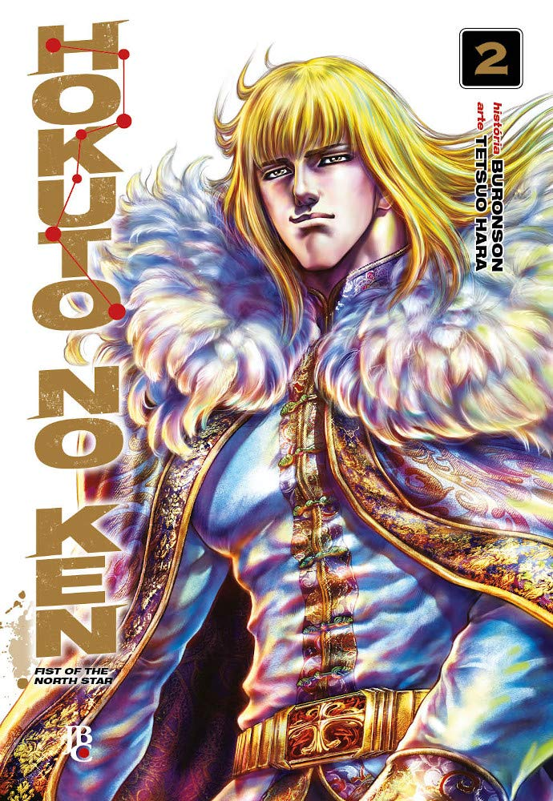

----

> Para salvar a pequena Lin, Kenshiro invade sozinho e destrói a cidade de Godland. Porém, o justiceiro errante mal terá tempo de descansar, pois Jakal, um inimigo ainda mais cruel, ataca a comunidade de Batt! Jakal é um homem sanguinário e muito estratégico, e marca Kenshiro como seu próximo alvo!

Continua muito bom, com muita violência, kung-fu, decapitações e explosões de corpos em um cenário pós-apocalíptico! O roteiro continua bastante simples e até ingênuo, com figuras desproporcionais sem qualquer explicação, como gigantes de, sei lá, 10 metros. Nada disso, entretanto, torna essa obra ruim; ao contrário, acho até que melhora ela! Hahaha!

Super recomendado!