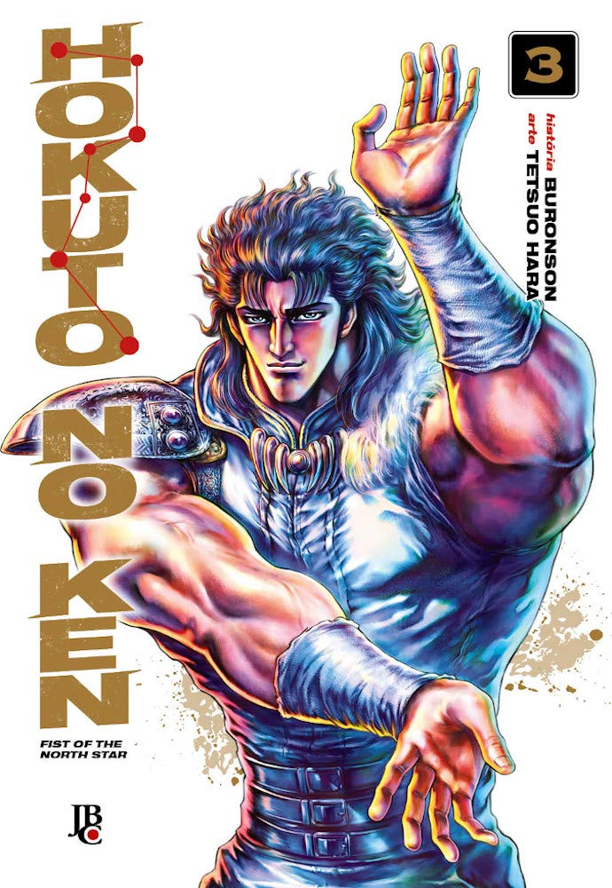

> Kenshiro conhece Rei, usuário do estilo Nanto Suicho-ken, e que está em busca de sua irmã, Airi. Os dois são contratados para salvar a comunidade de Mamiya do Clã das Garras. Porém, em retaliação, eles raptaram Airi e a usam de refém. Kenshiro e Rei se dirigem à base do Clã das Garras para salvá-la, e então, os dois mestres de seus respectivos estilos se unem para formar a equipe mais poderosa de todas!

Existem vários clichês; mesmo assim, é um clássico que vale a pena ser lido. Foi introduzido um vilão realmente perigoso neste volume. Veremos como será o quarto volume!

Super recomendado!