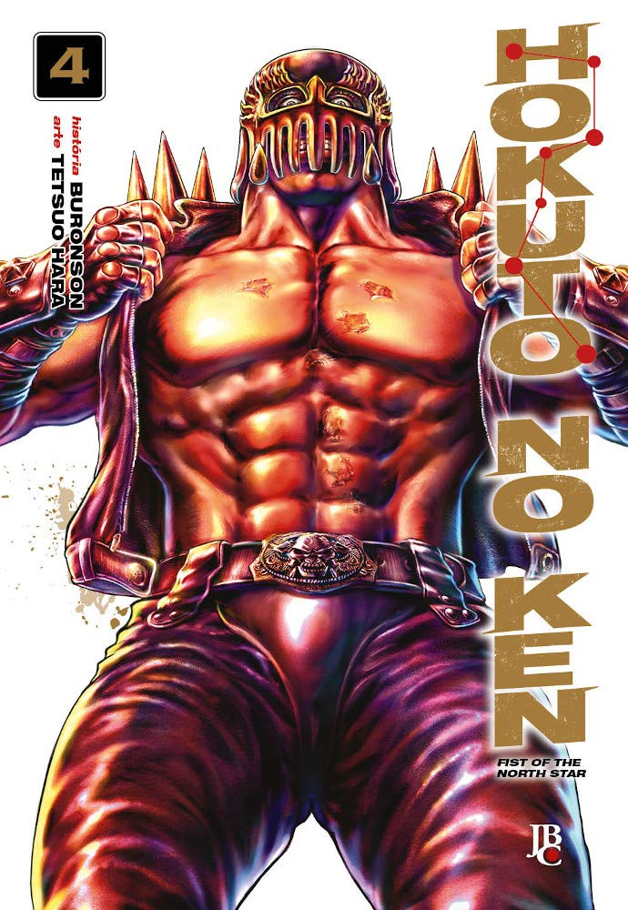

> O homem que fez as sete feridas no peito de Kenshiro e tentou fazê-lo desistir de seu próprio nome… ele é nada mais, nada menos do que o irmão mais velho do nosso herói e usuário do Hokuto Shin-ken, Jagi! Jagi nutre um rancor imenso por seu irmão mais novo ter sido escolhido como sucessor do Hokuto Shin-ken. A raiva de Kenshiro contra a paranóia de Jagi! Quem vencerá?!

Altas expectativas sobre Jagi, o irmão de Kenshiro apresentado no volume anterior. Usuário do Hokuto, Jagi foi apresentado como um adversário mortal para Kenshiro. Na prática, o desempenho de Jagi foi patético. Este volume trouxe um pouco mais do passado de Kenshiro, então foi bastante interessante.