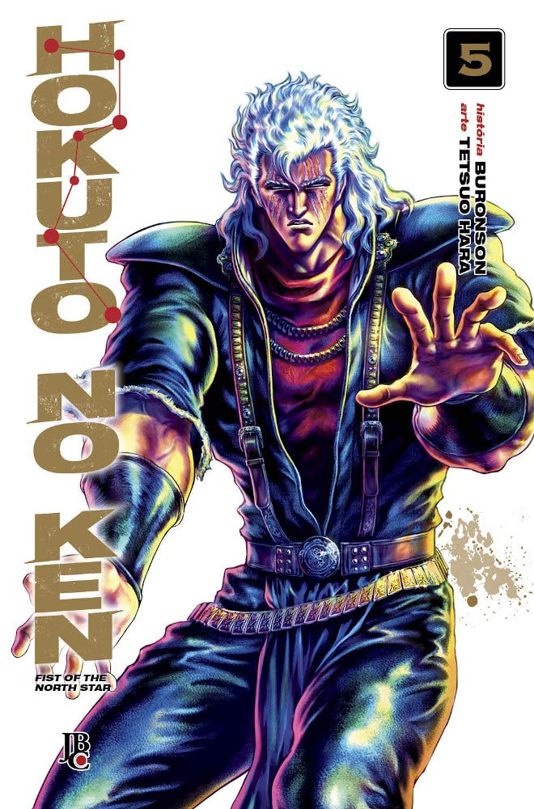

> Kenshiro se dirige até a prisão lendária Cassandra para salvar seu irmão Toki. Diante de Kenshiro, ergue-se Uighur, o impiedoso dono da prisão lendária.

Um pouco mais sobre o passado de Kenshiro, agora apresentando o interessante Toki, outro irmão de Kenshiro. Mais pancadarias e violências, a arte continua muito boa, até melhor eu diria.