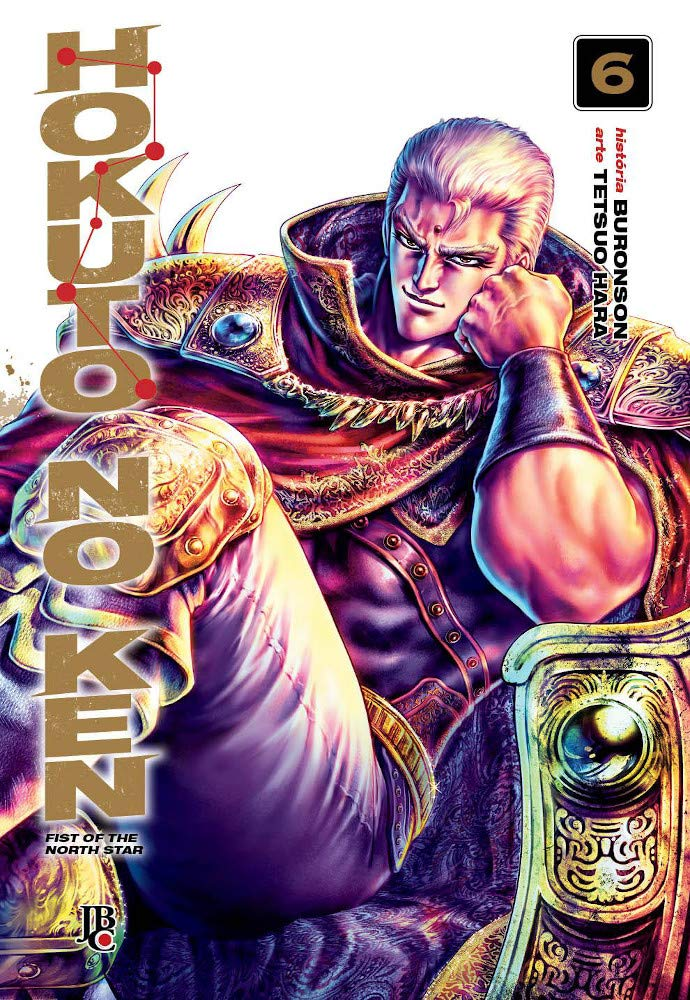

----

> Kenshiro e Raoh finalmente se encontram! A batalha entre os dois é mortal, e ambos estão empatados, sem sinal de quem sairá vitorioso! Enquanto isso, Rei, que foi atingido no ponto vital secreto de Raoh e só tem três dias de vida, resolve gastar seus últimos dias para enfrentar Yuda, o homem que capturou e torturou sua amada Mamiya e também traiu os Seis Punhos Sagrados da Estrelas do Norte. "Yuda, você irá pagar sangue com sangue!"

melhor volume, sem dúvidas até agora. Raoh é o primeiro vilão que realmente representa um perigo frente a turma de Kenshiro. A batalha entre os dois termina em um empate e ambos saem gravemente feridos. Veremos o que nos trará o volume 7!