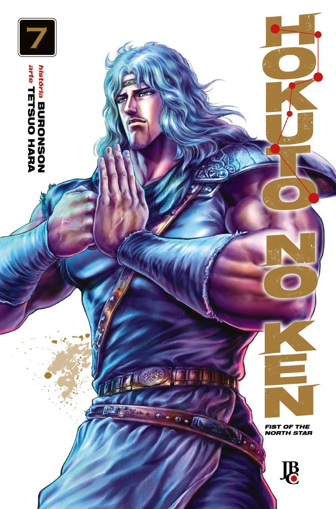

----

> O homem mais forte do Estilo Nanto Sei-ken que controla tudo com uma administração despótica, Souther. Aquele que reverteu essa tirania foi Shu, a Estrela da Benevolência. Kenshiro resolve lutar ao seu lado e de seu grupo de Resistência, mas não consegue derrotar Souther, pois o Hokuto Shin-ken não funciona contra ele!

Certo, está repetitivo. O volume anterior foi bem intenso com a promessa do até então mais poderoso vilão: Raoh. A batalha entre Raoh e Kenshiro terminou em um empate mortal entre os dois e fiquei com boas expectativas para esse volume.

O início do volume foi interessante seguindo a trama de Rei, que infelizmente, acaba falecendo como resultado de sua batalha contra Raoh. Apesar disso, Rei dá um show incrível mostrando todo o seu poder em uma luta maravilhosa! 

Após a morte de Rei, não há tempo de luto e aparece Souther, outro vilão bem pior que Raoh (Raoh ainda aparece no volume, inclusive salvando Kenshiro!) num padrão que já se repetia em outros volumes: Kenshiro precisa resolver alguma situação, se depara com um vilão muito poderoso, para em seguida derrotá-lo. É verdade que neste volume não houve uma resolução ainda, mas achei que esse ciclo acabou sendo cansativo. Talvez se tivesse continuado com o foco em Raoh, minha opinião seria diferente.

No mais, continua interessante, apesar do roteiro ser um tanto repetitivo.