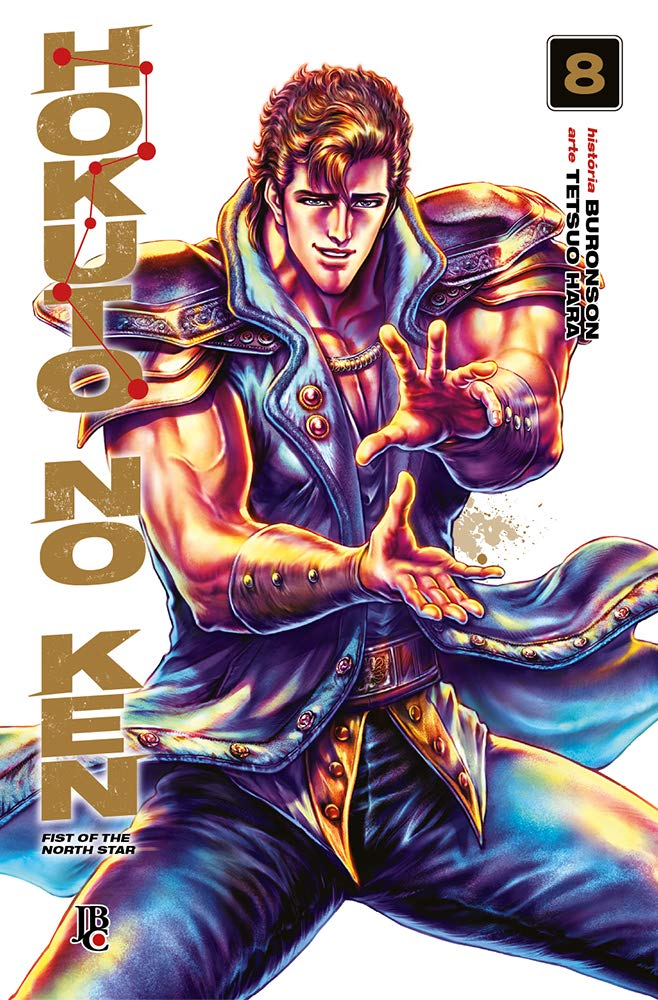

----

> Chegou a hora de Kenshiro enfrentar a derradeira batalha contra Souther. Mas para vencer um oponente tão poderoso, Ken terá de descobrir o segredo do corpo imortal dele. Já os irmãos Raoh e Toki terão de encarar o cruel destino que lhes foi predestinado: lutar até a morte para descobrir quem será o sucessor do Hokuto Shin-Ken.

Finalmente, uma resolução para o conflito com Souther. Neste volume, também testemunhamos o fim de Toki. Sinto que essa repetição de eventos está se tornando bastante chata; eu queria uma resolução para o conflito com Raoh. Veremos como continua o próximo confronto.