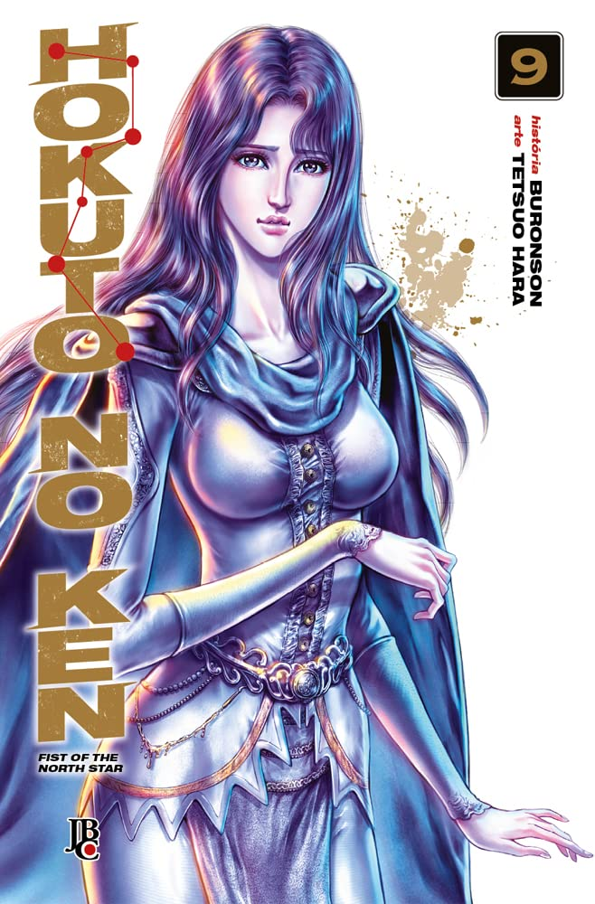

> Raoh tenta derrotar Toki para aumentar seu reinado sob este mundo caótico. Para detê-lo, as Cinco Estrelas de Auriga, guardiãs do último General dos Seis Punhos Sagrados do Sul, despertam e começam a agir. Porém, apenas uma delas é capaz de enfrentar Raoh de igual para igual, e ela se chama Juza das Nuvens! “Eu sou uma nuvem! Me moverei apenas quando quiser!”

Como que o autor consegue criar tanta história e personagens? Tá certo, a história é basicamente só porradaria (o que eu me amarro também) mas toda hora aparece um personagem com alguma estrela regente. A mitologia é bastante interessante. Me lembra Cavaleiro dos Zodíacos. Vai saber, não sei qual obra saiu primeiro mas vai que um sofreu influência do outro...