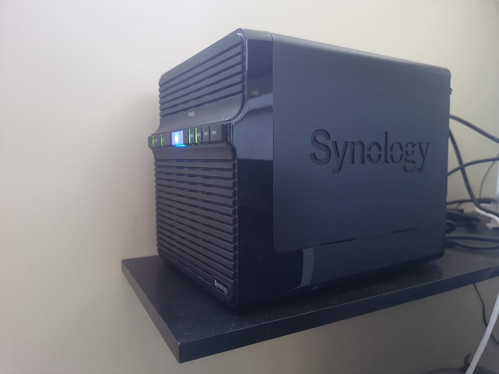

Synology DS420J by Acervo Pessoal

## Sumário
Descrevo as especificações do meu primeiro servidor, o NAS de entrada Synology DS420j e impressões gerais sobre ele. Atualmente meu [servidor principal é um montado por mim](https://www.marcal.dev/meu-segundo-homelab-montado/), onde tenho mais flexibilidade de configuração.

*   CPU: Realtek RTD1296 SoC
*   Taxa de clock da CPU: 1.4 GHz
*   Núcleos da CPU: 4
*   Memória RAM: 1024 MB DDR4
*   4 baias de HDD (vendido sem discos)
*   Armazenamento máximo teórico: 60TB
*   Armazenamento HDD em uso: 2 discos de 4TB (3.6 TB real) em RAID 1
*   Sistema de Arquivos: EXT4
*   LAN: 1x Gigabit (RJ-45)

Este é um servidor de entrada. Como pode ser observado em suas especificações, seus recursos são bastante modestos, embora sejam suficientes apenas para operar como um NAS (um servidor de armazenamento).

Foi o meu primeiro servidor NAS (Network Attached Storage), no qual costumava executar diversos serviços. Os principais eram o Plex, Gitea, Synology Photos e Synology Drive. À medida que desenvolvi um gosto por hospedar meus próprios dados, surgiu a necessidade de migrar para um servidor mais potente em comparação com este Synology.

## Plex e o transcoding de vídeos

Utilizei bastante o Plex, e ele atendeu bem, exceto quando eu precisava do hardware transcoding para os vídeos na minha TV (na época, uma LG). Infelizmente, o Synology DS420j não oferece suporte ao hardware transcoding, sendo necessário adquirir uma versão diferente do hardware da Synology que suporte essa funcionalidade.

O hardware transcoding aproveita os recursos da placa de vídeo, resultando em um transcoding mais suave na maioria das vezes, dependendo das configurações específicas do hardware e do sistema operacional. Por outro lado, o software transcoding é realizado pelo software, exigindo mais do processador do hardware.

É bastante inconveniente lidar com o congelamento do vídeo durante o streaming causado pelo software transcoding. No caso deste Synology específico, por ser um hardware de entrada, é comum experimentar congelamentos durante o streaming de vídeo devido ao trabalho (lento/ineficiente) do software transcoding. Felizmente, na maior parte das vezes, meus vídeos não precisavam de transcoding, e esses congelamentos não ocorriam com frequência. Se ocorressem, tornando o streaming impossível, eu convertia o vídeo para um formato mais compatível com a minha TV, evitando a necessidade de transcoding no Plex.

## Suporte ao Docker

Inicialmente, o uso do Docker não era possível, mas por volta de meados de 2023, a Synology habilitou o suporte a essa ferramenta, o que certamente deu uma sobrevida ao hardware. Realizei alguns testes, embora na época já possuísse outro servidor que atendia plenamente aos meus requisitos, então não utilizei efetivamente o Docker no Synology.

## Synology Photos

Ainda utilizo o Synology como gerenciador da minha biblioteca pessoal de fotos. Seu aplicativo proprietário, o Synology Photos, embora não seja um substituto completo do Google Photos, atende muito bem ao uso diário. Possui excelentes funcionalidades, incluindo reconhecimento facial, criação de álbuns, compartilhamento de fotos e álbuns, edição de metadados, upload automático do celular para o servidor via aplicativo próprio e visualização por geolocalização.

O reconhecimento facial é bastante preciso; pessoalmente, tive poucos problemas na detecção de rostos. A funcionalidade de marcação de fotos é muito útil: além de criar álbuns, você pode atribuir inúmeras marcas a um grupo de fotos. Dessa forma, é possível pesquisá-las ou, de maneira semelhante aos álbuns, vê-las agrupadas de forma conveniente, facilitando a organização de fotos relacionadas.

## Synology Drive

O Synology Drive tem se mostrado bastante útil, proporcionando recursos como edição pela interface web, upload, compartilhamento e versionamento de arquivos. Durante o tempo em que o utilizei, quase chegou a ser o substituto perfeito do Google Drive.

No entanto, alguns pontos negativos, pelo menos até o momento da escrita deste texto, merecem destaque:

*   **Edição de Arquivos no Celular:** Não é possível editar arquivos pelo celular diretamente na interface do aplicativo Synology Drive. É necessário baixar o arquivo pelo aplicativo e, em seguida, editá-lo fora do app, utilizando algum editor instalado no celular. Essa limitação não existe na interface web.
*   **Formato Proprietário da Suite Office Synology:** A suíte office da empresa, embora baseada no LibreOffice, utiliza um formato proprietário. Se você baixar o arquivo no seu computador, não será possível abri-lo nem com o LibreOffice, nem com a suíte da Microsoft. É necessário converter para um formato conhecido na própria interface do Synology Office antes de fazer o download do arquivo.
*   **Aplicativos Clientes de Sincronização:** Existem aplicativos clientes de sincronização para Windows, Mac e distribuições baseadas no Debian, mas não para outras distribuições Linux. Como utilizo o Fedora atualmente, não tive a oportunidade de testar a sincronização, então eu fazia upload dos arquivos no Synology Drive pela interface web/app ou via compartilhamento Samba no Linux.

Apesar desses pontos negativos, usei massivamente o Synology Drive no meu dia a dia, e ele realmente se mostrou uma ótima ferramenta.

## Ferramentas de backup

No Synology, há diversas opções de ferramentas de backup, e duas que provei com sucesso foram o Hyper Backup e o Glacier Backup, ambas desenvolvidas pela Synology.

O Hyper Backup oferece a flexibilidade de criar rotinas de backup para diversos destinos, como Google Drive, Dropbox e AWS S3. Eu o utilizo principalmente para realizar backups diários em um HD externo de 1TB da Samsung. O programa permite configurar agendamentos, a rotação dos arquivos e oferece a opção de criptografar os arquivos de backup.

O Glacier Backup, como o próprio nome sugere, é um programa de backup projetado para o Amazon Glacier. O serviço Glacier oferece armazenamento de longo prazo a um custo relativamente baixo em comparação com o S3 padrão, mas o custo de recuperação de dados é mais elevado. Além disso, o tempo necessário para recuperar dados pode ser significativo, variando de dias a semanas, dependendo do tamanho dos arquivos.

Apesar dessas limitações, o Glacier Backup é uma ferramenta útil em situações de falha geral no hardware, proporcionando uma camada adicional de segurança quando não há outro backup prontamente acessível. É uma opção econômica para armazenamento a longo prazo.

## Considerações Finais

Além de ser um bom gerenciador de biblioteca de imagens, também o utilizo fortemente como um servidor de backup. Os dados de "produção" são criados, utilizados e alterados em [outro servidor](https://www.marcal.dev/meu-segundo-homelab-montado/) para, finalmente, serem replicados no Synology. Assim, se, por algum motivo, eu perder a versão original de algum arquivo no meu servidor principal, ainda posso recuperá-lo no Synology.

Por fim, a combinação do hardware e software do Synology DS420j faz dele um ótimo dispositivo de entrada, principalmente para aqueles que não desejam gastar muito tempo configurando um servidor sozinhos e querem apenas um servidor de armazenamento com os benefícios dos bons softwares da suíte Synology. Entretanto, sua óbvia limitação de hardware o torna desencorajador para o usuário que pretende fazer um uso mais intenso do servidor, como foi o meu caso.