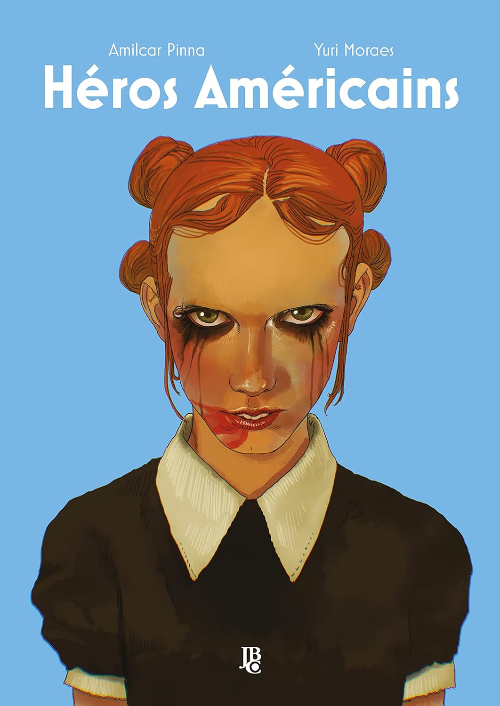

----

>Coraline tem um namorado: O DJ. Só que ele não sabe disso. O DJ costuma tocar pelos subúrbios élficos do bairro que ele e Coraline moram.Nesse mundo, os elfos foram seduzidos pela modernidade e perderam suas raízes ancestrais. Se tornaram materialistas e consumistas, perdendo o seu contato com a natureza. As florestas do mundo viraram grandes favelas élficas e os elfos se adaptaram a cultura e a tecnologia humana.

Esse é um quadrinho "curta-metragem" de tão breve que é, podendo ser lido em 15 min. Comprei no escuro quando vi o preço de 13 reais , mas já vi na Amazon até por 10.

A história não é muito convencional, ler esse quadrinho é como se pegássemos um filme pela metade, ou como quando assistimos um episódio aleatório de uma série que nunca acompanhamos. O trabalho da arte com suas cores e desenhos são realmente bons. 

Não é ruim, mas é esquecível. Acho que vale o que paguei.