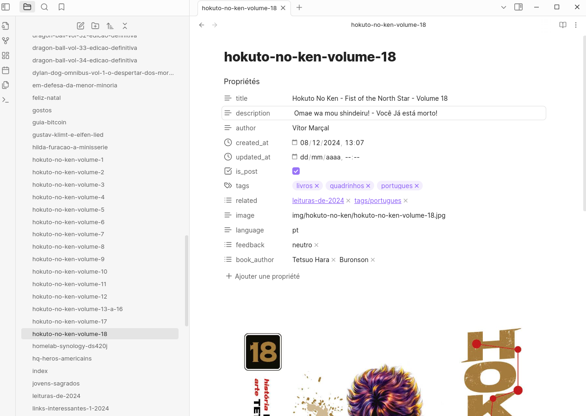
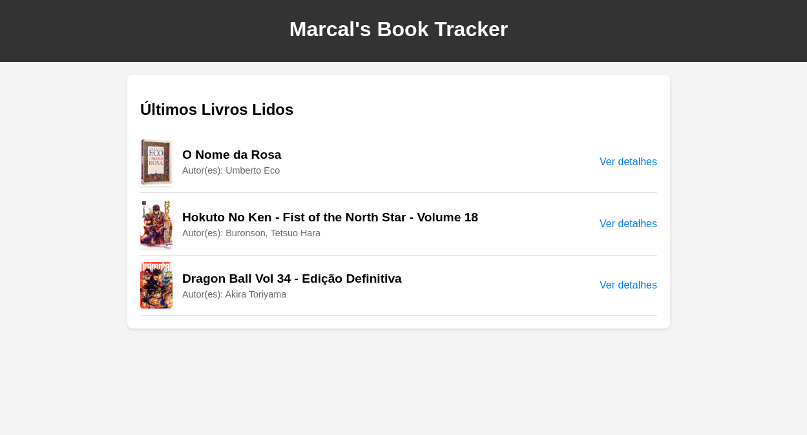
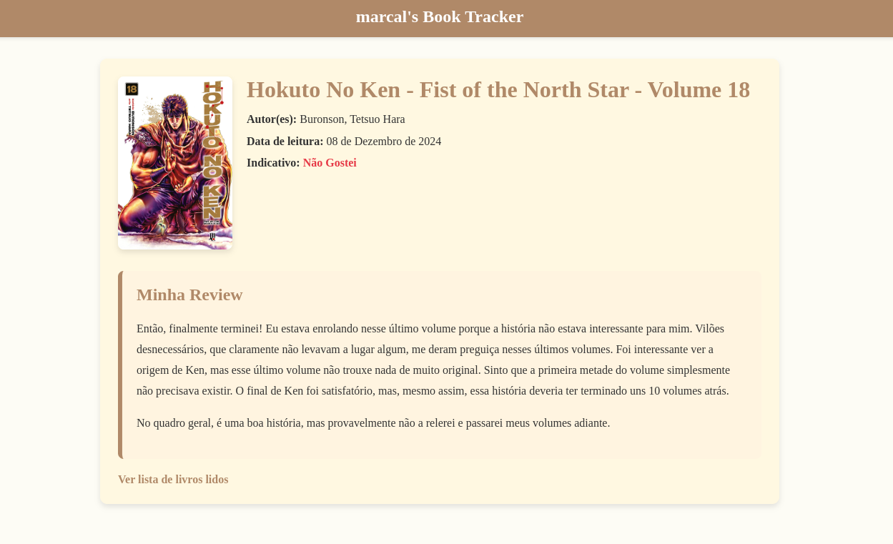
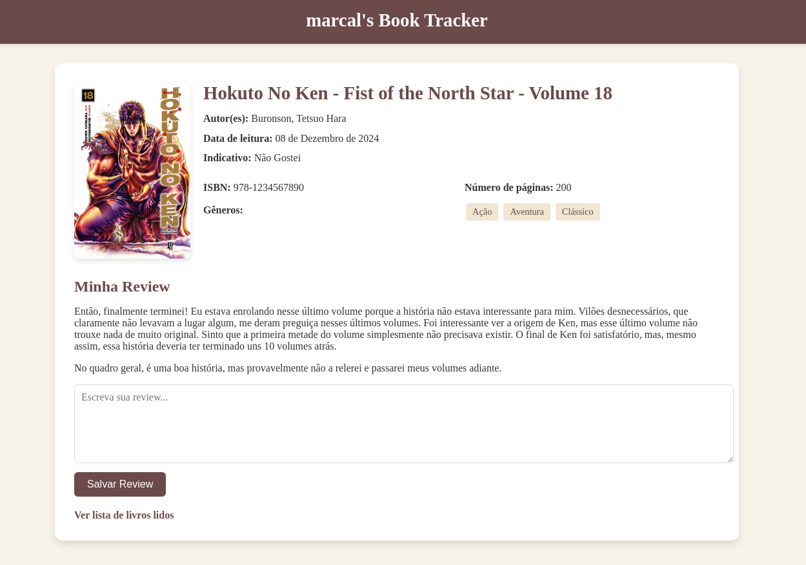
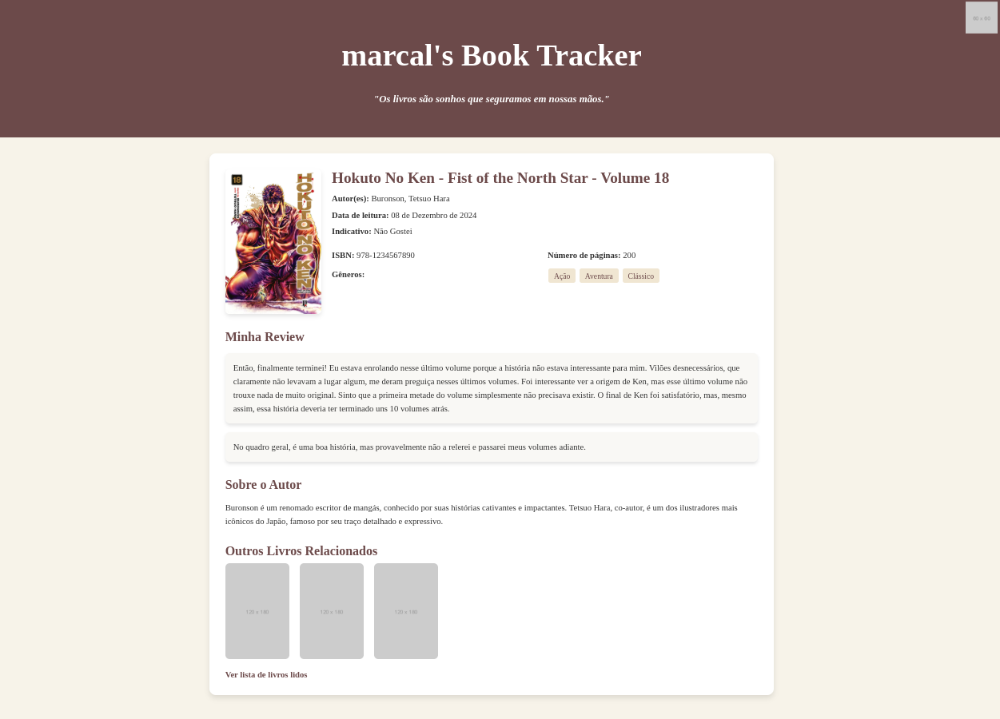

----
Ano passado, deixei de usar o GoodReads e passei a registrar minhas leituras, livros abandonados ou que desejo ler diretamente aqui no blog. Para 2024, por exemplo, já existe uma [publicação](leituras-de-2024) que documenta minhas explorações literárias. É possível listar todos os livros que li navegando pelas [categorias](tags/mdc) do site e acessando a tag `livro` , ou diretamente pelo filtro de [livros](tags/livros).

Minha decisão de abandonar o GoodReads foi motivada por alguns fatores. A interface da plataforma é antiquada e parece ter parado no tempo. Além disso, o aspecto social do site nunca foi algo que me atraiu muito; eu só queria uma ferramenta para registrar minhas leituras e fazer anotações simples. Foi isso que me levou a migrar para o blog, onde tenho total controle.

No blog, já comentei resumidamente como funciona o processo de publicação [aqui](sobre). O fluxo é simples: crio um arquivo Markdown no Obsidian, utilizo um template de postagem, preencho as informações necessárias, adiciono uma imagem (se for o caso) e escrevo algumas linhas. Depois, envio para o GitHub e pronto: está na internet. Claro, não é tão prático quanto o GoodReads, onde basta acessar a página do livro, marcar que foi lido e adicionar um comentário. Porém, o meu método tem vantagens significativas. Sem distrações sociais, o conteúdo é meu, o formato é meu, e, se um dia eu quiser migrar para outro lugar, será fácil, já que o Markdown é um formato amplamente suportado por editores como Obsidian, Notion e Evernote.

Tela do meu Obsidian, repare os metadatas como title, description etc.

Após um ano registrando cada livro lido, abandonado ou que desejo ler, pensei: e se eu aproveitasse esses arquivos para criar um "book tracker"? Atualmente, o blog já funciona como um tracker simples, com postagens e uma lista de livros lidos, cada item linkado para a respectiva resenha. Mas imaginei algo mais visual. Poderia criar uma página específica, diferente do layout padrão do blog, talvez até gerar estatísticas automaticamente. Achei a ideia interessante!

Como não sou um designer, comecei com protótipos básicos para explorar as possibilidades. Primeiro, criei uma página simples com os últimos livros lidos. O layout é básico, mas já é algo diferente do restante do blog, servindo como prova de conceito.

Depois, pensei em uma página de detalhes de cada livro. Atualmente, armazeno no Markdown metadados como autor, título, data de leitura e um comentário (que pode variar de algumas linhas a textos mais longos). O Obsidian tem sido um grande aliado na edição desses textos. Mais uma vez, as cores e o layout não são nada impressionantes — são apenas experimentações, sem código real.

Também considerei integrar a edição das resenhas diretamente na interface, via formulário. No entanto, já uso o Obsidian, que considero o melhor editor atualmente, então seria difícil superar essa experiência. Além disso, meu blog não usa banco de dados; ele é gerado estaticamente a partir dos arquivos Markdown. Adicionar backend e banco de dados foge do propósito atual, mas fica como ideia para explorar no futuro.

Por fim, imaginei incluir mais informações nos metadados do Markdown, como ISBN, número de páginas, gênero, detalhes do autor e até livros relacionados que já li. Poderia até criar uma interface para exibir essas informações. Pensei em destacar a cor dominante da capa do livro como fundo do cabeçalho de cada página, o que daria um toque único a cada entrada. Ainda não sei como implementar isso automaticamente, mas seria divertido tentar. Também considerei incluir uma citação do livro no cabeçalho, o que é relativamente fácil de fazer adicionando um campo no metadata.

Esses layouts ainda não são definitivos, mas já comecei a programar algumas ideias. Planejo criar páginas diferentes, como listas de leituras por ano ou leituras favoritas, além de estatísticas. Apesar de não serem os designs mais bonitos, gosto mais do meu estilo "esquisito" do que das opções engessadas de plataformas como o GoodReads. Use suas próprias `merdas`. No fim das contas, esse projeto é mais sobre diversão do que utilidade, mas espero alcançar um resultado que me deixe satisfeito!