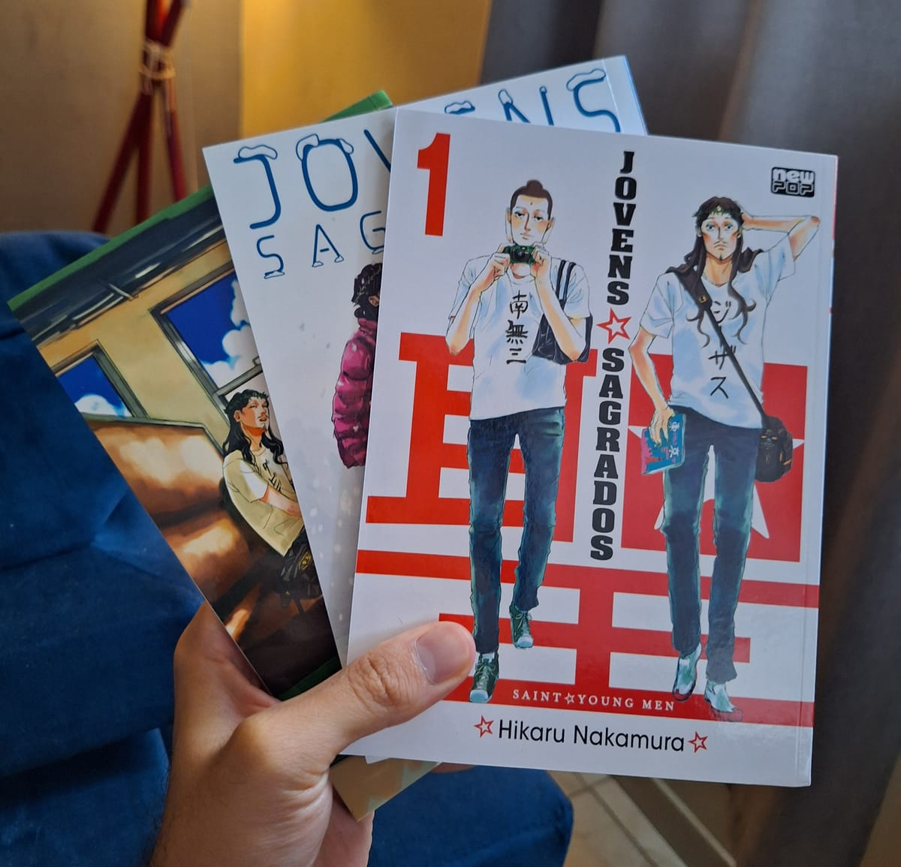

> O humano despertado, Buda e o filho de Deus, Jesus. Após superarem com sucesso o final do século, ambos dividem um apartamento em Tachikawa, Tóquio, para passarem as férias. Buda, que se preocupa com o menor dos trocados como uma senhorinha e Jesus, que compra muito por impulso. Esse é o cotidiano da dupla divina em Tachikawa.

Comprei os volumes de 1 a 3 aproveitando os descontos do saldão da Amazon de 2024. Trata-se essencialmente de um slice of life de comédia, com o diferencial de ter como protagonistas o improvável par de amigos Jesus e Buda. Contém piadas engraçadas e algumas sátiras religiosas de forma não ofensiva. É possível ler os capítulos fora de ordem, pois cada um é independente, sem muita continuidade.

A proposta é interessante, mas, para mim, hoje, não me cativou muito. Algumas piadas foram engraçadas, outras nem tanto, talvez devido a nuances perdidas na tradução. Continuarei com os próximos volumes sem muita prioridade, apenas se encontrar novas promoções. Recomendo com ressalvas.