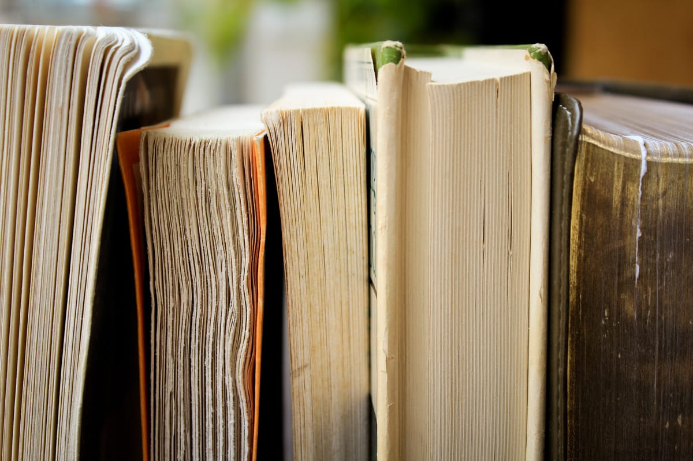

Photo by [Syd Wachs](https://unsplash.com/@videmusart?utm_source=ghost&utm_medium=referral&utm_campaign=api-credit) / [Unsplash](https://unsplash.com/?utm_source=ghost&utm_medium=referral&utm_campaign=api-credit)

Já há alguns anos, eu registro minhas atividades de leitura no Goodreads. Lá, consigo me planejar, marcar leituras desejadas e concluídas. Acontece que o Goodreads tem uma usabilidade péssima e uma funcionalidade limitada para exportar nossos dados.

Este ano, farei um pouco diferente. Ainda registrarei lá no Goodreads, mas desta vez, também registrarei o que li ou quero ler aqui. No futuro, quem sabe, não desenvolvo algo mais prático, algo que seja auto-hospedado e de código aberto.

### Lidos

1.  [Dragon Ball Vol. 29 - Edição Definitiva](dragon-ball-vol-29-edicao-definitiva), de Akira Toriyama - 2024-01-04
2.  [Antologia Poética](antologia-poetica-de-carlos-drummond-de-andrade), de Carlos Drummond de Andrade - 2024-01-11
3.  [Mushishi: Volume 1](mushishi), de Yuki Urushibara - 2024-01-15
4.  [A navalha de Ockham: O princípio filosófico que libertou a ciência e ajudou a explicar o universo](a-navalha-de-ockham-o-principio-filosofico-que-libertou-a-ciencia-e-ajudou-a-explicar-o-universo), de Johnjoe McFadden - 2024-01-24
5.  [Jovens Sagrados: Volume 1](jovens-sagrados), de Hikaru Nakamura - 2024-02-02
6.  [Jovens Sagrados: Volume 2](jovens-sagrados), de Hikaru Nakamura - 2024-02-03
7.  [Dragon Ball Vol. 30 - Edição Definitiva](dragon-ball-vol-30-edicao-definitiva), de Akira Toriyama - 2024-02-05
8.  [Jovens Sagrados: Volume 3](jovens-sagrados), de Hikaru Nakamura - 2024-02-07
9.  [Oshi no Ko - Minha Estrela Preferida Vol. 01](oshi-no-ko-minha-estrela-preferida-vol-01), de Aka Akasaka - 2024-02-15
10.  [Aprenda Inglês num piscar de olhos](aprenda-ingles-num-piscar-de-olhos), de Fabiana Lara - 2024-02-21
11.  [O Planeta dos Macacos](o-planeta-dos-macacos), de Pierre Boulle - 2024-02-26
12. [Cypherpunks: Liberdade e o Futuro da Internet](cypherpunks-liberdade-e-o-futuro-da-internet)c, de Julian Assange -  2024-03-07
13. [Necron - Volume 1: A Fabricante de Monstros](necron-volume-1-a-fabricante-de-monstros), de Magnus - 2024-03-07
14. [Necron - Volume 2: O Navio dos Leprosos](necron-volume-2-o-navio-dos-leprosos), de Magnus - 2024-03-08

### Lendo

1. [Contos Reunidos do Mestre do Horror Cósmico,](contos-reunidos-do-mestre-do-horror-cosmico.md) de H. P. Lovecraft, desde 2024-01-25

### Quero Ler

1.  Berserk Vol. 36: Edição, de Luxo de Kentaro Miura
2.  Neon Genesis Evangelion Collector's Edition Vol. 04, de Yoshiyuki Sadamoto
3.  Como Ler Livros - O guia clássico para a leitura inteligente, de Mortimer Jerome Adler
4.  O método Bullet Journal: Registre o passado, organize o presente, planeje o futuro, de Ryder Carroll
5.  Como as democracias morrem, de Steven Levitsky
6.  Ignorância: Uma história global, de Peter Burke
7.  O Homem que Calculava, de Malba Tahan
8.  Buda: Volume 5, de Osamu Tezuka
9.  Hokuto no Ken: Volume 4, de Buronson e Tetsuo Hara
10. A vida intelectual – Seu espírito, suas condições, seus métodos, de Padre Sertillanges