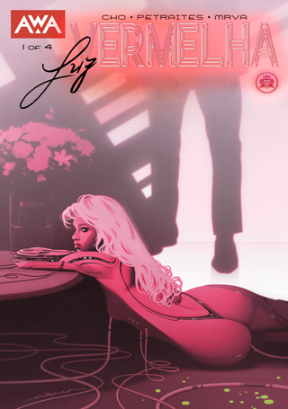

> Lacy é uma IA. profissional do sexo em um futurista Distrito da Luz Vermelha. E Lacy sabe exatamente o que seus clientes desejam – melhor do que eles próprios. Alojada num bordel de alta tecnologia sob o olhar atento do misterioso Mestre, Lacy tem pouco na sua vida fabricada além do trabalho. Tudo isso muda quando ela faz amizade com Natalie, uma criança órfã que fica sob seus cuidados.

Essa é uma minissérie em 4 capítulos, e em uma ou duas horas dá para ler tudo. É um thriller e, pela ambientação, a história poderia facilmente se passar em um cenário como o de _Blade Runner_. Não é indispensável, mas vale pelo entretenimento!