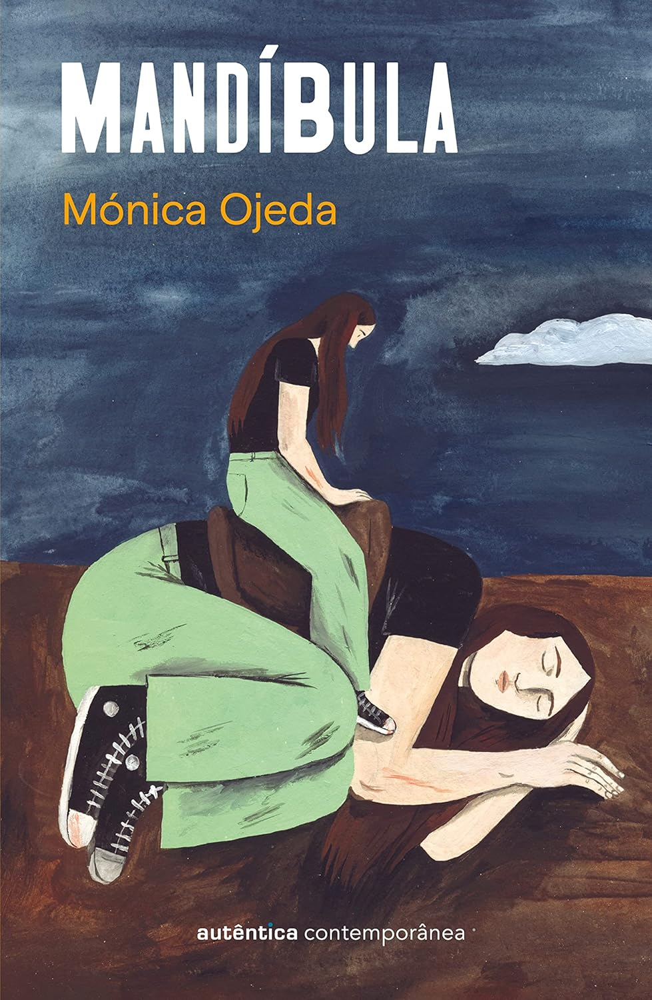

---

Photo by Editora Autêntica Contemporânea

Foi certamente uma leitura que me causou estranheza em diversos momentos, muito pela forma como Mónica constrói sua narrativa. Ela não segue um padrão entre os capítulos, mudando a forma de diálogo, sua intensidade e até mesmo o tempo-espaço. Muitas vezes, as mudanças não se limitam à transição dos capítulos, mas ocorrem também entre as linhas e parágrafos do mesmo capítulo.

Causa estranheza, mas provou ser uma forma bastante acertada de prender a atenção do leitor e também transmitir, como um fluxo psicológico, o horror que permeia todo o livro. A história é quase uma homenagem às creepypastas (histórias de terror publicadas na internet, muitas vezes apresentadas como verídicas) e ao Horror Cósmico de Lovecraft.

Um grupo de jovens meninas forma uma espécie de clube secreto em um prédio abandonado. Esse local acaba se tornando um lugar para as meninas extravasarem e liberarem todo o sentimento reprimido por sua criação (tanto na família quanto na escola). Isso me lembrou um pouco do mangá "Aku no Hana - As Flores do Mal" de Shūzō Oshimi; os temas das obras conversam um pouco. Jovens reprimidos com imagens comportadas experimentam a liberdade transgredindo, quebrando regras, sentindo-se vivos à medida que quebram e usam da violência, mostrando seus lados mais animalescos, explorando seus corpos e mentes.

Mónica Ojeda constrói uma narrativa de horror cheia de críticas válidas, como as relações complexas entre mães e filhas, hipocrisias religiosas, a sexualidade e descobertas sobre o corpo, bem como relações homoafetivas. Não vi ali um caráter panfletório, e realmente todos esses ganchos servem para fazer o leitor entrar no clima do horror.

Essas meninas acabam criando jogos que progridem a ponto de serem realmente letais. Somos apresentados ao Horror Branco, que é o que não pode ser visto, mas apenas sentido, e ao Deus Branco, esta última uma entidade inventada por uma das personagens, que vai se tornando real à medida que mais histórias são contadas e sentidas pelas meninas. Entretanto, como em certa altura um personagem fala, não é porque é inventado que não sentimos medo.

Como bom apreciador de literatura de terror e horror, como Poe, Stephen King e Lovecraft, eu realmente apreciei essa leitura e fiquei bastante feliz por ter encontrado algo que segue a linha de Lovecraft sendo produzido por esse lado dos trópicos (Mónica Ojeda é equatoriana). Recomendo muito a leitura; deu-me vontade de maratonar Lovecraft.