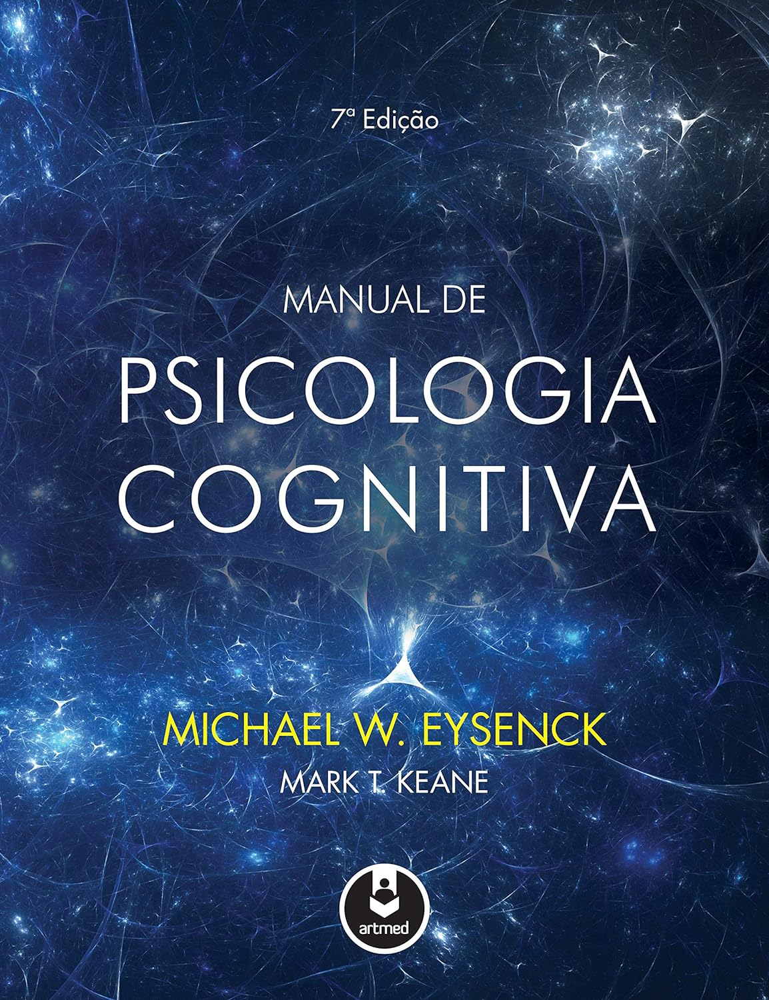

> Manual de psicologia cognitiva, principal livro da área, chega a sua 7ª edição totalmente atualizado, trazendo uma cobertura ampla de todos os ramos da disciplina. Considerando a cognição humana em contexto, este livro tem por objetivo auxiliar os estudantes a desenvolverem uma compreensão profunda dos fundamentos de psicologia cognitiva.

Depois de quase três meses, finalmente terminei. É uma boa leitura, bastante técnica. Não é apenas um livro de divulgação científica; é um livro que deve ser utilizado em sala de aula. É bastante completo no assunto e abrange muita, mas muita coisa mesmo.

Por isso, é longo e, em muitos momentos, me senti entediado — não porque o conteúdo seja desinteressante ou repetitivo, pois definitivamente não é. São pouco mais de 800 páginas abordando diversos estudos e pesquisas sobre o aprendizado e o processamento da percepção humana. No entanto, a leitura se torna cansativa pelo simples fato de ser um tema imenso e denso para se estudar por longos períodos. A verdade é que eu queria ler outras coisas também, explorar outros assuntos.

Os autores também não têm uma escrita instigante como a de Richard Dawkins (_O Gene Egoísta_) ou Desmond Morris (_O Macaco Nu_), que verdadeiramente têm o dom da escrita e da divulgação científica.

Verdade seja dita: a leitura deste livro não é difícil, apenas cansativa, dado o volume de conteúdo.

Dito isso, definitivamente é um ótimo livro, que se apoia em diversos estudos modernos sobre a imensa área da psicologia cognitiva. Recomendo.