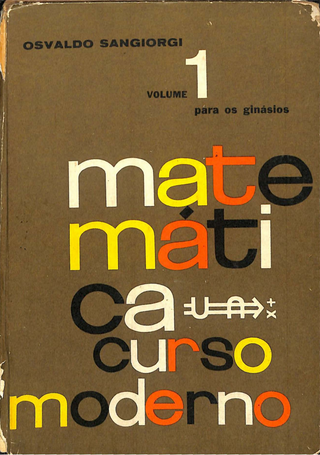

> O livro é o primeiro volume de uma coleção didática para o ginásio. Recebeu o prêmio Jabuti - 1963 em Ciências Exatas outorgado pela Câmara Brasileira do Livro.

Animei voltar a estudar Matemática por diversão e decidi revisar minhas bases. Para isso, decidi encarar o famoso _Matemática Curso Moderno para cursos ginasiais_, do Sangiorgi. 

Não se deixe enganar pela data de publicação livro. Ter sido publicado há 60 anos não o torna ultrapassado — afinal, é um livro de Matemática — e muito menos significa que sua didática seja ruim. Pelo contrário, ela é excelente, a ponto de o livro ter recebido o Prêmio Jabuti em 1963 na categoria de Ciências Exatas. 

Sangiorgi, ao escrever este curso para os primeiros anos do antigo ginásio, apresenta a Matemática com uma linguagem clara, em um texto simples, que nos aproxima dessa matéria tão temida e, muitas vezes, vista como alienígena, graças, infelizmente, à forma corrida e fora da realidade com que é ensinada na escola.

Parece estar esgotado, e não o encontrei à venda on-line, mas é possível baixar o PDF do livro gratuitamente e legalmente no [repositório da UFSC](https://repositorio.ufsc.br/handle/123456789/221459).

Recomendo!