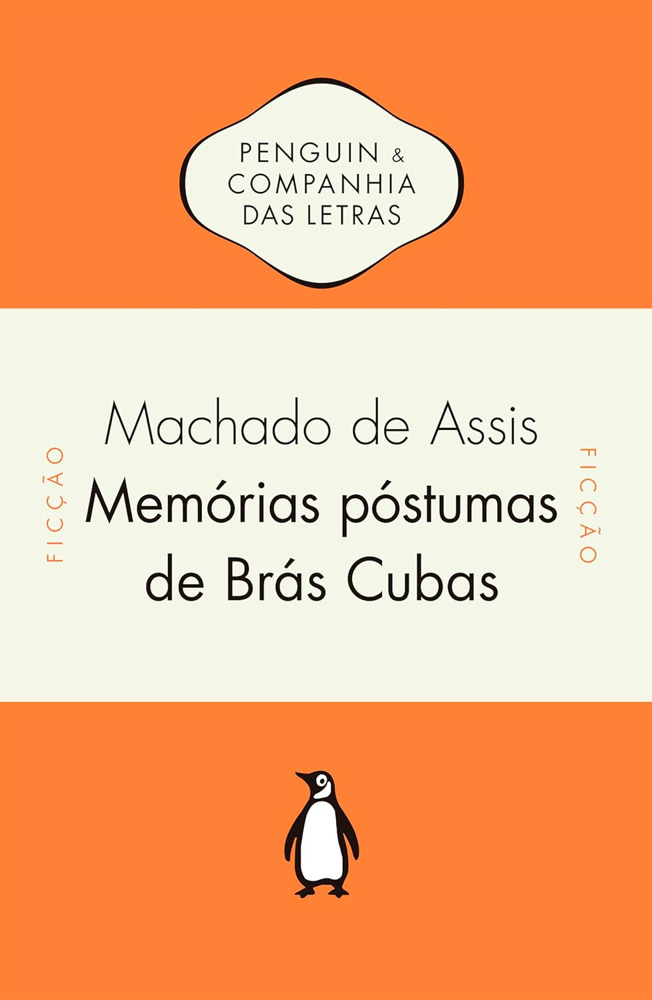

> Em 1881, Machado de Assis lançou aquele que seria um divisor de águas não só em sua obra, mas na literatura brasileira: Memórias póstumas de Brás Cubas . Ao mesmo tempo em que marca a fase mais madura do autor, o livro é considerado a transição do romantismo para o realismo. Num primeiro momento, a prosa fragmentária e livre de Memórias póstumas , misturando elegância e abuso, refinamento e humor negro, causou estranheza, inclusive entre a crítica. Com o tempo, no entanto, o defunto autor que dedica sua obra ao verme que primeiro roeu as frias carnes de seu cadáver tornou-se um dos personagens mais populares da nossa literatura. Sua história, uma celebração do nada que foi sua vida, foi transformada em filmes, peças e HQs, e teve incontáveis edições no Brasil e no mundo, conquistando admiradores que vão de Susan Sontag a Woody Allen.

Honestamente, seria pretensioso da minha parte tentar avaliar esta obra. Afinal, Machado de Assis é, provavelmente, o autor brasileiro mais estudado de todos os tempos, com uma vasta bibliografia, além de vídeos, resenhas, podcasts e programas dedicados a sua análise. Tudo o que posso dizer é: simplesmente leia este livro. Ele é realmente incrível.

Esta edição modernizou alguns termos e nomes onde fazia sentido, tornando o texto mais acessível, mas sem comprometer sua essência. Ainda assim, aqui e ali, você pode se deparar com palavras em desuso, como _cousa_ em vez de _coisa_. Nada que dificulte a leitura, que continua fluida e envolvente. Além disso, as centenas de notas contextuais enriquecem ainda mais a experiência. Não poderia recomendar mais a edição da Penguin!

Abaixo, alguns trechos marcantes que anotei ao longo da leitura:

> Ao verme que primeiro roeu as frias carnes do meu cadáver dedico como saudosa lembrança estas Memórias póstumas

> O que faz do meu Brás Cubas um autor particular é o que ele chama “rabugens de pessimismo”. Há na alma deste livro, por mais risonho que pareça, um sentimento amargo e áspero, que está longe de vir dos seus modelos.

> não sei se lhe meti algumas rabugens de pessimismo. Pode ser. Obra de finado. Escrevi-a com a pena da galhofa e a tinta da melancolia, e não é difícil antever o que poderá sair desse conúbio.

> O melhor prólogo é o que contém menos cousas, ou o que as diz de um jeito obscuro e truncado.

> A obra em si mesma é tudo: se te agradar, fino leitor, pago-me da tarefa; se te não agradar, pago-te com um piparote, e adeus.

> Algum tempo hesitei se devia abrir estas memórias pelo princípio ou pelo fim, isto é, se poria em primeiro lugar o meu nascimento ou a minha morte. Suposto o uso vulgar seja começar pelo nascimento, duas considerações me levaram a adotar diferente método: a primeira é que eu não sou propriamente um autor defunto, mas um defunto autor, para quem a campa foi outro berço; a segunda é que o escrito ficaria assim mais galante e mais novo.

> A vida estrebuchava-me no peito, com uns ímpetos de vaga marinha, esvaía-se-me a consciência, eu descia à imobilidade física e moral, e o corpo fazia-se-me planta, e pedra, e lodo, e cousa nenhuma.

> Assim, a minha ideia trazia duas faces, como as medalhas, uma virada para o público, outra para mim. De um lado, filantropia e lucro; de outro lado, sede de nomeada. Digamos: — amor da glória.

> Quem não sabe que ao pé de cada bandeira grande, pública, ostensiva, há muitas vezes várias outras bandeiras modestamente particulares, que se hasteiam e flutuam à sombra daquela, e não poucas vezes lhe sobrevivem?

> Creiam-me, o menos mau é recordar; ninguém se fie da felicidade presente; há nela uma gota da baba de Caim. Corrido o tempo e cessado o espasmo, então sim, então talvez se pode gozar deveras, porque entre uma e outra dessas duas ilusões, melhor é a que se gosta sem doer.

> — Pobre minuto! — exclamou. — Para que queres tu mais alguns instantes de vida? Para devorar e seres devorado depois? Não estás farto do espetáculo e da luta?

> Não importa ao tempo o minuto que passa, mas o minuto que vem. O minuto que vem é forte, jucundo, supõe trazer em si a eternidade, e traz a morte, e perece como o outro, mas o tempo subsiste.

> Dessa terra e desse estrume é que nasceu esta flor.

> Marcela amou-me durante quinze meses e onze contos de réis; nada menos.

> Talvez espante ao leitor a franqueza com que lhe exponho e realço a minha mediocridade; advirta que a franqueza é a primeira virtude de um defunto.

> Senhores vivos, não há nada tão incomensurável como o desdém dos finados.

> Cada estação da vida é uma edição, que corrige a anterior, e que será corrigida também, até a edição definitiva, que o editor dá de * graça aos vermes.

> Morreu sem lhe poder valer a ciência dos médicos, nem o nosso amor, nem os cuidados, que foram muitos, nem cousa nenhuma; tinha de morrer, morreu.

> A questão, porém, não é de pão, é de manteiga. Pão seco é que eu não engulo.

> A razão não podia ser outra senão o momento oportuno. Não era oportuno o primeiro momento, porque, se nenhum de nós estava verde para o amor, ambos o estávamos para o nosso amor: distinção fundamental. Não há amor possível sem a oportunidade dos sujeitos. Esta explicação achei-a eu mesmo, dous anos depois do beijo, um dia em que Virgília se me queixava de um pintalegrete que lá ia e tenazmente a galanteava. — Que importuno! — dizia ela fazendo uma careta de raiva. Estremeci, fitei-a, vi que a indignação era sincera; então ocorreu-me que talvez eu tivesse provocado alguma vez aquela mesma careta, e compreendi logo toda a grandeza da minha evolução. Tinha vindo de importuno a oportuno.

> mas o eflúvio da manhã, quem é que o pediu ao crepúsculo da tarde?

> Matamos o tempo; o tempo nos enterra.

> Cinquenta anos! Não é ainda a invalidez, mas já não é a frescura. Venham mais dez, e eu entenderei o que um inglês dizia, entenderei que “cousa é não achar já quem se lembre de meus pais, e de que modo me há de encarar o próprio ESQUECIMENTO”.

> Lutar. Podes escachá-los ou não, o essencial é que lutes. Vida é luta. Vida sem luta é um mar morto no centro do organismo universal.

> Não tive filhos, não transmiti a nenhuma criatura o legado da nossa miséria.
